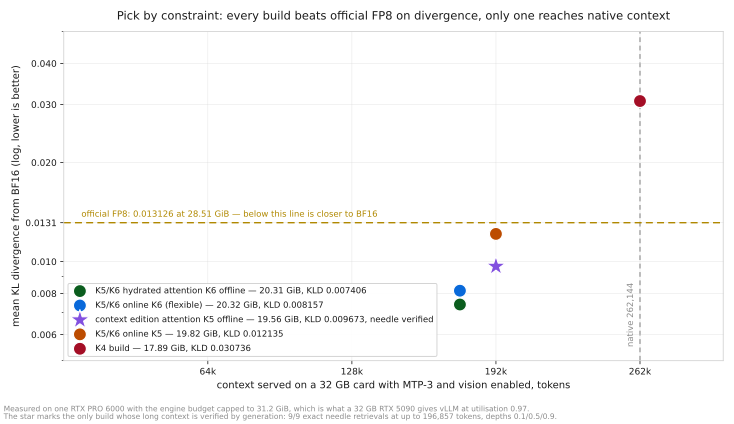

# Qwen3.8-27B EXL3 K5/K6 context edition — native 262,144 qualified on a physical RTX 5090, at 34 % lower divergence than official FP8

> **Requires a custom runtime.** Does **not** load in upstream vLLM, SGLang, TensorRT-LLM,
> llama.cpp, transformers, or stock exllamav3. It needs the Gilded Gnosis vLLM fork with
> explicit `--quantization exl3` and an exact `ignore` list. Treat it as an experimental,
> runtime-specific research artifact.

The long-context member of the family: K5 attention plus an opt-in int8 input embedding
overlay starts at native 262,144 with MTP-3, decode graphs and an 8,388,608-pixel image
ceiling. All seven acceptance gates pass on one **physical NVIDIA GeForce RTX 5090**
(`GPU-506a575d`, 32,607 MiB total, which vLLM sizes as 31.4 GiB usable), qualified at
`--gpu-memory-utilization 0.955` with `PYTORCH_CUDA_ALLOC_CONF=expandable_segments:True`:
**9.28 GiB of KV = 265,122 tokens** and 1.01x concurrency at 262,144. It retrieved a code from
261,794 text tokens and from a 236,824-token prompt containing a seven-megapixel image, both
on that card
([`receipts/qualification-5090-context.json`](https://github.com/malaiwah/qwen38-27b-exl3/blob/main/receipts/qualification-5090-context.json)).
**`0.955` is that board's measured value, not a constant every RTX 5090 shares:** a second
physical 5090 reported by a user needed **`0.956`**, missing at 0.955 by about **0.01 GiB**
([`receipts/second-5090-datapoint.json`](https://github.com/malaiwah/qwen38-27b-exl3/blob/main/receipts/second-5090-datapoint.json)).
See *Utilisation is a per-card measurement* below before copying the number.
On the v5 held-out suite — 5,120 contexts, **10,480,640 scored positions** —
it measures **0.003509** mean `KL(BF16 ‖ candidate)` against official FP8's **0.005294**, a
paired **−0.001785** that wins **5,109/5,120** contexts. It was already below FP8 on the older
v3 development and v4 source-disjoint suites.

## Which of the four builds

Same architecture and tokenizer. The headline KLD column is the v5 held-out suite
(5,120 contexts, 10,480,640 scored positions, body-only through one shared BF16 head); the
overlap-corrected 127-context v3 subset is kept beside it because absolute KLD is
suite-specific and the two columns cannot be compared with each other. The frontier figure
below still plots the v3 axis. The context edition's native result is MTP-3 with an 8.4 MP
image cap, qualified on a physical RTX 5090 at utilisation 0.955; the other rows are real
RTX 5090 MTP-3 tests.
These profiles are not interchangeable.
([collection](https://huggingface.co/collections/qwen38-27b-mixed-precision-exl3-measured-6a7fe0cb27817c23e4a57025)).

<picture>
  <source media="(prefers-color-scheme: dark)" srcset="assets/context-frontier-dark.svg">
  
</picture>

| build | download | resident | v5 held-out mean KLD | corrected v3 mean KLD | context profile | pick it when |
|---|---:|---:|---:|---:|---:|---|
| [-hydrated](https://huggingface.co/malaiwah/Qwen3.8-27B-EXL3-K5K6-hydrated) | 21.61 GB | 20.31 GiB | **0.002760** | 0.007172 | ~180k, 5090 MTP-3 | fidelity first |
| [-EXL3-K5K6](https://huggingface.co/malaiwah/Qwen3.8-27B-EXL3-K5K6) | 30.60 GB | 20.32 GiB | 0.003210 | 0.007945 | ~180k, 5090 MTP-3 | you want the width knob at launch |
| **this build** | 20.70 GB | **18.41 GiB** | **0.003509** | 0.009459 | **262,144, MTP-3, 8.4 MP cap** | native window plus speculative decode, hardware-qualified on a physical RTX 5090 |
| [-K4](https://huggingface.co/malaiwah/Qwen3.8-27B-K4) | 28.31 GB\* | 17.89 GiB | 0.010604 | 0.029679 | **262,144, 5090 MTP-3** | native context is non-negotiable |

**Byte and memory conventions for this table.** The download column is whole-tree bytes —
every published file of the artifact as its release evidence counted it
([`receipts/collection-index.json`](https://github.com/malaiwah/qwen38-27b-exl3/blob/main/receipts/collection-index.json),
`serialized_bytes.whole_tree_bytes`: hydrated 21,610,933,884 B, K5/K6 30,597,231,933 B, this
build 20,696,053,306 B) — and they are serialized bytes on disk, never resident memory.
\*The K4 release evidence records no tree count, so that one row is the sum of its safetensors
shards, 28,313,841,196 B, read from the published repository. This build's resident weight is
measured twice: **18.41 GiB** as run on the rental RTX PRO 6000 engine-budget proof and
**18.19 GiB** on the physical RTX 5090 at the qualified `0.955` profile. The table prints the
larger figure deliberately, because
[`receipts/vram-class-verdict.json`](https://github.com/malaiwah/qwen38-27b-exl3/blob/main/receipts/vram-class-verdict.json)
elects 18.41 GiB for every class prediction; the 0.22 GiB gap is the rental-versus-5090 delta,
not a change in the checkpoint.

Official `Qwen/Qwen3.8-27B-FP8` reads **0.005294** on the v5 suite and 0.012798 on the
corrected v3 subset: the three K5/K6 rows are below it on both suites, K4 on neither.

## Recipe

| role | representation |
|---|---|
| MLP `gate_proj`, `up_proj` (64 layers) | EXL3 **K5**, `mcg` |
| MLP `down_proj` (64 layers) | EXL3 **K6**, `mcg` |
| attention: `linear_attn.{in_proj_qkv,in_proj_z,out_proj}` ×48, `self_attn.{q,k,v,o}_proj` ×16 | **EXL3 K5 on disk**, `mcg`, calibrated |
| `lm_head` | EXL3 **K6**, `mcg` |
| MTP draft head | quantized (`fc` + attention K4, MLP K5/K6) |
| `embed_tokens`; vision tower (27 blocks), norms | BF16 on disk; input table **int8 at load** with the overlay; vision/norms BF16 |
| GatedDeltaNet `in_proj_a` / `in_proj_b` (96) | FP16 passthrough |

Built from [`Qwen/Qwen3.8-27B`](https://huggingface.co/Qwen/Qwen3.8-27B)
@ `1d4bf0f2ff6012fd82039f2fa52739d0dd7c60c0`. Verified after the build: reconstructing every
EXL3 module yields exactly upstream's **1,199 logical tensor names with matching shapes**; the
finalizer fails closed otherwise.

**A rebuild of this recipe is a sibling, not this checkpoint.** The published bytes are the
artifact: a recipe fixes composition, widths and byte budget exactly, and it does not fix the
weights. That was measured on the hydrated sibling's recipe, which comes out of the same
converter. A fresh conversion returned **13 of 16 pinned payload files identical** — every config,
the tokenizer, the index and both quantization descriptors — with byte-identical shard headers,
the same tensor names, dtypes, shapes and offsets, and the same per-role byte totals and assigned
widths, while **399 of the 409 quantized modules (97.6 %) differed inside their `.trellis`
payloads, at 41-92 % of the bytes each (mean 82 %)**. No scale, norm, embedding, vision or BF16
companion tensor moved. The converter is nondeterministic and that was measured, not inferred:
two runs of one conversion, minutes apart, agreed on every width and global scale and disagreed on
the converter's own `proxy_err`
([`receipts/converter-determinism.json`](https://github.com/malaiwah/qwen38-27b-exl3/blob/main/receipts/converter-determinism.json)).
A rebuild is a different valid artifact of the same recipe, not a broken one, and every fidelity
number on this card — all of which measure the published bytes a downloader receives — is
unaffected. And "rebuild this and you get these numbers" is no longer an untested expectation. A
third conversion of that hydrated recipe — a sibling again, differing in 399 `.trellis` payloads
and nothing else — was captured and replayed on the identical v5 shard-0 protocol (512 contexts,
1,048,064 scored positions, same shared head, same comparator): paired against the published
checkpoint the difference is **−3.755e-06, 95 % source-cluster bootstrap interval
[−2.854e-05, +2.062e-05]**, which **brackets zero**, on **257 contexts to 255 with no ties**. Two
controls make that attributable to the sibling's weights rather than to the harness — replaying
the published checkpoint against the same reference capture returned its mean and all 512
per-context rows bitwise, and a fresh recapture reproduces that mean exactly — so the comparison's
floor is zero, not a tolerance. **97.6 % of the quantized modules come back with different bytes
and the fidelity is the same to within our resolution**, which is what turns "the recipe is the
reproducible thing, the bytes are the artifact" into a measurement rather than a hedge. It is one
sibling, one recipe, one shard, at this protocol's resolution: it bounds the converter's fidelity
variance, it does not estimate it, and it is not a finding that converter nondeterminism is
fidelity-neutral in general
([`receipts/sibling-rebuild-fidelity.json`](https://github.com/malaiwah/qwen38-27b-exl3/blob/main/receipts/sibling-rebuild-fidelity.json)).
Practically: check the digest of the published tree against `SHA256SUMS`
rather than against your own conversion, and read a byte diff below this floor as the converter
rather than as tampering, corruption or a changed recipe. The same run also showed the recorded
build environment is incomplete — the pinned image has no `marisa_trie`, which the conversion
imports on an unconditional path, so that image provably could not have finished the job; the
conversion-capable image is `gg-r34-convert`. Keep the two senses of
reconstruction apart: the 1,199-tensor check above is the converter-side one, names and shapes
verified by the finalizer, while the runtime's `reconstruct_fp8_slice` / reconstruct+GEMM prefill
path turns stored trellis bytes back into weights at load and is untouched by any of this.

**The vision tower stays BF16 for a measured reason.** Quantizing it (`-vb 6`) saves 0.58 GB
but the converter splits upstream's fused `visual.blocks.N.attn.qkv` into separate q/k/v
projections, so the checkpoint stops matching the architecture's weight names — and the EXL3
loader excludes vision by design anyway. The topology check caught it; the build was redone.

## Fidelity

### v5 held-out suite — 10,480,640 scored positions

This is the headline fidelity evidence, and it replaces the 136-context / 278,392-position v3
table below as the number to quote. The v3 and v4 results stay published because they are what
the recipe was selected and then frozen against. Metric is `KL(BF16 ‖ candidate)` over the full
vocabulary with both operands replayed through one shared BF16 LM head, body-only; this build
is scored as its serialized checkpoint, with no int8 input overlay and no candidate-owned head.
Intervals are a source-cluster bootstrap over the 842 clusters, 10,000 resamples, seed 1.

| candidate | v5 mean KLD | 95 % CI | top-1 | paired vs official FP8 | exact worst position |
|---|---:|---|---:|---|---:|
| [hydrated](https://huggingface.co/malaiwah/Qwen3.8-27B-EXL3-K5K6-hydrated) | 0.002760 | [0.002540, 0.003020] | 97.70 % | −0.002534 [−0.002708, −0.002383], **5,118/5,120** | 8.258 |
| [online K5/K6](https://huggingface.co/malaiwah/Qwen3.8-27B-EXL3-K5K6) | 0.003210 | [0.002982, 0.003480] | 97.52 % | −0.002084 [−0.002249, −0.001942], **5,105/5,120** | 22.241 |
| **this build, serialized, MTP off** | **0.003509** | [0.003220, 0.003852] | **97.44 %** | **−0.001785** [−0.001884, −0.001697], **5,109/5,120** | **5.557** |
| `Qwen/Qwen3.8-27B-FP8` | 0.005294 | [0.004927, 0.005728] | 96.79 % | — | 10.714 |
| [K4](https://huggingface.co/malaiwah/Qwen3.8-27B-K4) | 0.010604 | [0.009640, 0.011746] | 95.76 % | +0.005310 [+0.004710, +0.006019], K4 wins **7/5,120** | 14.283 |

**How closely these absolute numbers may be read.** Each mean is a body-only replay value: both
operands are projected through the one shared BF16 head, and the replay path is not the engine's
own logit path. Replaying the unquantized model against its own live logits measures
`KL(live ‖ replayed)` = **6.54e-04**
([`receipts/v3-qualification-bf16.json`](https://github.com/malaiwah/qwen38-27b-exl3/blob/main/receipts/v3-qualification-bf16.json)),
and moving hidden-state storage from BF16 to fp32 moves a candidate's KLD by 5.6 %
([docs/24](https://github.com/malaiwah/qwen38-27b-exl3/blob/main/docs/24-p0-results.md)). Absolute
values are therefore **within-suite numbers**: they carry a ~6e-4 implementation offset plus a
~5 % storage systematic, and absolute differences below about 1e-3 are not resolvable. Both
offsets are **common-mode** — every candidate replays through the identical path — so **paired
differences and orderings are the resolvable quantity**: hydrated − online K5/K6 is −4.50e-04
[−4.69e-04, −4.33e-04] on 4,922 of 5,120 contexts
([`receipts/kld5-10M-paired.json`](https://github.com/malaiwah/qwen38-27b-exl3/blob/main/receipts/kld5-10M-paired.json)),
smaller than the replay floor and resolved *because* the floor cancels in the pairing. The floor
itself was measured on six v3 contexts; re-deriving it on v5 is an open measurement. Method of
record:
[`docs/42-kld-method.md`](https://github.com/malaiwah/qwen38-27b-exl3/blob/main/docs/42-kld-method.md).

0.003509 against FP8's 0.005294 is **34 % lower divergence**. The paired result is what
carries it: this build is closer to BF16 than official FP8 on **5,109 of 5,120** contexts, and
the interval on that difference never touches zero. The build that produces it serves at
**18.41 GiB** resident in its int8-overlay MTP-3 profile, 19.31 GiB with the BF16 input table,
against FP8's 28.51 GiB. Its exact maximum single-position divergence over all 10,480,640
positions is **5.557**, the lowest of the five candidates — below FP8's 10.714 and far below
the online-encoded sibling's 22.241, which is the one axis on which the context edition leads
the whole family. Ordering is unchanged from v3, and from v4 for the four builds that suite
covered: hydrated, online K5/K6, this build, then FP8, then K4.

<picture>
  <source media="(prefers-color-scheme: dark)" srcset="assets/kld-all-measurements-dark.svg">
  
</picture>

*The widest single view of the evidence: **A** is the only panel where every family appears
together (v5 shard 0, 512 contexts, 1,048,064 positions, nine candidates — this build is the
`context` circle at 0.003409), **B** is the same suite's 1M → 10M ladder (five vLLM builds, 5,120
contexts at 10M), **C1/C2** are the superseded corrected v3 (127 contexts, 259,969 positions) and
the source-disjoint v4 (36 contexts, 73,692 positions) on separate y-axes behind a barrier, and
**D** is turboderp's own published protocol (OpenWebText, 65,536 positions), which we have never
run. Two rules travel with the figure: the cross-engine floor belongs to the llama.cpp rows only,
and no ratio across panels means anything. Generated by
[`tools/make_master_kld_chart.py`](https://github.com/malaiwah/qwen38-27b-exl3/blob/main/tools/make_master_kld_chart.py),
which reads every one of our values from `receipts/` at runtime.*

**These numbers are re-derivable, not merely re-runnable.** 5,240,320 scored positions — five
candidates x 512 contexts x 2,047 positions — reproduce **bit-for-bit** across independent runs
with separate model loads and different harness generations: every measured field identical,
including the complete per-context arrays and the whole bootstrap block, with only the capture
directory paths and the additively-added tail histogram differing
([`receipts/capture-determinism.json`](https://github.com/malaiwah/qwen38-27b-exl3/blob/main/receipts/capture-determinism.json)),
and a third harness generation's unwindowed `--score-from 0` control returns the same shard-0
means to the last digit
([`receipts/scored-window-offset.json`](https://github.com/malaiwah/qwen38-27b-exl3/blob/main/receipts/scored-window-offset.json)).
The scope is part of the claim and travels with it: one GPU, one driver, one pinned rootfs,
`enforce_eager=True`, `max_num_seqs=1`, one context per forward, 512 MiB bf16 KV. It is **not** a
claim that vLLM is bitwise deterministic in general — nothing here covers CUDA graphs,
`max_num_seqs > 1`, chunked prefill with more than one chunk per context, other GPUs or drivers, or
anything downstream of the logits.

**Suite identity.** [`receipts/kld5-suite-manifest.json`](https://github.com/malaiwah/qwen38-27b-exl3/blob/main/receipts/kld5-suite-manifest.json),
schema `qwen38-distribution-fidelity/6`, suite token SHA-256
`510541f6861b589d44932db253ec25d96d6daaeeee4ea2ab9b65329209482b88`: 5,120 contexts ×
2,047 scored positions = **10,480,640**, drawn from **842 source clusters** over a corpus of
941 documents / 70,348,971 bytes fetched by `tools/fetch_corpus_v5.py`
([fetch log](https://github.com/malaiwah/qwen38-27b-exl3/blob/main/receipts/kld5-corpus-fetch-log.json)).
Windows are exact-advance and non-overlapping; an independent re-check of the emitted suite
found **5,120/5,120 unique context token hashes and 0 overlapping windows**. It is
token-disjoint from the v4 qualification — 0 of the 160 prior context hashes is reachable.

**Exclusion policy: contamination is 0 by construction, not by luck.** Before a single context
is selected, every source document is scanned at every position for exact normalized 12-token
overlap with the exllamav3 calibration data, and any document with even one hit is dropped
whole: **44 of 941 documents excluded** (43 code, 1 encyclopedic), 897 eligible. No emitted
context can then contain calibration text, which is why the scan over the finished suite
reports zero hits. This is the same conservative rule that had to be applied retroactively to
v3 and v4, applied here before selection instead of after.

**Ladder stability.** `tools/kld_ladder.sh` walks the suite in ten 512-context shards —
capture six models, replay the five candidates, verify, delete 64 GB of hidden states, next
shard — and `tools/kld_aggregate.py` welds the verified shard reports into cumulative receipts
at the 1M / 2M / 5M / 10M checkpoints. The cumulative mean is flat along that ladder: hydrated
reads **0.002700 / 0.002759 / 0.002699 / 0.002760**, so the 10M figure is not a late-shard
artifact. Per-candidate receipts are `receipts/kld5-10M-{hyd,k5k6,ctx,fp8,k4}.json`
(schema `qwen38-kld-ladder-cumulative/2`); the paired differences are in
[`receipts/kld5-10M-paired.json`](https://github.com/malaiwah/qwen38-27b-exl3/blob/main/receipts/kld5-10M-paired.json).

**Distribution tail.** A mean, a top-1 rate and one worst position do not describe a tail, so
here is all of it, measured on **shard 0 of the same suite — 512 contexts, 1,048,064 scored
positions** — the identical contexts for all five candidates. Receipts
`receipts/kld5-1M-tail-{hyd,k5k6,ctx,fp8,k4}.json` (schema `qwen38-kld-ladder-cumulative/2`,
built by `tools/kld_aggregate.py`); this build's row is
[`receipts/kld5-1M-tail-ctx.json`](https://github.com/malaiwah/qwen38-27b-exl3/blob/main/receipts/kld5-1M-tail-ctx.json).
Every `qwen38-fidelity-report/2` replay accumulates a **560-bin log-spaced histogram of
per-position KLD** (`KLD_HIST_LOG10_LOW=-12.0`, `KLD_HIST_LOG10_HIGH=2.0`,
`KLD_HIST_BINS_PER_DECADE=40` in `tools/fidelity.py`) whose bin counts add across shards,
which is what makes cumulative quantiles possible at all.

| candidate | mean | p50 | p95 | p99 | p99.9 | p99.99 | exact max | share of positions above 0.1 | above 1.0 |
|---|---:|---:|---:|---:|---:|---:|---:|---:|---:|
| [hydrated](https://huggingface.co/malaiwah/Qwen3.8-27B-EXL3-K5K6-hydrated) | 0.002700 | 0.00109 | 0.0082 | 0.0276 | 0.1319 | 0.463 | 3.735 | 0.1534 % | 0.00219 % |
| [online K5/K6](https://huggingface.co/malaiwah/Qwen3.8-27B-EXL3-K5K6) | 0.003141 | 0.00128 | 0.0099 | 0.0321 | 0.1446 | 0.498 | 5.507 | 0.1820 % | 0.00200 % |
| **this build** (context) | **0.003409** | **0.00135** | **0.0107** | **0.0357** | **0.1642** | **0.587** | **3.749** | **0.2287 %** | **0.00305 %** |
| `Qwen/Qwen3.8-27B-FP8` | 0.005197 | 0.00202 | 0.0167 | 0.0531 | 0.2438 | 0.812 | 5.296 | 0.3912 % | 0.00592 % |
| [K4](https://huggingface.co/malaiwah/Qwen3.8-27B-K4) | 0.010345 | 0.00320 | 0.0332 | 0.1194 | 0.5555 | 1.870 | 7.565 | 1.2604 % | 0.03807 % |

For this build the tail behaves exactly like the mean: the ordering at p50, p95, p99, p99.9
and p99.99 is the same as the ordering of the means, so the mean is not hiding anything worse
at depth. Its entire tail sits **below official FP8's at every measured quantile** — 0.0357
against 0.0531 at p99, 0.1642 against 0.2438 at p99.9, 0.587 against 0.812 at p99.99 — and
**0.2287 %** of positions exceed 0.1 against FP8's 0.3912 %. It is the highest of the three
K5/K6 builds at every quantile, the same third place its mean reports, and the price of the
262,144-token window. Its exact maximum on this shard is 3.749, essentially level with
hydrated's 3.735, which is consistent with this build owning the lowest exact maximum
(5.557) over the full ten-shard run.

**What this run does not give you.**

- Absolute KLD is suite-specific. The v5 numbers are **not** comparable with the v3 numbers
  below: the corpus mix differs, and K4 reads 0.029679 there against 0.010604 here. Only
  within-suite ordering and paired differences transfer.
- Cumulative token percentiles come from **one shard**, not from all ten: the ten shard
  reports of the 10M run carry no token-level KLD histogram, so nothing could be recombined
  across them. The tail table above closes that gap on **shard 0**
  (`receipts/kld5-1M-tail-*.json`), with bin-bounded quantiles — each receipt carries
  `lower` / `upper` / `estimate`, relative bin width about 5.6 % — and **exact** maxima and
  exceedance counts. Across all 10,480,640 positions only the means, the intervals, the
  paired results and one exact global maximum per candidate exist.
- The five candidates' hidden states and the BF16 references for shards 1-9 were deleted shard by
  shard to fit 135 GB of scratch, so the v5 run is recomputable from the pinned corpus fetch log
  and suite manifest. The **shard-0 BF16 reference was kept and is published**, with the suite, all
  ten shard views and 79 per-shard reports, so a new candidate can be replayed against the
  identical contexts without recapturing the reference — see [Reproduce this](#reproduce-this).

### v3 development suite — 136 contexts, 278,392 positions (superseded as headline, kept)

These are the measurements the recipe was selected against, and they remain the source of the
int8-input-overlay and K6-head attributions below. Every number in this subsection, including
both overlay rows, is a v3 measurement; none of it is comparable to the v5 magnitudes above.

Held-out corpus, 136 analysis contexts, 278,392 full-vocabulary scored positions,
`KL(BF16 ‖ candidate)` with one shared BF16 head for both operands, source-cluster bootstrap.
The first row is the serialized checkpoint with its BF16 input table; the second changes only
that table at load.

| candidate | resident profile | mean KLD | 95 % CI | token median | top-1 |
|---|---:|---:|---|---:|---:|
| this build, BF16 input, MTP off | 19.31 GiB | **0.009673** | [0.00711, 0.01275] | 0.001672 | 96.81 % |
| **this build, int8 input overlay, MTP off** | **18.13 GiB** | **0.009738** | [0.00716, 0.01284] | 0.001687 | 96.80 % |
| hydrated (attention K6) | 20.31 GiB | 0.007406 | [0.00543, 0.00978] | 0.001335 | 97.19 % |
| `Qwen/Qwen3.8-27B-FP8` | 28.51 GiB | 0.013126 | [0.00981, 0.01709] | 0.002343 | 96.22 % |
| `unsloth/Qwen3.8-27B-NVFP4` | 21.34 GiB | 0.094978 | [0.06858, 0.12688] | 0.012911 | 90.53 % |

**Overlap-corrected subset:** a later all-position 12-token scan found exact calibration
overlap in 2/41 source documents that the original fixed-stride scan missed. Conservatively
removing their nine contexts gives this build **0.009378**, hydrated **0.007172**, official FP8
**0.012798**, and NVFP4 **0.092727** over 127 contexts. The int8 input-overlay row is
**0.009459** on that same subset. No ordering changes.

**The v3 NVFP4 number is not our current one, and the two suites must never be mixed.** NVFP4 reads
**0.092727** on this corrected subset and **0.030115** on v5 shard 0 — same checkpoint, same
revision, same flags, same shared-head protocol — and its v5 row is in the
[shard-0 table below](#against-gguf-measured-on-our-suite). That gap is suite hardness, measured for
all six candidates rather than argued: v3-corrected ÷ v5 shard 0 is **2.4625x** official FP8,
**2.5293x** online K5/K6, **2.6564x** hydrated, **2.7505x** this build, **2.8688x** K4 and
**3.0791x** NVFP4 — a band spanning **1.2504x** end to end, with the **ordering identical in both
suites**
([`receipts/nvfp4-v5-measurement.json`](https://github.com/malaiwah/qwen38-27b-exl3/blob/main/receipts/nvfp4-v5-measurement.json),
block `suite_comparability_v3_vs_v5`). A band of factors and not one factor is why no conversion
between the suites exists: the ordering carries across, an absolute value never does, and a v3
number must never appear in the same sentence as a v5 number.

Paired on identical v3 contexts:

- baseline versus official FP8: **−0.003453**, 95 % CI [−0.004383, −0.002666],
  **135/136 contexts** — 26 % lower divergence on this suite at 68 % of its resident weight;
  the int8 overlay is 64 % of FP8 resident weight for +0.000065 KLD. The same comparison on
  the v5 held-out suite is **−0.001785 over 5,109/5,120 contexts**, 34 % lower divergence; the
  two percentages are not two measurements of one quantity, they are two suites.
- baseline versus the hydrated build: **+0.002266** (1/136). That is what K5 attention costs,
  and it buys 0.85 GiB and ~16k tokens of context before the embedding overlay.
- **Calibration beats the runtime overlay again:** serialized K5 attention measures 0.009673
  where the same family encoded K5 *at load* measures 0.012135 on the original v3 receipt;
  overlap-corrected values are **0.009378 versus 0.011801**.
- With its own K6 head the BF16-input baseline is 0.009795 on the original v3 receipt and
  **0.009503** on the corrected subset. The head and input-overlay deltas were measured
  separately; their combination is not presented as a measured number.

## Against GGUF, measured on our suite

The standing objection to this card's headline is that official FP8 is a throughput format whose
quality is Q4-to-Q5 class, so beating it is a weak claim, and that llama.cpp's `Q8_0` and `Q6_K`
are the honest bar. That is now measured rather than argued.

Three GGUFs from `unsloth/Qwen3.8-27B-GGUF@f1bfb127c64f7072bdd2cad55f258b9c8b2910fe` were
captured under **llama.cpp pinned at commit `ece963f41b0b02d7a0d61436ae365762c073a4c8`** with
[`tools/gguf_capture.cpp`](https://github.com/malaiwah/qwen38-27b-exl3/blob/main/tools/gguf_capture.cpp),
which reads the **post-final-norm** state — the same mathematical point the vLLM hook takes, with
bf16 rounding verified bit-identical to torch on 2,012,449 probe values — and scored against the
same BF16 teacher through **the same shared BF16 head**, on **shard 0 of the v5 suite: the same
512 contexts and the same 1,048,064 scored positions every row below saw**. Manifests come from
[`tools/gguf_manifest.py`](https://github.com/malaiwah/qwen38-27b-exl3/blob/main/tools/gguf_manifest.py)
and each one carries the GGUF blob digest and the llama.cpp identity; the build script is
[`tools/build_llamacpp.sh`](https://github.com/malaiwah/qwen38-27b-exl3/blob/main/tools/build_llamacpp.sh).
Receipt
[`receipts/cross-engine-comparator.json`](https://github.com/malaiwah/qwen38-27b-exl3/blob/main/receipts/cross-engine-comparator.json),
per-candidate reports
[`receipts/gguf-report-{q8_0,q6_k,q5_k_xl}.json`](https://github.com/malaiwah/qwen38-27b-exl3/tree/main/receipts).

<picture>
  <source media="(prefers-color-scheme: dark)" srcset="assets/kld-family-comparison-dark.svg">
  
</picture>

| candidate | engine | measured mean KLD | net of engine floor | top-1 | p99.9 | serialized |
|---|---|---:|---:|---:|---:|---:|
| GGUF `Q8_0` | llama.cpp | 0.001087 | ~0.000579 | 98.53 % | 0.0351 | 27.05 GiB |
| GGUF `Q6_K` | llama.cpp | 0.002035 | ~0.001528 | 97.98 % | 0.0794 | 21.31 GiB |
| hydrated | vLLM | 0.002700 | n/a, same engine | 97.80 % | 0.1313 | 20.12 GiB payload |
| online K5/K6 | vLLM | 0.003141 | n/a, same engine | 97.61 % | 0.1447 | — |
| **this build** (context edition) | vLLM | **0.003409** | n/a, same engine as the reference | **97.55 %** | **0.1632** | **19.27 GiB payload** |
| GGUF `UD-Q5_K_XL` | llama.cpp | 0.004444 | ~0.003936 | 97.20 % | 0.2144 | 18.83 GiB |
| official FP8 | vLLM | 0.005197 | n/a, same engine | 96.92 % | 0.2440 | 28.51 GiB resident |
| K4 | vLLM | 0.010345 | n/a, same engine | 95.91 % | 0.5576 | — |
| `unsloth/Qwen3.8-27B-NVFP4` @ `9c73e2da` | vLLM | 0.030115 | n/a, same engine | 93.16 % | 1.6228 | — |

**The engine floor, measured and not assumed.** A GGUF row carries llama.cpp-versus-vLLM numerics
on top of quantization error, so that term was measured the same way: the unquantized **BF16
GGUF** against the vLLM BF16 reference, identical token ids, the same shared head, the same 512
contexts — **0.000507** mean, 99.07 % top-1, p99.9 0.0113
([`receipts/gguf-report-engine-floor.json`](https://github.com/malaiwah/qwen38-27b-exl3/blob/main/receipts/gguf-report-engine-floor.json)).
Every GGUF row above contains that term; no vLLM row — ours or FP8's — does. **KL is not additive,
so the net column is an estimate, not an identity**: the measured GGUF value is an upper bound and
the net figure is the naive lower one.

Three `—` cells, for two different reasons. Two are the builds that ship BF16 attention for the
runtime to encode at load, so their disk bytes are not a like-for-like payload; NVFP4's cell is
empty because we publish no serialized-byte receipt of our own for a third party's checkpoint, and
its 21.34 GiB is measured resident weights, a different quantity. The payload
figures are `immutable_payload_bytes` from
[`receipts/collection-index.json`](https://github.com/malaiwah/qwen38-27b-exl3/blob/main/receipts/collection-index.json)
(this build 20,696,033,532 B = 19.275 GiB, hydrated 21,610,916,123 B = 20.127 GiB; the table
truncates both to two decimals) and are **serialized bytes, never VRAM** —
this build's 19.27 GiB on disk is larger than its 18.41 GiB resident because the input table ships
BF16 and is narrowed to int8 at load. The FP8 figure is resident weights and is labelled as such.

**The p99.9 column, and why it differs from the tail table above.** These p99.9 values are each
report's **exact** shard-0 p99.9 as the comparator receipt read them; the tail table in
[Fidelity](#v5-held-out-suite--10480640-scored-positions) quotes the **bin-bounded cumulative
estimate** from the 560-bin histogram, whose bins are about 5.6 % wide — this build reads 0.1642
there and 0.1632 here, and the exact value lies inside the bin the estimate names. The two differ by
construction, not by measurement.

**NVFP4 on the identical shard, and it carries no cross-engine term.**
`unsloth/Qwen3.8-27B-NVFP4` at revision `9c73e2da` is served by **the same vLLM build as our
rows**, so unlike the GGUF rows there is no engine term to subtract or estimate and it is directly
comparable to this build. On the same 512 contexts and the same 1,048,064 positions, through the
same shared BF16 head, it measures **0.030115** mean KLD, 95 % CI [0.027637, 0.032965], **93.16 %**
top-1, median 0.009584, p95 0.10051, p99 0.33546, p99.9 **1.6228**, exact worst position 10.6285 and
mean JSD 0.010104 bits
([`receipts/kld5-1M-nvfp4.json`](https://github.com/malaiwah/qwen38-27b-exl3/blob/main/receipts/kld5-1M-nvfp4.json),
with the run's own account in
[`receipts/nvfp4-v5-measurement.json`](https://github.com/malaiwah/qwen38-27b-exl3/blob/main/receipts/nvfp4-v5-measurement.json)).
That is **8.8x this build's 0.003409**, 2.9x K4 at the same 4-bit weight class, 5.8x official FP8,
11.2x the hydrated sibling and 27.7x `Q8_0` as measured; its p99.9 of 1.6228 is 9.9x this build's
0.1632.

**Paired per context, which is a stronger statement than any ratio of means: NVFP4 loses every one
of 512 contexts against this build.** The paired difference is **+0.026706** in this build's favour
(95 % CI [+0.024465, +0.029285], **512 wins to 0**), and NVFP4 loses all 512 against official FP8
as well (+0.024918, [+0.022756, +0.027424], **0 wins to 512**) — not one context anywhere in the
shard where it is the better of either pair
([`receipts/kld5-1M-paired-nvfp4.json`](https://github.com/malaiwah/qwen38-27b-exl3/blob/main/receipts/kld5-1M-paired-nvfp4.json)).
That is the honest form of the comparison: a clean sweep of paired contexts, not a ratio of means.

**Where this build sits, without spin.** This is the build that wins the 5-bit comparison.
`UD-Q5_K_XL` measures 0.004444 and ~0.003936 net of the floor at 18.83 GiB against this build's
0.003409 at 19.27 GiB of payload: **about 13 % lower divergence for 0.445 GiB more file**, and
the win is larger under the measured reading (0.004444), which is the reading that includes their
cross-engine term. Its tail is lighter too, at the one quantile both receipts publish: p99.9
**0.1632** against `UD-Q5_K_XL`'s **0.2144**. Against official FP8 it is
**34 % lower** at two thirds of the resident weight. What it does **not** win: `Q6_K` at 0.001528
net for 21.31 GiB — 2.038 GiB more file for **55 % lower divergence** than this build — and `Q8_0`,
the leader, at 27.05 GiB. A 13 % win at 5 bits is the honest size of this result; it is not a
format-wide victory.

**The two conclusions worth stating plainly:**

1. **At the 6-bit operating point GGUF `Q6_K` is genuinely better than our best build** —
   0.001528 net at 21.31 GiB against the hydrated build's 0.002700 at 20.12 GiB of payload, and
   further ahead of this build. It is the first measurement in this project where an off-the-shelf
   artifact beats the recipe, and it is published as such.
2. **At the 5-bit operating point this build wins** — 0.003409 at 19.27 GiB against `UD-Q5_K_XL`'s
   0.003936 net at 18.83 GiB, about 13 % better fidelity for **0.445 GiB** more payload.

So the format advantage at this bitrate is real at 5 bits, negative at 6 bits, and far short of a
full bit. Two further readings that are not flattering: **`Q8_0` is the fidelity leader** at
0.001087 for 27.05 GiB, and its measured value is only about twice the engine floor, so its own
number sits near the resolution limit of any cross-engine comparison — the net column is an
estimate, not an identity, so **no ordering closer than a factor of two should be pressed against
`Q8_0`**; and **every GGUF point at or
above 5 bits beats official FP8**, which makes this card's "34 % lower divergence than official FP8"
true and a weaker achievement than it sounds. **K4 is the weakest of our own builds here, and
Unsloth's NVFP4 — measured on the identical shard, in the same engine — is 2.9x weaker still.**

**What this comparison does not settle.** It is text-only teacher-forced fidelity on one shard of
ten. It says nothing about serving 262,144 tokens with vision and MTP on a 32 GB card — this card's
entire reason to exist — and llama.cpp KV-quant behaviour, prefill and decode speed are separate
axes that were not measured here. Nothing above should be read as a capacity comparison: the GGUF
numbers come with no measured resident weights, no KV budget and no native-context proof of ours.
The GGUF rows are also a shard-0 ranking, not a paired per-context bootstrap against the ten-shard
rows above, because those were welded from a different position count. Shard 0 is one tenth of the suite, and it is close to it: over all 10,480,640 positions the five vLLM
means read 0.002760 / 0.003210 / 0.003509 / 0.005294 / 0.010604 — **1.9-2.9 % above** these shard-0
values, ordering unchanged (`receipts/kld5-10M-{hyd,k5k6,ctx,fp8,k4}.json`). The GGUFs have no
ten-shard equivalent; extending them is unrun.

**One protocol objection, bounded rather than argued.** `llama-perplexity` scores only the second
half of each window, so every position it scores has at least 256 tokens of left context, while our
suite scores from position 0. Re-scoring our own captures under that restriction lowers every
candidate's mean by **1.3-2.1 %** at a 256-token floor and **3.9-4.9 %** second-half-only,
uniformly enough to change no ordering — this build reads 0.003342 and 0.003243 respectively
([`receipts/scored-window-offset.json`](https://github.com/malaiwah/qwen38-27b-exl3/blob/main/receipts/scored-window-offset.json)).
The external protocol's scoring floor therefore explains at most about 5 % of any cross-protocol
gap, and nothing in the ordering above.

### Cross-citation: the same three GGUFs under llama.cpp's own protocol

The rows above are those GGUFs on **our** axis. They have also been measured on **theirs**, run
exactly as its authors run it, so the two can be cited side by side without either being converted
into the other: `llama-perplexity --kl-divergence` on **WikiText-2 raw test**, `n_ctx` 512,
**147,900 scored positions**, `KL(BF16 GGUF ‖ candidate)` with both operands inside llama.cpp and
each candidate's **own output head inside the measured path**, base `Mean PPL 6.950230 ± 0.044933`
([`receipts/wikitext-kld-run-a.json`](https://github.com/malaiwah/qwen38-27b-exl3/blob/main/receipts/wikitext-kld-run-a.json);
full protocol, delta by delta, in
[`docs/35-external-protocol-comparability.md`](https://github.com/malaiwah/qwen38-27b-exl3/blob/main/docs/35-external-protocol-comparability.md)).

| quant | their protocol, their corpus | their top-1 | ours, net of the engine floor | theirs ÷ ours-net |
|---|---:|---:|---:|---:|
| `Q8_0` | 0.000926 ± 0.000042 | 98.761 % | ~0.000579 | 1.60x |
| `Q6_K` | 0.002286 ± 0.000108 | 97.875 % | ~0.001528 | 1.50x |
| `UD-Q5_K_XL` | 0.004426 ± 0.000167 | 97.178 % | ~0.003936 | 1.12x |

**The ordering is identical on both axes**, and the level difference is protocol rather than
disagreement about which quantization is better: their number is pushed down by scoring only the
second half of each window, by a single English corpus and by dropping base-side terms below
`log p ≤ −16`, and pushed up — this is the large one — by having the candidate's own output head
inside the measured path, while both of our operands go through one shared BF16 head. Only our
number carries a cross-engine term, which is why the honest comparison is against our net column.

**Their harness's own floor, measured on our hardware instead of assumed.** The `Minimum KLD`
column is negative for all three — −0.000080, −0.000056, −0.000077, i.e. **5.6e-5 to 8.0e-5** — the
uint16 16-nat log-probability encoding showing through rather than a candidate beating its own
reference. The same term appears in the perplexity: 6.9525 in the capture log against 6.950230 in
the scoring runs, identical weights on identical tokens, differing only by that stored round trip.

**Tokenization is not part of the difference, and that is a measured null result.** llama.cpp's
GGUF BPE and our Hugging Face tokenizer produce **bit-identical 297,194-token streams** over this
corpus — same int32 digest, no first divergence index — and the 296,960-token prefix that
`llama-perplexity` actually scores is identical too
([`receipts/wikitext-kld-token-identity.json`](https://github.com/malaiwah/qwen38-27b-exl3/blob/main/receipts/wikitext-kld-token-identity.json)).

**And one finding worth its own line: perplexity does not reproduce the KLD ordering.** `Q6_K` has
the *smallest* PPL delta of the three, **+0.00079** against the 6.950230 base, while `Q8_0` — the
better quant by every divergence statistic, including a mean 2.5x lower and 0.9 points more top-1
agreement — is **+0.00467**. A quantization that shifts the distribution can shift it in the
direction that happens to flatter a corpus mean, which is an argument for the metric this whole
section is built on and against ranking quants by perplexity delta.

What this cross-citation cannot do is put **this** build on their axis: `llama-perplexity` cannot
read an EXL3 checkpoint. The table at the top of this section, where every candidate is scored by
one harness on one suite, stays the primary comparison.

## Post-selection qualification (v4, source-disjoint)

The v3 numbers above come from the suite that guided recipe selection. This is the test that
did not: **160 new contexts from 100 documents with zero intersection with the development
suite** (context token hashes 0/160, document names 0/100, content hashes 0/100), partitioned
by whole source cluster, run **once**, with no recipe changed afterwards. The v5 held-out
suite is a third, much larger post-selection run, and it is token-disjoint from this one.

The original 42-context table used a fixed-stride character overlap scan. A later,
offset-independent scan found exact 12-token calibration overlap in four qualification source
documents. Applying the same conservative rule to every candidate — exclude every context from
any source document with even one hit — leaves **36 contexts / 24 clusters**:

| candidate | mean KLD | 95 % CI | top-1 | paired vs FP8 |
|---|---:|---|---:|---|
| [hydrated](https://huggingface.co/malaiwah/Qwen3.8-27B-EXL3-K5K6-hydrated) | **0.003093** | [0.002577, 0.003684] | 97.63 % | −0.002798, **36/36** |
| [K5/K6 online K6](https://huggingface.co/malaiwah/Qwen3.8-27B-EXL3-K5K6) | 0.003455 | [0.002916, 0.004060] | 97.50 % | −0.002436, **36/36** |
| [context edition](https://huggingface.co/malaiwah/Qwen3.8-27B-EXL3-K5K6-context) | 0.003990 | [0.003268, 0.004797] | 97.36 % | −0.001901, **36/36** |
| `Qwen/Qwen3.8-27B-FP8` | 0.005891 | [0.004901, 0.006985] | 96.72 % | — |

The correction changes no ordering or paired win: the three EXL3 builds remain 47 / 41 / 32 %
below FP8. The original 42-context figures and the candidate-independent correction are both
preserved in [docs/31](https://github.com/malaiwah/qwen38-27b-exl3/blob/main/docs/31-frozen-qualification.md).
Absolute magnitudes remain suite-specific.

## Public capability — MMLU-Pro, item-paired against BF16

70 MMLU-Pro questions, 14 official categories, 5 per category, pinned
`TIGER-Lab/MMLU-Pro@b189ec765aa7ed75c8acfea42df31fdae71f97be`, official five-shot category
prefixes, greedy, thinking at low reasoning effort, 5,120-token completion cap. The BF16
control ran first and the acceptance rule was frozen in
[`receipts/public-capability-plan.json`](https://github.com/malaiwah/qwen38-27b-exl3/blob/main/receipts/public-capability-plan.json)
before any candidate result was seen. All six models answered the same 70 items in the same
order through the same extractor, so every candidate row is paired item-by-item against that
control.

| model | absolute | Wilson 95 % | BF16-pass retention | Wilson lower | regressions | improvements | completion-cap failures | receipt |
|---|---:|---|---:|---:|---:|---:|---:|---|
| `Qwen/Qwen3.8-27B` BF16 | 57/70 (81.4 %) | [70.8 %, 88.8 %] | reference | — | — | — | 4 | [bf16](https://github.com/malaiwah/qwen38-27b-exl3/blob/main/receipts/public-capability-bf16.json) |
| **this edition (context)** | **58/70 (82.9 %)** | **[72.4 %, 89.9 %]** | **56/57** | **90.7 %** | **1** | **2** | **3** | [ctx](https://github.com/malaiwah/qwen38-27b-exl3/blob/main/receipts/public-capability-ctx.json) |
| [K4](https://huggingface.co/malaiwah/Qwen3.8-27B-K4) | 57/70 (81.4 %) | [70.8 %, 88.8 %] | 55/57 | 88.1 % | 2 | 2 | 4 | [k4](https://github.com/malaiwah/qwen38-27b-exl3/blob/main/receipts/public-capability-k4.json) |
| [hydrated](https://huggingface.co/malaiwah/Qwen3.8-27B-EXL3-K5K6-hydrated) | 56/70 (80.0 %) | [69.2 %, 87.7 %] | 54/57 | 85.6 % | 3 | 2 | 4 | [hyd](https://github.com/malaiwah/qwen38-27b-exl3/blob/main/receipts/public-capability-hyd.json) |
| `Qwen/Qwen3.8-27B-FP8` | 56/70 (80.0 %) | [69.2 %, 87.7 %] | 55/57 | 88.1 % | 2 | 1 | 4 | [fp8](https://github.com/malaiwah/qwen38-27b-exl3/blob/main/receipts/public-capability-fp8.json) |
| [online K5/K6](https://huggingface.co/malaiwah/Qwen3.8-27B-EXL3-K5K6) | 55/70 (78.6 %) | [67.6 %, 86.6 %] | 54/57 | 85.6 % | 3 | 1 | 4 | [k5k6](https://github.com/malaiwah/qwen38-27b-exl3/blob/main/receipts/public-capability-k5k6.json) |

### The pre-registered bar, and this edition's verdict

The frozen plan accepts a candidate when BF16-pass retention has a **Wilson 95 % lower bound at
or above 0.90** and **no category loses more than two BF16 passes**. The category clause is met
by all five candidates — the worst case is two passes in philosophy, for the hydrated build and
online K5/K6 — so the retention lower bound is the only clause that ever fails.

**This edition is the only candidate that clears the bar: 56/57 BF16-pass retention, Wilson 95 %
lower bound 90.7 %.** Exactly one of BF16's 57 passes flipped to a failure and two BF16 failures
flipped to passes, for 58/70 absolute. K4 and official `Qwen/Qwen3.8-27B-FP8` read 88.1 %; the
hydrated build and online K5/K6 read 85.6 %. None of the other four candidates clears the bar,
and all four shortfalls are published as measured.

**Clearing the bar is not a claim that this edition beats anything.** Every interval in the
table overlaps every other interval, including the BF16 control's and official FP8's, so the
matrix does not rank these models and this card does not claim it does. 58/70 against BF16's
57/70 is one item inside intervals more than 15 points wide; it is **not** evidence that this
edition is better than BF16, than official FP8, or than its siblings.

### Why almost nothing clears this bar at 70 items

With 57 BF16 passes as the paired denominator, **56/57 is the smallest count whose Wilson 95 %
lower bound clears 0.90** (56/57 → 90.7 %; 55/57 → 88.1 %; 54/57 → 85.6 %). A single paired
regression is the entire budget, so no result that gives up two can pass, however sound the
build — the suite has too few items to certify the bar it pre-registered. This edition clears
it by spending exactly one regression and no more, which is a narrow pass rather than a
demonstrated margin. The same limit applies to official FP8 exactly as it applies to the EXL3
builds: what the matrix shows is a **power limitation of a 70-item draw, not evidence that any
of these checkpoints is broken**.

### Two protocol facts that bound the reading

- **Exact-answer agreement is 0/70 for every EXL3 candidate, and 1/70 for official FP8** (one
  math item, a 113-token answer both models pass). Long chains of thought differ token-wise on
  essentially every item, so pass/fail outcome is the only meaningful pairing unit; nothing
  here is a generated-text match claim.
- **Four BF16 items end at the 5,120-token completion cap with no letter emitted and are
  scored as failures** under the plan's frozen addendum, so the control itself is depressed by
  the cap; per-model counts are in the table (this edition: 3). The earlier 2,048-cap control,
  where BF16 lost 7/70 to truncation, is retained unchanged at
  [`receipts/public-capability-bf16-superseded-cap2048.json`](https://github.com/malaiwah/qwen38-27b-exl3/blob/main/receipts/public-capability-bf16-superseded-cap2048.json).

### Status of this evidence

This is a **first public, licence-compatible, item-paired benchmark, not a leaderboard claim**.
The honest next step is more items, which is the plan's own P1: HumanEval+/MBPP-style
executable cases, IFEval-style constraint following, tool schemas, and a larger MMLU-Pro draw.
No capability claim on this card graduates before that — including this edition's pass.

Harness
[`tools/public_capability.py`](https://github.com/malaiwah/qwen38-27b-exl3/blob/main/tools/public_capability.py),
sweep runner
[`tools/run_public_capability.sh`](https://github.com/malaiwah/qwen38-27b-exl3/blob/main/tools/run_public_capability.sh),
suite
[`receipts/public-capability-suite-mmlupro-70.json`](https://github.com/malaiwah/qwen38-27b-exl3/blob/main/receipts/public-capability-suite-mmlupro-70.json).
Every run receipt carries the per-item raw request, raw response, extracted letter, gold letter
and digests.

## Downstream task retention — 40-task smoke suite (prior, narrower evidence)

This ran before the MMLU-Pro suite above and is kept unchanged. It is the narrower evidence:
self-generated tasks with contract checks, not a public benchmark.

On 40 deterministic generated tasks (10 each arithmetic, executable builtins-only code,
exact-list instruction following and tool-call schema), BF16 and every comparator scored
40/40. This build had **zero regressions** and matched BF16's exact final-answer text on
**32/40**; all eight differing answers still passed their contracts. Wilson 95 % lower bound
is 91.2 %. This is a transparent smoke suite, not a public leaderboard; full responses are in
the [run receipt](https://github.com/malaiwah/qwen38-27b-exl3/blob/main/receipts/tasks-v2-ctx.json);
its extracted-value agreement field is superseded by the
[strict rescore](https://github.com/malaiwah/qwen38-27b-exl3/blob/main/receipts/task-retention-v2-strict-rescore.json).

## Long context, verified by generation

Not an allocation test. A unique code is planted in held-out literary text at three depths and
the model is asked to return it. **Every row below was measured on the rental RTX PRO 6000
(SM120, 95.6 GiB) with vLLM budget-capped to a 5090-sized budget** — the int8 native rows at the
30.24 GiB engine budget — and not on a physical card of that size, so every wall time and token
rate in this table is a rental figure:

| profile | prompt tokens | needle depth | retrieved exactly | wall | request-average prompt tok/s* |
|---|---:|---|---|---:|---:|
| BF16 input, MTP-3 | 28,613 | 0.1 / 0.5 / 0.9 | **3/3** | 6.3 s | ~4,500 tok/s |
| BF16 input, MTP-3 | 113,345 | 0.1 / 0.5 / 0.9 | **3/3** | 34.3 s | 3,301 tok/s |
| BF16 input, MTP-3 | 196,857 | 0.1 / 0.5 / 0.9 | **3/3** | 76.1 s | 2,588 tok/s |
| int8 input, MTP off | 227,334 | 0.1 / 0.5 / 0.9 | **3/3** | 94.8 s | ~2,400 tok/s |
| **int8 input, MTP-3, 8.4 MP cap** | **261,794** | 0.5 | **1/1** | 123.1 s | 2,127 tok/s |

**13/13 exact retrievals.** \*This is prompt tokens divided by total request wall time,
including decode, queueing and HTTP overhead — not an engine-timed prefill measurement.
The request-average prompt-token rate falls with length, consistent with increasing attention
cost; this receipt does not attribute the decline. The **physical RTX 5090** later re-ran the
same 261,794-token needle at the qualified profile and retrieved it exactly in **179.218 s** at
**1,460.8 prompt tok/s** including decode. That is a different card from the 123.1 s /
2,127 tok/s row above, and the qualification receipt's own `claim_scope` sets the rule this
card follows: throughput measured on the 5090 is never comparable with rental numbers and the
two are never differenced.

For text-only proof, the harness applies the chat template itself and posts to `/completions`,
so the server tokenizer can size the exact final prompt. The multimodal chat path is also
validated at length, but it **must** use
`--mm-processor-kwargs '{"truncation":false,"max_pixels":8388608}'`: one combined request
preserved **236,824 prompt tokens**, retrieved the planted code and read the image correctly.
The text-only wrapper is:

```text
<|im_start|>user
{your long prompt}<|im_end|>
<|im_start|>assistant
<think>

</think>

```

## Native 262,144, qualified on a physical RTX 5090

The opt-in `VLLM_EXL3_EMBED_BITS=8` overlay narrows the input embedding table. At
248,320 × 5,120, BF16 costs **2.543 GB resident**; the operation is a gather, so per-row
symmetric int8 halves it without putting another matmul on the serving path.

| | BF16 input, MTP off | int8 input, MTP off | **int8 input, MTP-3 + 8.4 MP cap** |
|---|---:|---:|---:|
| embedding table | 2.543 GB | **1.272 GB** | **1.272 GB, shared with draft** |
| resident weights | 19.31 GiB | **18.13 GiB** | **18.41 GiB** |
| largest configured context tested | 229,376 | **262,144** | **262,144 (native)** |
| KV allocated at that length | 240,080 tokens | 279,007 tokens | **266,612 tokens** |
| v3 full-suite mean KLD | 0.009673 | 0.009738 | **0.009738 (same target)** |
| multimodal smoke score | 24/30 | 24/30 | **24/30 (identical)** |

The **18.41 GiB** in the last column is the as-run figure from the rental engine-budget proof.
The same checkpoint in the same configuration measured **18.19 GiB** on the physical RTX 5090
at the qualified `0.955` profile, quoted later in this section — 0.22 GiB lower. Both are real
measurements on different cards with different allocator settings; this card publishes the
larger one for the reason given under the four-builds table, and never adds the two.

Fidelity cost of the input overlay, measured on the v3 suite: **+0.000065 mean KLD**, 95 % CI
[+0.0000046, +0.00013], 49/136 v3 contexts; corrected v3-subset point estimate +0.000082. The
v5 held-out run scored the serialized checkpoint only, so the overlay delta has not been
remeasured there and the v3 attribution stands as the only evidence for it.
MTP does not alter the accepted target distribution; its draft is separately quantized and
shares the target input table.

The native MTP profile is a served proof, not allocation arithmetic. Every figure in this
paragraph is from the **rental RTX PRO 6000** engine-budget run: 261,794 text tokens
retrieved exactly; a 3,072 × 2,304 image returned `red, blue`; and a single request combining
that seven-megapixel image with 229,910 measured text tokens produced a **236,824-token**
prompt and exact `1376346594 | red, blue`. Warmed 256-token single-stream decode measured
**98.72 tok/s** in one run on that rental card.

**Qualified on a physical RTX 5090.** All seven acceptance gates pass on one NVIDIA GeForce
RTX 5090 (`GPU-506a575d-01d7-b12e-9a0a-c1ab5f38ae0a`, 32,607 MiB total, 32,149 MiB free idle,
which vLLM sizes as **31.4 GiB usable**; driver 610.57.04, CUDA UMD 13.3), running the pinned
image digest below plus the three content-pinned patch modules, vLLM
`0.11.2.dev280+gilded.gnosis.v20.vllm4d006a4.b12xcd3ce19.fi1ac6942.cu132.20260810.r34`.
The qualified profile is **`--gpu-memory-utilization 0.955` with
`PYTORCH_CUDA_ALLOC_CONF=expandable_segments:True`**; everything else is the published recipe
unchanged. That utilisation is a measurement **on that board**, not a property of the RTX 5090:
a second physical 5090 needed `0.956`, and *Utilisation is a per-card measurement* below gives
the mechanism and what to do about it.

At startup the engine budget is **29.98 GiB** (free 30.9 of 31.4 GiB) and measured usage is
18.19 weight + 1.78 peak activation + 0.27 non-torch + 0.45 CUDAGraph = **20.69 GiB**, leaving
**9.28 GiB of KV = 265,122 tokens** and **1.01x maximum concurrency at 262,144**. Attention
block size is forced to 1600 tokens so the attention page is at least the mamba page; the
mamba page is padded 0.25 %; 3 padding layers cost at most 6.25 % KV waste. Startup is 55.7 s,
of which model load is 18.19 GiB in 3.99 s.

The seven gates: startup native allocation within the utilisation ceiling; the 261,794-token
needle exact, in **179.218 s** at **1,460.8 prompt tok/s** including decode; the combined
236,824-token plus 7,077,888-pixel request returning `1376346594 | red, blue` exactly; the
30-case image suite at 24/30; three warmed 256-token concurrency-1 decode runs at a median
**107.56 tok/s** (107.47–108.12, 0.60 % spread); a second native-length request after release
in the same process; and identity complete. Every number in this paragraph is a **physical
RTX 5090** measurement, and per the receipt's `claim_scope` none of them may be differenced
against the rental figures earlier on this card. Machine-readable proof:
[`receipts/qualification-5090-context.json`](https://github.com/malaiwah/qwen38-27b-exl3/blob/main/receipts/qualification-5090-context.json)
(schema `qwen38-qualification-5090-context/1`), with per-process server logs
`receipts/qualification-5090-context-server-{B3,B4,C,D,E,F}.log`.

**Prior receipt, superseded in hardware scope.** The earlier result ran on an RTX PRO 6000
with vLLM capped to **30.24 GiB**, below the 30.44 GiB budget of a 31.39 GiB RTX 5090 at
utilisation 0.97. That remains a valid engine-budget and served-path proof, and it is the
historical source of the 0.97 value earlier revisions of this card printed; what it could not
prove is a physical card, because the real GPU retained memory beyond the cap. The 5090
qualification above replaces it as the hardware claim and corrects the utilisation.

The captured run named the pinned image digest but did not preserve a launch-time full-rootfs
manifest. The published rerun harness now verifies every extracted-rootfs entry and the three
installed patch hashes before launch; that stronger image check applies to reruns, not
retroactively to this historical result.

```bash
-e VLLM_EXL3_EMBED_BITS=8 -e VLLM_EXL3_GRAPH_DECODE=1 \
  -e PYTORCH_CUDA_ALLOC_CONF=expandable_segments:True \
  ... --max-model-len 262144 --gpu-memory-utilization 0.955 --max-num-seqs 1 \
      --kv-cache-dtype fp8 --max-num-batched-tokens 2048 \
      --speculative-config '{"method":"mtp","num_speculative_tokens":3}' \
      --mm-processor-kwargs '{"truncation":false,"max_pixels":8388608}' \
      --compilation-config '{"cudagraph_mode":"FULL_DECODE_ONLY","cudagraph_capture_sizes":[4]}'
```

`0.955` is the measured value, not a round number: it is what passes the combined
long-text-plus-large-image case on that one physical 5090 with the full 8,388,608-pixel ceiling,
and `0.97` does not
([`receipts/qualification-5090-context.json`](https://github.com/malaiwah/qwen38-27b-exl3/blob/main/receipts/qualification-5090-context.json)).
It is also not universal — a second physical 5090 needed `0.956`. Read *Utilisation is a
per-card measurement* below before treating it as a constant.

Two model files must pass their existing quant config into `VocabParallelEmbedding`:
`qwen3_5.py` and `qwen3_5_mtp.py`. Backends without an `embedding()` method retain BF16.
The exact patched files and SHA-256 digests are in the companion repository.

### Utilisation is a per-card measurement

**`0.955` is what qualified on one board, and it is not a constant.** That board is
`GPU-506a575d-01d7-b12e-9a0a-c1ab5f38ae0a`: 32,607 MiB of framebuffer, **458 MiB of it held by
the driver**, so 32,149 MiB CUDA-visible, driver 610.57.04 — all seven gates, 265,122 KV tokens
at 262,144, 1.01x
([`receipts/qualification-5090-context.json`](https://github.com/malaiwah/qwen38-27b-exl3/blob/main/receipts/qualification-5090-context.json)).
A **second physical RTX 5090**, reported by a user running this edition at 262,144 with MTP-3,
needed **`0.956`**: 0.955 missed by about **0.01 GiB**
([`receipts/second-5090-datapoint.json`](https://github.com/malaiwah/qwen38-27b-exl3/blob/main/receipts/second-5090-datapoint.json)).
Two data points, two different minimum values, so the claim this card makes is "0.955 is
measured, on the board named above, and the margin is thin" — never "0.955 is what an RTX 5090
needs".

**Why a thousandth is enough to matter, measured.** Two nominally identical boards differ in
exactly two quantities that no configuration can move: the **driver's framebuffer reserve**,
which sets how much of the board CUDA can see at all, and the **CUDA context**, which is the
first thing subtracted from what CUDA can see. On the qualified board those are **458 MiB** and
**0.496 GiB**. In the 24 GiB-class proxy run the most fragile gate — the combined long-text
plus seven-megapixel request — passed with **68 MiB** of margin, so a board reserving 68 MiB
more, or carrying a 68 MiB larger context, would have failed it; both are 0.3 % perturbations
([`receipts/qualification-24gib-capped.json`](https://github.com/malaiwah/qwen38-27b-exl3/blob/main/receipts/qualification-24gib-capped.json)
→ `residual_risk_versus_a_physical_board`). The engine requests
`ceil(cudaMemGetInfo_total × utilisation)`, and on a 32,149 MiB CUDA total one thousandth of
utilisation is about **32 MiB** — the same order as the differences between two cards. A 0.001
bump between two 5090s is therefore expected behaviour, not a defect in either card.

**So if your card refuses to start or OOMs at startup, raise utilisation by `0.001` at a time**
— `0.956`, then `0.957` — and stop at the first value that starts. Do **not** drop
`--max-model-len` first: the window is the capability and the shortfall is tens of MiB. And do
**not** reach for `max_pixels`: at fixed utilisation, lowering it lowers profiled activation,
the engine spends every freed byte on more KV, and the large-image request then fails *sooner*
— at 0.97 the 4,194,304-pixel profile OOMed with **6.56 MiB** free against 8,388,608 pixels'
**26.50 MiB** (`bounded_negative_results` in
[`receipts/qualification-5090-context.json`](https://github.com/malaiwah/qwen38-27b-exl3/blob/main/receipts/qualification-5090-context.json),
and *Bounded negative: utilisation is the knob, not the image ceiling* below). The ceiling on
the bump is the one gate 3 sets: `0.97` starts and serves text but cannot serve a large image on
this board, so treat anything approaching it as text-only.

### Correction: no second resident MTP embedding

An earlier card revision said the draft kept a second resident table and that separately
quantizing it to int4 preserved acceptance. Runtime receipts contradict that:

```text
Detected MTP model. Sharing target model embedding weights with the draft model.
```

The draft table is materialized during load, then replaced by the target embedding. The
int8/int4 acceptance comparison therefore did **not** exercise int4 at inference; 56.1 %
versus 56.7 % was run noise. The separate draft-width environment variable and int4 method
were removed. PR #319 carries the same correction in its body and public comment.

### Why the image ceiling is load-bearing

The initial MTP-3 profile retained the model's 16,777,216-pixel image default. It needed
9.13 GiB of KV against 8.59 GiB available and refused native length. vLLM reserves activation
memory for the maximum allowed image at startup; that default, not a second draft embedding,
was the remaining lever.

At **8,388,608 pixels** and the stricter 30.24 GiB budget, peak activation is 1.78 GiB,
available KV is **9.31 GiB**, and the engine allocates **266,612 tokens**. The cap still
accepts the tested 7,077,888-pixel image. It does not claim that the original 16.8 MP ceiling
fits.

Reducing concurrency to one and capturing only the speculative row count are also part of this
profile. A compact KV-group experiment remains rejected: it reduced padding from three layers
to one but raised graph memory from 0.46 to 1.25 GiB and increased total required KV.
Machine-readable proof and exact artifact hashes:
[`receipts/native-mtp-8mp-amendment.json`](https://github.com/malaiwah/qwen38-27b-exl3/blob/main/receipts/native-mtp-8mp-amendment.json).

### Bounded negative: utilisation is the knob, not the image ceiling

At `--gpu-memory-utilization 0.97` **with no allocator configuration** (`bounded_negative_results`
arm **B**) on the physical 5090 the engine starts, serves text and retrieves the 261,794-token
needle exactly, but the combined 236,824-token plus 7,077,888-pixel request dies with
`torch.OutOfMemoryError` inside `vllm/v1/attention/ops/vit_attn_wrappers.py`: it wants
**62.00 MiB** with **34.56 MiB free** and 272,570 KV tokens allocated, the engine goes
`EngineDeadError` and the request returns HTTP 500.

Adding `PYTORCH_CUDA_ALLOC_CONF=expandable_segments:True` — the setting PyTorch's own OOM
message recommends — did not save it (arm **B2**, the same 0.97 budget). The allocator did free
memory, and vLLM immediately spent it on KV: **272,570 → 280,017 tokens**, the same 62.00 MiB
allocation, now **26.50 MiB free**. The two free-memory figures are two different arms of the
same utilisation, not one condition measured twice.

Lowering the image ceiling instead was strictly worse. At 0.97 with
`--mm-processor-kwargs '{"truncation":false,"max_pixels":4194304}'` the profiled peak
activation fell to **1.35 GiB**, so KV grew to **291,933 tokens**, and the request OOMed
sooner: 20.00 MiB wanted, **6.56 MiB free**.

The mechanism is that vLLM sizes the KV cache to consume whatever is left of the budget after
profiling, so every byte freed anywhere else is spent on KV and the slack never materialises;
lowering `max_pixels` lowers profiled activation, which enlarges KV, which leaves *less* room
for the real vision activation. The knob is therefore **utilisation, not `max_pixels`** —
and lowering `max_pixels` additionally downscales large images silently.

Seven megapixels is **not** a hard ceiling on a 32 GB card. The identical request succeeds on
the same physical card at 0.955 with the full 8,388,608-pixel ceiling, native 262,144 and MTP
depth 3 all intact; the only cost is KV slack, 280,017 → **265,122 tokens**, still 1.01x
concurrency at native length. Failures and pass are recorded as `bounded_negative_results`
runs B, B2 and B4 in
[`receipts/qualification-5090-context.json`](https://github.com/malaiwah/qwen38-27b-exl3/blob/main/receipts/qualification-5090-context.json),
with server logs `receipts/qualification-5090-context-server-{B3,B4}.log`.

### Prefix caching is off by default for this model

vLLM disables prefix caching for this hybrid mamba model: the engine banner of every recipe
here reports `enable_prefix_caching=False` with no flag from us, and every scheduler line logs
`Prefix cache hit rate: 0.0%`. The absent upstream fix
[vLLM #51113](https://github.com/vllm-project/vllm/pull/51113) — a prefill chunk ending
mid-block can publish a truncated GDN state that a later request over a shared prefix could
consume — is therefore **latent** on this profile, never exercised, and **no gate depended on
it**; a control arm run with `--no-enable-prefix-caching` reproduced the needle and the decode
bench unchanged
([`receipts/qualification-5090-context.json`](https://github.com/malaiwah/qwen38-27b-exl3/blob/main/receipts/qualification-5090-context.json),
`prefix_caching_control_arm`). Turning prefix caching on is **outside** this qualification: it
requires the declared-superset image that adds #51113 (`localhost/vllm:gg-r34-patched-apc`,
not the qualified digest) plus a qualification run of its own.

### 24 GB class

This checkpoint has a 24 GB-class serving profile. **No new conversion is required** — it is the
same weights, so every fidelity number above carries over unchanged.

| profile | context window | KV dtype | MTP | `max_num_seqs` | image cap | KV pool required |
|---|---:|---|---|---:|---:|---:|
| speculative | **24,576** | fp8 | 3 draft tokens | 1 | 8.4 MP | 1.43 GiB |
| non-speculative | **45,056** | fp8 | off | 1 | 8.4 MP | 1.52 GiB |

Both windows are **predictions**, not measurements on a 24 GB board. They rest on a
**capped-budget proxy**: an RTX 5090 whose engine budget was restricted to 22.49 GiB *and* whose
card was ballasted down to 23.55 GiB free — a 24 GiB board's budget and its card together. On that
proxy, **32,768 with MTP-3 and 45,056 with MTP off were each started and passed 7/7 gates**:
startup, needle retrieval at the profile's own length, a combined long-text plus 7 MP image
request, the 30-case vision suite, warmed throughput, a second long request in the same process,
and receipt completeness. **24,576 was not itself started.** It is derived from those measurements
as the largest 4,096-multiple clearing the ≥15 % KV-headroom rule, and it is safe *a fortiori*: it
requires **1.4269 GiB** against the **1.6925 GiB** the gated 32,768 window actually demanded, at a
measured 1.79 GiB pool. **The physical-board gate remains open.** No 24 GB board has been started,
and until one is, "predicted" and "allocated" are different words.

**A budget cap on a big card is not a substitute for a small board.** The control arm, which
capped the engine's budget but left the card whole, peaked 1,496 MiB *above* the total memory a
24 GB board has — it passed the image gates on memory no such board owns, which is precisely why
the ballasted arm exists and why this profile is labelled a proxy.

Serving flags — the qualified 32 GB configuration with the window changed and nothing else:

```bash
VLLM_EXL3_EMBED_BITS=8 VLLM_EXL3_GRAPH_DECODE=1 \
PYTORCH_CUDA_ALLOC_CONF=expandable_segments:True \
vllm serve <ctx-checkpoint> --gpu-memory-utilization 0.955 \
  --max-model-len 24576 --max-num-seqs 1 --kv-cache-dtype fp8 \
  --max-num-batched-tokens 2048 \
  --speculative-config '{"method":"mtp","num_speculative_tokens":3}' \
  --mm-processor-kwargs '{"truncation":false,"max_pixels":8388608}' \
  --compilation-config '{"cudagraph_mode":"FULL_DECODE_ONLY","cudagraph_capture_sizes":[4]}'
```

For the non-speculative profile, drop `--speculative-config` and set `--max-model-len 45056`.

Evidence: `receipts/qualification-24gib-capped.json` (proxy qualification, `physical_board_gate:
open`) and `receipts/vram-class-verdict.json` (class decision and arithmetic).

## Throughput

Median of 3 runs on one **rental RTX PRO 6000 Blackwell**, `--max-num-seqs 8`, greedy,
256 output tokens. Every figure in this section is a rental measurement.

| configuration | TG C1 | TG C4 | TG C8 | PP 2k | PP 6k |
|---|---:|---:|---:|---:|---:|
| B12X everywhere (as published upstream) | 56.0 | 197.2 | 397.3 | 5,078 | 5,188 |
| **+ prefill routing (shipped here)** | 56.0 | 197.0 | 398.8 | **5,250** | 5,249 |
| + FP8 prefill (**rejected**, see below) | 56.7 | 199.5 | 401.6 | 6,650 | 6,285 |

The native MTP-3 / 8.4 MP / 262,144 profile measured **98.72 tok/s C1** in one warmed
256-token run on that same rental card. It is a capability receipt, not part of the three-run
concurrency matrix above. The **physical RTX 5090** measured that same profile at a median
**107.56 tok/s** over three warmed runs; the two cards are never differenced, per the
qualification receipt's `claim_scope`.

**A whole class of matrices was on the wrong kernel at prefill.** The serialized EXL3 path
routes every K6/MCG shard with 128-divisible dimensions to B12X's native kernel *before* the
reconstruct dispatch is consulted — on this build that is 208 attention projections, 64
`down_proj` and the head. B12X is the right choice at decode (measured ~5x faster at m≤8) and
the wrong one at prefill (reconstruct+GEMM wins 1.08-1.40x at m=2048). Routing by row count
inside the opaque op gains **+3.4 % prefill and costs +0.0000377 mean KLD** (95 % CI
[−0.00001, +0.00009], 59/136 v3 contexts — a coin flip, i.e. free).

**FP8 prefill is measured and rejected.** Emitting the reconstructed weight directly as E4M3
and using `torch._scaled_mm` gives **+31 % prefill (5,078 → 6,650)** but costs **+0.0141 mean
KLD**, which lands this build at 0.0237 — worse than official FP8. Row-wise scaling (per-token
activation, per-channel weight) did not help: the loss is FP8 *activations*, not scale
granularity. It stays off; `VLLM_EXL3_PREFILL_FP8=1` enables it for anyone who wants prefill
over fidelity.

### Concurrent serving: speculative depth is a concurrency-dependent choice

Measured on the **user's own physical GeForce RTX 5090** (32,607 MiB, driver 610.57.04) on the
immutable production image `localhost/vllm:gg-r34-patched` (`sha256:6eca4c69…`) with no source bind
mounts, serving **this checkpoint** — 11 configurations at `--max-model-len 262144` with fp8 KV,
identical frozen token-id prompts, three warmed repeats
([`receipts/perf-sweep-5090.json`](https://github.com/malaiwah/qwen38-27b-exl3/blob/main/receipts/perf-sweep-5090.json),
decision record
[`docs/36-performance-levers-5090.md`](https://github.com/malaiwah/qwen38-27b-exl3/blob/main/docs/36-performance-levers-5090.md)).
**Nothing in this subsection may be differenced against the rental table above**, per the receipt's
own rule; every figure here is a physical-5090 measurement.

The decision metric is **accepted tokens per step ÷ step time**, never acceptance rate. Reference
row, MTP depth 3 at `--max-num-seqs 8`: prefill **3,374.4** tok/s at 2,048 prompt tokens and
**3,255.4** at 6,144; decode aggregate at temperature 0 **82.94 / 263.12 / 313.28** tok/s at 1 / 4 /
8 concurrent streams, 2.1429 accepted tokens per step at one stream, step time 25.72 / 30.64 /
49.52 ms.

| configuration | C1 | C4 | C8 | acc. tok/step (C1) | step ms (C1) | step ms (C8) | KV tokens |
|---|---:|---:|---:|---:|---:|---:|---:|
| **MTP depth 3** (the shipped default) | **82.94** | 263.12 | 313.28 | 2.1429 | 25.72 | 49.52 | 272,570 |
| MTP depth 2 | 79.46 | **269.79** | 306.67 | 1.9615 | 24.59 | 47.37 | 278,812 |
| **MTP depth 1** | 74.09 | 256.91 | **409.35** | 1.6558 | 22.29 | **31.07** | **283,481** |

At one stream depth 3 wins on the decision metric, 2.1429 accepted tokens per step over 25.72 ms =
**83.31** per-request tok/s against depth 1's 1.6558 over 22.29 ms = 74.28. At **eight** streams it
reverses decisively: `num_speculative_tokens=1` costs **22.98 %** of accepted tokens per step
(2.1753 → 1.6754) but takes **37.25 %** off step time (49.52 → 31.07 ms), so aggregate throughput
rises **30.67 %, 313.28 → 409.35 tok/s** (+22.75 % per request), and it holds **10,911 more KV
tokens** — it was the only row whose needle ran at the full **261,794** tokens, retrieved exactly,
with the 30-case image suite unchanged at 24/30. Depth 2 is dominated at both ends, and at
concurrency 4 the choice does not matter (±2.6 %). The crossover exists because depth costs a fixed
amount of step time per drafted token and its acceptance does not improve with batch size, while a
wider batch already fills the step: past some concurrency the cheaper step buys more than the
deeper draft.

**The concurrent-serving variant of the recipe below**, then, is the same command with
`--max-num-seqs 8` and `"num_speculative_tokens":1`. One constraint that comes with it: at 262,144
tokens the 8-sequence profile does not start at the qualified `0.955` — the engine needs 9.13 GiB of
KV and 0.955 leaves 9.07 — so the whole matrix ran at **0.97**, which is a **text-only** profile
because a large image OOMs in the vision tower there. Keep `--max-num-seqs 1` at 0.955 for any
vision-capable deployment, exactly as the qualified recipe below does.

**Closed avenues, so nobody re-runs them.** `--attention-backend FLASHINFER` is a **no-op**: the
engine already auto-selects FlashInfer on SM120 with fp8 KV and head_size 256
(`Using FLASHINFER attention backend out of potential backends: ['FLASHINFER', 'TRITON_ATTN']`).
Forcing `TRITON_ATTN` is up to **5.5 % worse** on step time at eight streams, and its apparent
+5.5 % gain at temperature 0 becomes **−7.3 % at temperature 0.6**, so it moves which tokens the
drafter proposes rather than how fast a step runs — acceptance noise, not throughput.
`custom_ops:["all"]` is **2.2-5.2 % worse** on step time and is **not bit-exact**. Both dynamic
speculative-decoding knobs are structurally unusable on this build: `adaptive_speculative_tokens_window`
and `num_speculative_tokens_per_batch_size` each downgrade `cudagraph_mode` from `FULL_DECODE_ONLY`
to `PIECEWISE`, which `Exl3Config` refuses outright, so the server does not start — and forced
eager, the only form that runs, loses 48 % of decode, far more than a depth schedule can win.
**Prefill did not move on any lever**: no graph-decode row is more than 4.0 % from the reference,
so the prefill deficit is structural rather than untuned, which is the same conclusion the FP8
prefill experiment above reached from the fidelity side.

One reconciliation, because both numbers are on this card: the 82.94 tok/s above sits below the
qualification's median **107.56 tok/s** purely because of **acceptance**, not speed — 2.14 accepted
tokens per step here against 2.69 there, because these frozen prompts are literary prose while the
qualification's were repetitive technical prose — and step time agrees to 2.6 % (25.72 ms against
25.05 implied). The two measurements are consistent; neither corrects the other.

## Multimodal

First quantitative multimodal check in this family, on deterministic synthetic images with
exactly known answers, scored by exact match (30 cases, greedy, thinking disabled):

| task | what it tests | score |
|---|---|---:|
| 6-digit code, 5×7 bitmap font | fine detail | **8/10** |
| bar chart, tallest bar by index | spatial ordering | **9/10** |
| colour grid, count of one colour | counting and localisation | **7/10** |
| overall | | **24/30 (80 %)** |

The generator is published (`tools/vision_eval.py`) so the same cases can be run against any
candidate. This build and its siblings carry the same BF16 vision tower; all score 24/30.
The native MTP profile also answered a 3,072 × 2,304 two-colour image exactly, both alone and
inside a 236,824-token combined prompt. This is still synthetic, not OCR/document/video quality.

## Serving

### Pinned image, unmodified fallback

```bash
docker run --rm --gpus '"device=0"' --ipc host -p 127.0.0.1:8000:8000 \
  -v /models:/models:ro \
  -e PYTORCH_CUDA_ALLOC_CONF=expandable_segments:True \
  --entrypoint /opt/venv/bin/vllm \
  voipmonitor/vllm@sha256:820181fbbc975cd5291c411cda9771d58fecee1636d916f508f47230df20592b \
  serve /models/Qwen3.8-27B-EXL3-K5K6-context \
    --served-model-name qwen38 --quantization exl3 --enforce-eager \
    --quantization-config '{"linear":{"weight":"mxfp8"},"ignore":["re:.*visual\\..*","re:.*in_proj_a$","re:.*in_proj_b$","re:.*in_proj_ba$","re:.*mtp\\..*","lm_head"]}' \
    --mm-processor-kwargs '{"truncation":false}' \
    --reasoning-parser qwen3 --enable-auto-tool-choice --tool-call-parser qwen3_coder \
    --max-model-len 196608 --gpu-memory-utilization 0.955 --max-num-seqs 4 \
    --kv-cache-dtype fp8 --max-num-batched-tokens 2048 \
    --speculative-config '{"method":"mtp","num_speculative_tokens":3}' \
    --host 0.0.0.0 --port 8000
```

This 196,608 profile was **not** itself measured on the 5090; it inherits `0.955` and the
allocator setting from the qualified native profile for the same reason — 0.97 leaves too
little card for the vision tower on a combined long-text-plus-large-image request — rather
than on a gate of its own
([`receipts/qualification-5090-context.json`](https://github.com/malaiwah/qwen38-27b-exl3/blob/main/receipts/qualification-5090-context.json)).
Its shorter window and `--max-num-seqs 4` are a different memory split, so treat the value as
a safe inherited default, not a qualified one.

Nothing is encoded at load: no `VLLM_EXL3_ONLINE_TRELLIS_BITS`, no cache directory. This is
what the pinned image runs without modification. It does not include the input-table overlay,
graph decode or prefill routing, so it is not the native-window profile. It also runs with prefix
caching **off**, and must: turning it on safely needs upstream #51113, which this image
predates. The patched profile below is where it is enabled.

### Patched native-window profile

Clone the companion repository, verify the three executed files against the native-MTP
receipt, then mount them over the pinned image:

```bash
set -euo pipefail
git clone https://github.com/malaiwah/qwen38-27b-exl3
cd qwen38-27b-exl3
cat <<'SHA256' | sha256sum -c -
2df9d0799fd323798cead1edb773cab556c94798eec263ee03ded35408c6e4ee  tools/vllm-exl3-prefill-dispatch.py
04d2bd587b37142f4f55a8d00b9f8c907309490168cb7fcdfde450531df2c9e7  tools/vllm-qwen3_5-embed-quant-config.py
0090dc131f0eaf439b24d50baf4def9f10b052864c76e695053d64f66b274bab  tools/vllm-qwen3_5_mtp-embed-quant-config.py
b431c1066dfee3ed56bfa7e71cc8606f9afadc300f22d7fc542c43835d1b22bf  tools/vllm-mamba-align-scheduler.py
SHA256
PATCH=$PWD/tools
VLLM=/opt/venv/lib/python3.12/site-packages/vllm
docker run --rm --gpus '"device=0"' --ipc host -p 127.0.0.1:8000:8000 \
  -v /models:/models:ro \
  -v "$PATCH/vllm-exl3-prefill-dispatch.py:$VLLM/model_executor/layers/quantization/exl3.py:ro" \
  -v "$PATCH/vllm-qwen3_5-embed-quant-config.py:$VLLM/model_executor/models/qwen3_5.py:ro" \
  -v "$PATCH/vllm-qwen3_5_mtp-embed-quant-config.py:$VLLM/model_executor/models/qwen3_5_mtp.py:ro" \
  -v "$PATCH/vllm-mamba-align-scheduler.py:$VLLM/v1/core/sched/scheduler.py:ro" \
  -e VLLM_EXL3_EMBED_BITS=8 -e VLLM_EXL3_GRAPH_DECODE=1 \
  -e VLLM_EXL3_PREFILL_RECONSTRUCT_M=128 \
  -e PYTORCH_CUDA_ALLOC_CONF=expandable_segments:True \
  --entrypoint /opt/venv/bin/vllm \
  voipmonitor/vllm@sha256:820181fbbc975cd5291c411cda9771d58fecee1636d916f508f47230df20592b \
  serve /models/Qwen3.8-27B-EXL3-K5K6-context \
    --served-model-name qwen38 --quantization exl3 \
    --quantization-config '{"linear":{"weight":"mxfp8"},"ignore":["re:.*visual\\..*","re:.*in_proj_a$","re:.*in_proj_b$","re:.*in_proj_ba$","re:.*mtp\\..*","lm_head"]}' \
    --max-model-len 262144 --gpu-memory-utilization 0.955 --max-num-seqs 1 \
    --kv-cache-dtype fp8 --max-num-batched-tokens 2048 \
    --speculative-config '{"method":"mtp","num_speculative_tokens":3}' \
    --mm-processor-kwargs '{"truncation":false,"max_pixels":8388608}' \
    --compilation-config '{"cudagraph_mode":"FULL_DECODE_ONLY","cudagraph_capture_sizes":[4]}' \
    --reasoning-parser qwen3 --enable-auto-tool-choice --tool-call-parser qwen3_coder \
    --host 0.0.0.0 --port 8000
```

`--gpu-memory-utilization 0.955` plus `PYTORCH_CUDA_ALLOC_CONF=expandable_segments:True` is
the profile qualified on one physical RTX 5090: it is the measured value that passes the
combined long-text-plus-large-image case at the full 8,388,608-pixel ceiling on that board, and
0.97 does not
([`receipts/qualification-5090-context.json`](https://github.com/malaiwah/qwen38-27b-exl3/blob/main/receipts/qualification-5090-context.json)).
**If your own card refuses to start or OOMs at startup, raise it by `0.001` at a time** rather
than lowering `--max-model-len` or `max_pixels`: a second physical 5090 needed `0.956`, missing
at 0.955 by about 0.01 GiB
([`receipts/second-5090-datapoint.json`](https://github.com/malaiwah/qwen38-27b-exl3/blob/main/receipts/second-5090-datapoint.json)),
and *Utilisation is a per-card measurement* above explains why a thousandth is the right step
size and why `max_pixels` makes the vision case worse rather than better.

The container listens on all interfaces internally, but Docker publishes the port to host
loopback only. For remote clients, keep that binding and put an authenticated TLS proxy in
front; do not expose this unauthenticated generation endpoint directly.

The changes remain open upstream:
[#314](https://github.com/local-inference-lab/vllm/pull/314),
[#316](https://github.com/local-inference-lab/vllm/pull/316),
[#318](https://github.com/local-inference-lab/vllm/pull/318), and
[#319](https://github.com/local-inference-lab/vllm/pull/319).

**Prefix caching is deliberately OFF in both recipes above, and this is what we measured before
deciding that.** At the native 262,144 window on a 32,607 MiB card it does not fit, and it
fails in three different ways as you give the engine more room. At `--gpu-memory-utilization
0.955` the engine refuses to start: it needs **9.29 GiB** of KV for one 262,144-token request
against an unchanged **9.28 GiB** supply, and names **260,800** as the longest window it could
serve. The reason is that `align` mode makes a request occupy whole 1,600-token blocks, so
262,144 rounds up to 164 blocks. At `0.9555` it starts with a pool of exactly 262,144 tokens
(1.0× concurrency) and then **deadlocks** mid-prefill. At `0.9585` — pool 265,072 tokens,
1.01×, which is within 50 tokens of what the same profile gets with the cache off — it
**livelocks**: the request prefills to 98.9 % of the pool, is dropped back to the waiting queue
with the pool freed, and re-prefills, on a 30-second cycle, at about 960 tok/s of wasted
prefill, with **zero output tokens** for the 656 seconds we let it run and no sign it would
ever stop. The cache was consulted throughout and never hit — 261,794 queries, 0 hits — because
the partial prefill is discarded rather than published, so every retry costs full price. The
pool is quantised, and 0.9585, 0.959 and 0.96 all yield the same pool, so there is no
utilisation on this card that makes it work; and going higher is barred anyway, because 0.97 is
the value that fails the combined long-text-plus-seven-megapixel request
([`receipts/qualification-5090-apc.json`](https://github.com/malaiwah/qwen38-27b-exl3/blob/main/receipts/qualification-5090-apc.json)).

**If you enable it anyway, this is what a hang looks like.** The server does not crash and does
not return an error: it accepts the request and stays busy forever.
`vllm:num_preemptions_total` stays at `0.0` and the only signal is
`vllm:num_requests_waiting_by_reason{reason="capacity"} = 1`, which is indistinguishable from a
healthy server that is momentarily full. Your hardware is not failing. Filed upstream as
[vllm-project/vllm#52520](https://github.com/vllm-project/vllm/issues/52520) — an accepted
request that can never be scheduled is re-prefilled indefinitely instead of being rejected at
admission, and no preemption counter moves — with the fork-side trace at
[local-inference-lab/vllm#394](https://github.com/local-inference-lab/vllm/issues/394). The
exact-boundary variant of the same row, where the pool equals `max_model_len` and the startup
check passes at 1.00× before the server produces nothing, is the open upstream PR
[#47272](https://github.com/vllm-project/vllm/pull/47272), which our measurement corroborates
at a 1,600-token mamba block size. Our own prior-art search, with every query recorded so the
negatives are checkable, is in
[`receipts/upstream-issue-sweep.json`](https://github.com/malaiwah/qwen38-27b-exl3/blob/main/receipts/upstream-issue-sweep.json).

**If you want prefix caching on this edition, cap the window.** Measured, not inferred: at
`--max-model-len 256000` with `--gpu-memory-utilization 0.9585` the pool is 264,777 tokens
(1.03×) and the engine serves a 255,000-token needle exactly in 180 s, completes three warmed
decode runs, and answers a second long request after the first is released. The price is
**6,144 tokens of context, 2.34 %**. Add `--enable-prefix-caching --mamba-cache-mode align` and
the fourth mount already shown above, and change the window. This is a bounded probe and not a
qualified profile — it does not carry the combined long-text-plus-image gate or the image suite
— so it is offered as a choice you may make, never as the default.

**The release unit moved on 2026-08-16, and #51113 is why.** Upstream vLLM #51113 (mamba
`align` prefill-chunk splitting: a chunk that ends mid-block leaves its slot holding a short
state, which a later chunk then publishes anyway — wrong tokens, HTTP 200, no crash) merged
2026-08-06, after the pinned public image was built, and is still absent from it and from fork
head `fa033bd4e`. Cherry-picks were requested upstream on 2026-08-16 ([issue
#392](https://github.com/local-inference-lab/vllm/issues/392), [PR
#393](https://github.com/local-inference-lab/vllm/pull/393)). Until they land it is carried as
`tools/vllm-mamba-align-scheduler.py` (`sha256 b431c106…`), and the image this project serves
is now the four-module `localhost/vllm:gg-r34-patched-apc`, manifest `sha256:16a936b877b90f…`,
promoted from the three-module `localhost/vllm:gg-r34-patched` (`sha256:6eca4c693f01b6…`)
([`receipts/production-image.json`](https://github.com/malaiwah/qwen38-27b-exl3/blob/main/receipts/production-image.json)).
With prefix caching off the two images are not merely similar but behaviourally identical,
because the added module's changed function is unreachable unless `mamba_cache_mode` is `align`
— so the earlier hardware qualification carries over unchanged. One warning if you inspect the
image yourself: its build-time label `io.malaiwah.image.qualified` still reads `false` and is
**superseded by the receipts named here** — it was written before the image could possibly have
been qualified, and correcting it would add a layer and change the very digest that was
measured. That digest is local to the build host, so the recipes here reproduce its content
with sha256-verified read-only mounts over the pullable public base.

**What prefix caching buys.** On disjoint documents, so the cold case is genuinely cold: a
32,842-token prefix went **12.07 s cold → 1.04 s warm (11.6×**, 2,442 of 32,842 prompt tokens
recomputed, 92.6 % hit rate) and a 131,146-token prefix went **67.60 s → 2.31 s (29.3×**, 3,146
of 131,146 recomputed, 97.6 %); a 38-request schedule ran 84.0 s with the cache against 144.4 s
without
([`receipts/apc-poison-repro.json`](https://github.com/malaiwah/qwen38-27b-exl3/blob/main/receipts/apc-poison-repro.json)).
**And what we actually know about its safety.** Correctness was probed adversarially before any
of this shipped: seven freshly started servers, 38 requests each, **266 scored requests**,
nested token prefixes so later requests hit blocks published by earlier ones, and no prompt
length a multiple of the measured 1,600-token mamba block, so prefill chunks end mid-block by
construction — **zero corrupted responses, zero wrong answers, zero acceptance collapses, on
the unpatched image as well as the patched one**. Thresholds were committed before the first
server started; the worst repeated block was 15 characters against an 80-character threshold,
with no U+FFFD anywhere. Greedy chosen-logprob drift with the cache on is 0.1063 mean absolute
against a measured run-to-run floor of 0.0823 — drift, never an answer change. So the module is
carried as **insurance backed by upstream's own regression file** — 14 failed / 6 passed
against the vendored scheduler, 20 passed against this one — and **not** by a reproduction of
our own: we tried hard to reproduce the reported corruption and could not
([`receipts/mamba-align-defect.json`](https://github.com/malaiwah/qwen38-27b-exl3/blob/main/receipts/mamba-align-defect.json)).

**LMCache is unmeasured by us.** It is not part of any recipe on this card, this project has
never run it, and it is the outstanding suspect in the one user report of prefix-cache
corruption we have. Nothing here says LMCache is safe; the evidence above covers vLLM's own
prefix cache and nothing else.

**#51812 was not observed to do anything on the recipes on this card, and it is not recommended
here.** Upstream #51812 (Qwen GDN speculative gate ordering: the vendored code gathers the speculative
Q/K/V rows but hands the recurrent update the ungathered `a`/`b` gate tensors, so gate row *i* can
belong to a different token than Q/K/V row *i*) merged 2026-08-11 and is absent from the promoted
image. A CPU-only counter mounted over the engine's GDN metadata builder measured whether that path
is ever entered on **this edition's own eight-stream concurrent profile** — the native 262,144
window, `--max-num-seqs 8`, MTP-3, fp8 KV, `--max-num-batched-tokens 2048`, utilisation 0.97, and
**prefix caching off**, as both recipes here ship it. **Zero events in 3,329 metadata builds**, which
bounds the rate below **0.90 miscomputed metadata builds per thousand** — and below **1.42 per
thousand gather-branch builds** — at 95 % by the rule of three
([`receipts/gdn-gate-concurrency.json`](https://github.com/malaiwah/qwen38-27b-exl3/blob/main/receipts/gdn-gate-concurrency.json)).
**Read that as a bound, not as an absence.** A zero over 3,329 builds says the rate is small, not
that the composition cannot occur: the smallest rate this run could have resolved is one event in
3,329 builds, 0.30 per thousand, and the traffic was ours rather than yours. What the run does rule
out is a rare-window excuse, because the suspect gather branch was not rare — it ran **2,112 times**,
63 % of all builds, and the speculative tokens were the leading tokens of the batch every single
time, which is what the engine's batch reorder gives you when no non-speculative request shares
their region. Mixed batches are the normal steady state here, and in that ordering the gather is
aligned and the module changes nothing.

**Reachable elsewhere, though — this is a statement about this recipe, not about the defect.** The
same instrument entered the defective path in the siblings' shipped 8,192-token prefix-caching
recipe at eight streams: **three events in 5,825 builds, 0.515 per thousand**. The three cards that
ship `--enable-prefix-caching --mamba-cache-mode align` now recommend mounting the overlay for
concurrent serving; this card does not, because the flag that opens the path is the one both recipes
here decline. Two consequences worth stating plainly. If you take the **capped-window prefix-caching
option** described above — `--max-model-len 256000` with `--enable-prefix-caching --mamba-cache-mode
align` — and run it at more than one sequence, you are in the regime that fired, and you should
mount the overlay; its rate at that window is unmeasured. And the token-budget clamp mechanism
specifically was not observed at all: 9,027 gather-branch builds across two token budgets bound it
below 0.332 per thousand, which is rarer-than-our-exposure, not impossible.

If you want it anyway, it is one more read-only mount: `tools/vllm-qwen-gdn-spec-gates.py`
(`sha256 7cd3f5fe763b621048af4817951a841d99c8b700d9a56ded27ccaca5a56ccbe0`) over
`/opt/venv/lib/python3.12/site-packages/vllm/model_executor/layers/mamba/gdn/qwen_gdn_linear_attn.py`,
diff-identical to upstream's eight changed lines and `py_compile`-clean under the image's Python
3.12.3. It stays an **overlay and deliberately not part of the qualified digest**:
`sha256:16a936b877b90f…` is what was qualified, and a reachability count is not evidence that would
survive a re-qualification. **The effect on answers was measured in neither direction**, and
measuring it was declined on resolution grounds: upstream's per-event effect is **0.002755** mean
absolute chosen-logprob error against this project's measured **0.0823** run-to-run floor — a noise
floor about thirty times the size of one event — so no A/B at these rates could return anything but
its own noise
([`receipts/gdn-spec-gate-defect.json`](https://github.com/malaiwah/qwen38-27b-exl3/blob/main/receipts/gdn-spec-gate-defect.json)
is the source-level defect analysis).

**What is still qualified here, and at what.** The recipe above is unchanged apart from the
fourth mount, and the fourth mount changes nothing while prefix caching is off:
`--gpu-memory-utilization 0.955` with `PYTORCH_CUDA_ALLOC_CONF=expandable_segments:True`
remains the profile whose seven gates passed on a physical RTX 5090, at window 262,144,
`--max-num-seqs 1`, MTP depth 3, fp8 KV and the full 8,388,608-pixel ceiling
([`receipts/qualification-5090-context.json`](https://github.com/malaiwah/qwen38-27b-exl3/blob/main/receipts/qualification-5090-context.json)).
The concurrent-serving variant this card also documents is not qualified at any sequence count,
with or without the cache.

Load-bearing details, unchanged from the siblings: `--quantization exl3` is mandatory; the
`ignore` list is mandatory and its anchoring is subtle (`re:.*visual\..*` matches,
`re:.*\.visual\..*` silently does not and **crashes** startup,
[#311](https://github.com/local-inference-lab/vllm/issues/311)). The tested config ignores
`mtp.*` from the generic BF16 online overlay; EXL3-owned draft projections are selected first
and still load from serialized tensors. `truncation:false` is required for large images
([#313](https://github.com/local-inference-lab/vllm/issues/313)); `max_pixels:8388608` is
required for the measured native-MTP memory profile.

### Chat template

This repo ships `chat_template.jinja` byte-identical to `Qwen/Qwen3.8-27B` (sha256
`c3cf9e34abf4f9e36c2d72165aa9c132d3e2a725b6c2586aaa3a8af9d7a81041`), and the same bytes again in
the `chat_template` key of `tokenizer_config.json`. Do not replace one without the other: under
transformers 5.15.0 the `.jinja` file takes priority, so editing only `tokenizer_config.json` is
a no-op. To override, pass `--chat-template <file>`.

Three upstream-template restrictions to code against. All three are Qwen's, unchanged by us, and
all three surface as HTTP 400:

- **`reasoning_effort` accepts only `xhigh` (default), `medium`, `low`, or `none`.** `high`,
  `minimal` and `max` are rejected even though vLLM's OpenAI surface advertises them. If your
  client hard-codes `high`, serve with `--default-chat-template-kwargs.reasoning_effort=xhigh`.
- **Exactly one `system` message, first.** Two `system` messages 400 with `System message must
  be at the beginning.` (vllm#41114, open; fix PR vllm#44505 closed unmerged). Merge them
  client-side. A `developer` role is safe - vLLM folds and consolidates it (vllm#43590).
- **Content blocks must be `text`, `image`, `image_url` or `video`.** Anything else, including
  an Anthropic `tool_result` carrying a `tool_reference` item on `/v1/messages`, 400s with
  `Unexpected item type in content.` (vllm#52489, open).

Echoing `reasoning_content` back on assistant history turns is what buys a full prefix-cache
hit: measured 100 % prefix reuse when the client returns it, 94.7 % at ten turns when it does
not. Community "fixed" Qwen templates are not recommended here: measured against
`--tool-call-parser qwen3_coder`, `qwen3.8-froggeric-v22` renders a tool call whose arguments
the parser recovers as `{}`. Details in
[`docs/39-chat-template-audit.md`](https://github.com/malaiwah/qwen38-27b-exl3/blob/main/docs/39-chat-template-audit.md)
and [`receipts/chat-template-audit.json`](https://github.com/malaiwah/qwen38-27b-exl3/blob/main/receipts/chat-template-audit.json).


## What is not verified

The 40-case deterministic downstream smoke has zero regressions against BF16, but it is not a
public benchmark, and the 70-item MMLU-Pro pass above is a narrow pre-registered pass, not a
capability claim. Still unverified: real OCR/document/video quality, long-context reasoning
beyond planted-code retrieval, YaRN-1M, multi-GPU or TP>1, non-SM120 GPUs, and quant-specific
safety regression testing.

Recipe development used the v3 analysis partition. A frozen source-disjoint v4 qualification
was run once after selection; after the same conservative overlap correction all three EXL3
builds still beat FP8 on 36/36 paired contexts. The v5 held-out suite then re-ran the same
question at 10,480,640 scored positions and reproduced the ordering and the paired wins.
Absolute KLD still differs by suite, and the three sets of magnitudes may not be compared with
each other.

Public capability remains partial even though this edition clears its bar. The paired MMLU-Pro
matrix above now covers all six models, and this edition is the **only** candidate whose
BF16-pass retention lower bound reaches the pre-registered 90 % (56/57, 90.7 %); K4 and official
FP8 read 88.1 %, the hydrated build and online K5/K6 read 85.6 %. At 70 items that bar cannot be
certified by anything giving up more than one paired pass, and every interval overlaps every
other, so the matrix separates no two models and this pass is not a superiority result. Missing
entirely: executable-code, constraint-following, tool-schema and larger-draw evidence — the
plan's own P1.

Machine-readable base evidence is `release-evidence.json`; the native-MTP result is the
[amendment](https://github.com/malaiwah/qwen38-27b-exl3/blob/main/receipts/native-mtp-8mp-amendment.json).
Comparator and sibling captures are published in the
[fidelity dataset](https://huggingface.co/datasets/malaiwah/qwen38-27b-fidelity-suite-v3).
This edition's v3 report is in the companion repository, but its replay capture is not yet
published; the 0.009738 / 0.009459 result is therefore not independently replayable from the
dataset snapshot. The v5 run publishes its manifest, corpus fetch log, cumulative receipts
(`receipts/kld5-*.json`), the frozen suite itself and the **shard-0 BF16 reference capture**, but no
candidate hidden states, for the scratch reason stated above — see
[Reproduce this](#reproduce-this).

## Reproduce this

This section is about **the numbers, not the bytes**: a fresh conversion of the recipe produces a
sibling rather than this checkpoint, as recorded under [Recipe](#recipe).

Everything the v5 numbers on this card were computed from is published as a dataset:
[`malaiwah/qwen38-27b-fidelity-suite-v5`](https://huggingface.co/datasets/malaiwah/qwen38-27b-fidelity-suite-v5)
— **5,835 files, 10,826,796,868 B (10.83 GB / 10.083 GiB)**, verified at revision `08bde6cc`. It
contains the 5,120 token-id files that are the authoritative evaluation input (retokenizing the
source text does not reproduce them), the parent suite manifest whose sha256 equals the ladder pin,
the ladder pin itself, all ten 512-context shard views with their capture and replay command lines,
the corpus fetch log, **the shard-0 unquantized BF16 hidden-state reference** (512 captures plus
manifest, 10.73 GB) and **79 per-shard reports** — 50 ladder, 10 tail, 15 scored-window, 4
cross-engine. Receipt
[`receipts/preserved-artifacts.json`](https://github.com/malaiwah/qwen38-27b-exl3/blob/main/receipts/preserved-artifacts.json);
5,326 of the 5,835 files were re-downloaded and re-hashed end to end, and the 10 GB hidden-state
tree was checked against the Hub's own LFS digests plus a three-file CDN spot check.

**What it costs to replay.** Because the suite *and* the shard-0 BF16 reference are both published,
a third party can score a **new** candidate against the identical contexts without recapturing the
reference: one candidate capture plus one replay, about 6 minutes of GPU for shard 0 on a single
RTX PRO 6000 Blackwell, instead of two model loads. That is exactly how the NVFP4 row in
[Against GGUF](#against-gguf-measured-on-our-suite) was produced. Re-running the whole ten-shard
ladder is a different bill — about 5 hours of GPU for the fifty candidate captures, plus about 54
minutes for the nine BF16 shard references that were deleted once their reports verified.

**Two archival mirrors keep the third-party citations resolvable.**
[`malaiwah/Qwen3.8-27B-NVFP4-archival-9c73e2da`](https://huggingface.co/malaiwah/Qwen3.8-27B-NVFP4-archival-9c73e2da)
is a **recovery** mirror: upstream super-squashed its history on 2026-08-15 and the Hub now answers
`Invalid rev id` for `9c73e2da…`, the revision every NVFP4 number on this card was measured against,
so the reviewed revision is otherwise unreachable.
[`malaiwah/Qwen3.8-27B-GGUF-archival-f1bfb127`](https://huggingface.co/malaiwah/Qwen3.8-27B-GGUF-archival-f1bfb127)
is **precautionary**: the five files the cross-engine table cites, at a revision that still resolves
upstream. Said plainly, a mirror preserves the **citation** — a resolvable repo id, revision and
digest table that survive an upstream squash or delete — and is **not** independent byte-level
redundancy. Hub storage is content-addressed, so our copy and upstream's plausibly reference the
same underlying chunks; nobody should assume physical copies we do not hold. The measured cost of
both mirrors was 2.34 GB of transfer for 149.3 GB of content, about 1.6 %, which is that
content-addressing showing through.

## Prior art and credits

- [exllamav3](https://github.com/turboderp-org/exllamav3) (Turboderp) — EXL3 Trellis format,
  LDLQ calibration, MCG codebook, conversion pipeline.
- Gilded Gnosis vLLM fork (Josh Cartu / jcartu) — the EXL3 serving path and the B12X native
  K6 kernel this build routes around at prefill.
- [Qwen](https://huggingface.co/Qwen) — base model and official FP8 derivative.
- An independent RTX 5090 tester — the memory model these context numbers are calibrated on.
- Research, recipe, harness and receipts:
  [malaiwah/qwen38-27b-exl3](https://github.com/malaiwah/qwen38-27b-exl3).
