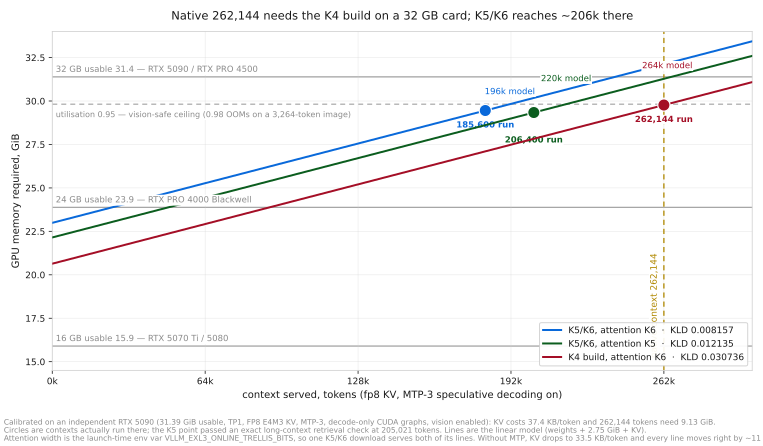

# Qwen3.8-27B EXL3 K5/K6 — lower divergence than official FP8 at 71 % of its memory

> **Requires a custom runtime.** This checkpoint does **not** load in upstream vLLM,
> SGLang, TensorRT-LLM, llama.cpp, transformers, or stock exllamav3. It needs the
> Gilded Gnosis vLLM fork (public image below), explicit `--quantization exl3`, an exact
> `ignore` list, and — for CUDA graphs — an as-yet-unmerged patch
> ([PR #314](https://github.com/local-inference-lab/vllm/pull/314)). Treat it as an
> experimental, runtime-specific research artifact.

Mixed-precision EXL3 quant of [`Qwen/Qwen3.8-27B`](https://huggingface.co/Qwen/Qwen3.8-27B)
@ `1d4bf0f2ff6012fd82039f2fa52739d0dd7c60c0`.

**Headline evidence:** on a 10,480,640-position held-out suite (5,120 contexts, 842 source
clusters, calibration-overlapping documents excluded before selection), this build's mean
KL divergence from BF16 is **0.003210** [0.002982, 0.003480] against official FP8's
**0.005294**, with **97.52 %** top-1 agreement, and it diverges less on **5,105 of 5,120**
paired contexts — while holding 8.2 GiB less weight. Its
[hydrated sibling](https://huggingface.co/malaiwah/Qwen3.8-27B-EXL3-K5K6-hydrated) is better
still, by 0.000450 on 4,922 of 5,120 contexts. [Details and limits](#fidelity).

| role | representation |
|---|---|
| MLP `gate_proj`, `up_proj` (64 layers) | EXL3 **K5**, `mcg` |
| MLP `down_proj` (64 layers) | EXL3 **K6**, `mcg` |
| attention: `linear_attn.{in_proj_qkv,in_proj_z,out_proj}` ×48, `self_attn.{q,k,v,o}_proj` ×16 | **BF16 on disk**, encoded to **K6 at load** by the runtime's Trellis overlay — and **K5 or K4 instead, from the same download**, by one env var ([table](#attention-width-is-a-runtime-knob-and-native-context-needs-the-k4-build)) |
| `lm_head` | EXL3 **K6**, `mcg` |
| MTP draft head | **quantized** (attention K4, MLP K5/K6) |
| `embed_tokens`, vision tower (27 blocks), norms | BF16 |
| GatedDeltaNet `in_proj_a` / `in_proj_b` (96) | **FP16** passthrough (exllamav3 emits FP16 for unquantized linears; more mantissa than BF16, less range) |

`quantization_manifest.json` and `build-receipt.json` in this repo are authoritative for
composition. **`SHA256SUMS` covers the immutable payload only** — the four shards, the index,
the configs, the tokenizer and preprocessor files: 17 files, 30,597,223,337 bytes.
Documentation that changes with card edits (`README.md`, `.gitattributes`, `assets/**`) is
listed separately in `DOCS-SHA256SUMS`, because a hash map that claims to describe a build
must not move when prose does. An earlier revision mixed the two, listed a `crc32.txt` that
does not exist, and carried stale hashes for two files. The legacy `config.json → quantization_config` block keeps a single
`bits`/`codebook` pair for loader compatibility and **cannot** describe this mixed
checkpoint.

**A rebuild of this recipe is a sibling, not this checkpoint.** The published bytes are the
artifact: the recipe fixes composition, widths and byte budget exactly, and it does not fix the
weights. That was measured on the hydrated sibling's recipe, which comes out of the same
converter. A fresh conversion returned **13 of 16 pinned payload files identical** — every config,
the tokenizer, the index and both quantization descriptors — with byte-identical shard headers,
the same tensor names, dtypes, shapes and offsets, and the same per-role byte totals and assigned
widths, while **399 of the 409 quantized modules (97.6 %) differed inside their `.trellis`
payloads, at 41-92 % of the bytes each (mean 82 %)**. No scale, norm, embedding, vision or BF16
companion tensor moved. The converter is nondeterministic and that was measured, not inferred:
two runs of one conversion, minutes apart, agreed on every width and global scale and disagreed on
the converter's own `proxy_err`
([`receipts/converter-determinism.json`](https://github.com/malaiwah/qwen38-27b-exl3/blob/main/receipts/converter-determinism.json)).
So a rebuild is a different valid artifact of the same recipe, not a broken one — and every
fidelity number on this card, which measures the published bytes a downloader receives, is
unaffected. And "rebuild this and you get these numbers" is no longer an untested expectation. A
third conversion of that hydrated recipe — a sibling again, differing in 399 `.trellis` payloads
and nothing else — was captured and replayed on the identical v5 shard-0 protocol (512 contexts,
1,048,064 scored positions, same shared head, same comparator): paired against the published
checkpoint the difference is **−3.755e-06, 95 % source-cluster bootstrap interval
[−2.854e-05, +2.062e-05]**, which **brackets zero**, on **257 contexts to 255 with no ties**. Two
controls make that attributable to the sibling's weights rather than to the harness — replaying
the published checkpoint against the same reference capture returned its mean and all 512
per-context rows bitwise, and a fresh recapture reproduces that mean exactly — so the comparison's
floor is zero, not a tolerance. **97.6 % of the quantized modules come back with different bytes
and the fidelity is the same to within our resolution**, which is what turns "the recipe is the
reproducible thing, the bytes are the artifact" into a measurement rather than a hedge. It is one
sibling, one recipe, one shard, at this protocol's resolution: it bounds the converter's fidelity
variance, it does not estimate it, and it is not a finding that converter nondeterminism is
fidelity-neutral in general
([`receipts/sibling-rebuild-fidelity.json`](https://github.com/malaiwah/qwen38-27b-exl3/blob/main/receipts/sibling-rebuild-fidelity.json)).
Practically: check the digest of the published tree against `SHA256SUMS`
rather than against your own conversion, and read a byte diff below this floor as the converter
rather than as tampering, corruption or a changed recipe. The same run also showed the recorded
build environment is incomplete — the pinned image has no `marisa_trie`, which the conversion
imports on an unconditional path, so that image provably could not have finished the job; the
conversion-capable image is `gg-r34-convert`. None of this touches the runtime's
weight-reconstruction path (`reconstruct+hgemm`, `reconstruct_fp8_slice`, reconstructed prefill),
which is a different sense of the word: that one is about turning stored trellis bytes back into
weights at load, and it is untouched here.

## Which of the four builds

Same architecture and tokenizer. The headline KLD column is the **v5 held-out suite
(5,120 contexts / 10,480,640 scored positions)**; the older overlap-corrected 127-context
v3 subset is kept beside it because the rest of this card's fidelity history is stated in it.
The two columns are different suites and are not comparable to each other.
Capacity uses each card's documented profile: hydrated, online and K4 are real RTX
5090 MTP-3 tests; context is MTP-3 with an 8.4 MP cap, qualified on a physical RTX 5090 at
utilisation 0.955.
These profiles are not interchangeable
([collection](https://huggingface.co/collections/qwen38-27b-mixed-precision-exl3-measured-6a7fe0cb27817c23e4a57025)).

<picture>
  <source media="(prefers-color-scheme: dark)" srcset="assets/context-frontier-dark.svg">
  
</picture>

*The figure plots the legacy v3 corrected means. The v5 ordering below is identical.*

| build | download | resident | v5 mean KLD | v3 corrected (legacy) | context profile | pick it when |
|---|---:|---:|---:|---:|---:|---|
| [-hydrated](https://huggingface.co/malaiwah/Qwen3.8-27B-EXL3-K5K6-hydrated) | 21.61 GB | 20.31 GiB | **0.002760** | 0.007172 | ~180k | fidelity first, smallest download |
| [-EXL3-K5K6](https://huggingface.co/malaiwah/Qwen3.8-27B-EXL3-K5K6) | 30.60 GB | 20.32 GiB | 0.003210 | 0.007945 | ~180k | you want the attention width knob at launch |
| [-context](https://huggingface.co/malaiwah/Qwen3.8-27B-EXL3-K5K6-context) | 20.70 GB | **18.41 GiB** | 0.003509 | 0.009459 | **262,144, MTP-3, 8.4 MP cap** | native window, hardware-qualified on a physical RTX 5090 |
| [-K4](https://huggingface.co/malaiwah/Qwen3.8-27B-K4) | 28.31 GB\* | 17.89 GiB | 0.010604 | 0.029679 | 262,144 | smallest footprint, native context without any overlay |

**Byte and memory conventions for this table.** The download column is whole-tree bytes —
every published file of the artifact as its release evidence counted it
([`receipts/collection-index.json`](https://github.com/malaiwah/qwen38-27b-exl3/blob/main/receipts/collection-index.json),
`serialized_bytes.whole_tree_bytes`: hydrated 21,610,933,884 B, this build 30,597,231,933 B,
context 20,696,053,306 B) — and they are serialized bytes on disk, never resident memory.
\*The K4 release evidence records no tree count, so that one row is the sum of its safetensors
shards, 28,313,841,196 B, read from the published repository. The context edition's resident
weight is measured twice: **18.41 GiB** as run on the rental RTX PRO 6000 engine-budget proof
and **18.19 GiB** on the physical RTX 5090 at the qualified `0.955` profile. This table prints
the larger figure deliberately, because
[`receipts/vram-class-verdict.json`](https://github.com/malaiwah/qwen38-27b-exl3/blob/main/receipts/vram-class-verdict.json)
elects 18.41 GiB for every class prediction; the 0.22 GiB gap is the rental-versus-5090 delta,
not a change in the checkpoint.

Official `Qwen/Qwen3.8-27B-FP8` is 28.51 GiB resident at **0.005294** on the v5 suite
(0.012798 on the v3 subset) and runs on stock vLLM, which none of these do.

## Measured results

**30.60 GB download → 20.32 GiB (21.82 GB) resident weights**, measured from the engine's
own allocation log, versus 28.51 GiB for official FP8 and 21.34 GiB for Unsloth NVFP4
under identical flags.

## Fidelity

The headline evidence for this build is the **v5 held-out run: 5,120 contexts x 2,047
scored positions = 10,480,640 full-vocabulary positions**, with five candidates scored
against the same BF16 reference. It supersedes the 136-context v3 development suite and the
36-context v4 qualification as the primary result. Both are preserved below with their
numbers untouched — this section adds evidence, it does not revise theirs.

<picture>
  <source media="(prefers-color-scheme: dark)" srcset="assets/kld-all-measurements-dark.svg">
  
</picture>

*The widest single view of the evidence: **A** is the only panel where every family appears
together (v5 shard 0, 512 contexts, 1,048,064 positions, nine candidates — this build is the
`online` circle at 0.003141), **B** is the same suite's 1M → 10M ladder (five vLLM builds, 5,120
contexts at 10M), **C1/C2** are the superseded corrected v3 (127 contexts, 259,969 positions) and
the source-disjoint v4 (36 contexts, 73,692 positions) on separate y-axes behind a barrier, and
**D** is turboderp's own published protocol (OpenWebText, 65,536 positions), which we have never
run. Two rules travel with the figure: the cross-engine floor belongs to the llama.cpp rows only,
and no ratio across panels means anything. Generated by
[`tools/make_master_kld_chart.py`](https://github.com/malaiwah/qwen38-27b-exl3/blob/main/tools/make_master_kld_chart.py),
which reads every one of our values from `receipts/` at runtime.*

**These numbers are re-derivable, not merely re-runnable.** 5,240,320 scored positions — five
candidates x 512 contexts x 2,047 positions — reproduce **bit-for-bit** across independent runs
with separate model loads and different harness generations: every measured field identical,
including the complete per-context arrays and the whole bootstrap block, with only the capture
directory paths and the additively-added tail histogram differing
([`receipts/capture-determinism.json`](https://github.com/malaiwah/qwen38-27b-exl3/blob/main/receipts/capture-determinism.json)),
and a third harness generation's unwindowed `--score-from 0` control returns the same shard-0
means to the last digit
([`receipts/scored-window-offset.json`](https://github.com/malaiwah/qwen38-27b-exl3/blob/main/receipts/scored-window-offset.json)).
The scope is part of the claim and travels with it: one GPU, one driver, one pinned rootfs,
`enforce_eager=True`, `max_num_seqs=1`, one context per forward, 512 MiB bf16 KV. It is **not** a
claim that vLLM is bitwise deterministic in general — nothing here covers CUDA graphs,
`max_num_seqs > 1`, chunked prefill with more than one chunk per context, other GPUs or drivers, or
anything downstream of the logits.

### Suite identity

`receipts/kld5-suite-manifest.json`, schema `qwen38-distribution-fidelity/6`, suite token
digest `510541f6861b589d44932db253ec25d96d6daaeeee4ea2ab9b65329209482b88`. 5,120 contexts,
2,047 scored positions each, **842 source clusters**. The corpus is 941 documents /
70,348,971 bytes fetched by `tools/fetch_corpus_v5.py`, logged in
[`receipts/kld5-corpus-fetch-log.json`](https://github.com/malaiwah/qwen38-27b-exl3/blob/main/receipts/kld5-corpus-fetch-log.json).

**Exclusion policy — contamination is zero by construction, not by audit.** Every discovered
document was scanned at every position for exact normalized 12-token overlap against the
exllamav3 calibration data **before** context selection, and any document with even one hit
was dropped whole: **44 of 941 documents excluded (43 code, 1 encyclopedic), 897 eligible**.
There is therefore nothing to correct after the fact and no "overlap-corrected subset" on
this suite — unlike the v3 numbers below, which needed one.

The suite is **token-disjoint from the v4 qualification suite** (0 of its 160 prior context
hashes is reachable), and its windows are exact-advance and non-overlapping: independently
verified as 5,120/5,120 unique context token hashes with 0 overlapping windows.

### Cumulative means at 10,480,640 positions

Body-only. Both operands replay through **one shared BF16 LM head**, so no candidate's head
quantization is counted and the five rows are comparable to each other.

| candidate | mean KLD | bootstrap 95 % CI | top-1 | max single position |
|---|---:|---|---:|---:|
| [hydrated](https://huggingface.co/malaiwah/Qwen3.8-27B-EXL3-K5K6-hydrated) | **0.002760** | [0.002540, 0.003020] | 97.70 % | 8.258 |
| **this build** (online K5/K6, attention K6) | **0.003210** | [0.002982, 0.003480] | **97.52 %** | 22.241 |
| [context edition](https://huggingface.co/malaiwah/Qwen3.8-27B-EXL3-K5K6-context) | 0.003509 | [0.003220, 0.003852] | 97.44 % | 5.557 |
| `Qwen/Qwen3.8-27B-FP8` | 0.005294 | [0.004927, 0.005728] | 96.79 % | 10.714 |
| [`malaiwah/Qwen3.8-27B-K4`](https://huggingface.co/malaiwah/Qwen3.8-27B-K4) | 0.010604 | [0.009640, 0.011746] | 95.76 % | 14.283 |

**This build sits 39 % below official FP8 on mean KL divergence and above it on top-1.**
Its maximum single-position divergence, 22.241, is the worst of the five — a tail property
that the mean does not show; the [distribution tail](#distribution-tail) below measures the
rest of that tail on one shard, and every quantile of it sits below official FP8's.

Per-candidate receipts are `receipts/kld5-10M-{hyd,k5k6,ctx,fp8,k4}.json`
([this build](https://github.com/malaiwah/qwen38-27b-exl3/blob/main/receipts/kld5-10M-k5k6.json)),
schema `qwen38-kld-ladder-cumulative/2`, built by `tools/kld_aggregate.py` from ten verified
per-shard reports produced by `tools/kld_ladder.sh`: capture six models over 512 contexts,
replay five candidates, verify, delete 64 GB of hidden states, next shard.

### Paired per-context differences

Bootstrap over 10,000 resamples, seed 1, 842 source clusters, receipt
[`receipts/kld5-10M-paired.json`](https://github.com/malaiwah/qwen38-27b-exl3/blob/main/receipts/kld5-10M-paired.json).
Negative means the first term diverges less.

| pair | mean difference | 95 % CI | contexts where the first term is lower |
|---|---:|---|---:|
| **this build - official FP8** | **-0.002084** | [-0.002249, -0.001942] | **5,105 / 5,120** |
| hydrated - this build | **-0.000450** | [-0.000469, -0.000433] | **4,922 / 5,120** |
| hydrated - FP8 | -0.002534 | [-0.002708, -0.002383] | 5,118 / 5,120 |
| context edition - FP8 | -0.001785 | [-0.001884, -0.001697] | 5,109 / 5,120 |
| K4 - FP8 | +0.005310 | [+0.004710, +0.006019] | 7 / 5,120 |

**Versus official FP8 this is settled:** lower divergence on 5,105 of 5,120 contexts, with a
paired CI far from zero, while holding 8.2 GiB less weight.

**Versus the hydrated sibling it is also settled, and this build loses.** Same K5/K6 recipe,
attention encoded ahead of time instead of at load, 20.31 against 20.32 GiB resident:
hydrated is lower by **0.000450** on average
[-0.000469, -0.000433] and lower on **4,922 of 5,120 contexts (96.1 %)**. The margin is
small — about 14 % of this build's mean, and below the ~6.5e-04 live-vs-replayed
qualification floor quoted for the older harness, so it is a robust ordering of the replayed
captures rather than a promise of a perceptible difference in serving. But it is consistent,
one-directional and no longer in question. Choose this build for the **launch-time attention
width knob** and the ~206k demonstrated context that comes with K5 attention; choose
[hydrated](https://huggingface.co/malaiwah/Qwen3.8-27B-EXL3-K5K6-hydrated) for the last
fraction of fidelity and a 9 GB smaller download. Nothing else separates them.

### Ladder stability

The run was aggregated at 1M / 2M / 5M / 10M scored positions. For the hydrated candidate,
carried through all four checkpoints, the cumulative mean reads **0.002700 / 0.002759 /
0.002699 / 0.002760** — a spread of 6.1e-05 across a tenfold increase in scored positions.
The headline numbers are not an artifact of where the run stopped.

### Distribution tail

A mean and a top-1 rate say nothing about the worst positions, and one exact maximum is not a
tail either. This is the whole right tail, measured on **shard 0 of the same suite — 512
contexts, 1,048,064 scored positions** — the identical contexts for all five candidates.
Receipts [`receipts/kld5-1M-tail-{hyd,k5k6,ctx,fp8,k4}.json`](https://github.com/malaiwah/qwen38-27b-exl3/tree/main/receipts),
schema `qwen38-kld-ladder-cumulative/2`, built by `tools/kld_aggregate.py`; this build's row is
[`receipts/kld5-1M-tail-k5k6.json`](https://github.com/malaiwah/qwen38-27b-exl3/blob/main/receipts/kld5-1M-tail-k5k6.json).

| candidate | mean | p50 | p95 | p99 | p99.9 | p99.99 | exact max | share of positions above 0.1 | above 1.0 |
|---|---:|---:|---:|---:|---:|---:|---:|---:|---:|
| hydrated | 0.002700 | 0.00109 | 0.0082 | 0.0276 | 0.1319 | 0.463 | 3.735 | 0.1534 % | 0.00219 % |
| **this build** (online K5/K6) | **0.003141** | **0.00128** | **0.0099** | **0.0321** | **0.1446** | **0.498** | **5.507** | **0.1820 %** | **0.00200 %** |
| context | 0.003409 | 0.00135 | 0.0107 | 0.0357 | 0.1642 | 0.587 | 3.749 | 0.2287 % | 0.00305 % |
| official FP8 | 0.005197 | 0.00202 | 0.0167 | 0.0531 | 0.2438 | 0.812 | 5.296 | 0.3912 % | 0.00592 % |
| K4 | 0.010345 | 0.00320 | 0.0332 | 0.1194 | 0.5555 | 1.870 | 7.565 | 1.2604 % | 0.03807 % |

**Method, in one sentence:** every `qwen38-fidelity-report/2` replay accumulates a **560-bin
log-spaced histogram of per-position KLD** (`KLD_HIST_LOG10_LOW=-12.0`,
`KLD_HIST_LOG10_HIGH=2.0`, `KLD_HIST_BINS_PER_DECADE=40` in `tools/fidelity.py`) whose bin
counts add across shards, which is what makes cumulative quantiles possible at all.

**What it says for this build.** The ordering at p50, p95, p99, p99.9 and p99.99 is the same
as the ordering of the means, so the mean is not hiding a worse tail. This build's tail is
**below official FP8's at every measured quantile** — 0.0321 against 0.0531 at p99, 0.1446
against 0.2438 at p99.9, 0.498 against 0.812 at p99.99 — and it has the **smallest share of
positions above 1.0 of the five**, 21 positions in 1,048,064 against FP8's 62. It stays
behind the hydrated sibling everywhere in the same ordering the means report. The exact
maximum is the one place it does not lead: 5.507 on this shard, just above FP8's 5.296, and
22.241 over the full ten-shard run — a single position, with 0.00200 % of positions above 1.0
behind it.

**Scope, stated exactly:**

- This is one 1,048,064-position shard, not the full 10,480,640-position run. The ten-shard
  run predates the histogram, so it could not be recomputed without re-running it.
- The quantiles are **bin-bounded, not exact**: each receipt carries `lower` / `upper` /
  `estimate` per quantile, with a relative bin width of about 5.6 %. The **maxima and the
  exceedance counts are exact**.
- The 10M receipts remain the source for the full-run means, intervals and paired results;
  nothing here replaces them.

### What the v5 numbers do not say

- **Absolute KLD is suite-specific.** v5 values are **not** comparable to the v3 values in
  the next section: the corpus mix differs, and K4 reads 0.029679 there against 0.010604
  here. Only within-suite ordering and paired differences transfer between the two.
- **Cumulative percentiles come from one shard, not from all ten.** The ten shard reports of
  the 10M run carry no token-level KLD histogram, so median/p95/p99/p999 could not be
  recombined across them. The [tail table above](#distribution-tail) closes that gap on
  **shard 0** (`receipts/kld5-1M-tail-*.json`); across all 10,480,640 positions only the
  means, the intervals, the paired results and the **exact global maximum** exist.
- **Captures: the reference survived, the candidates did not.** The five candidates' hidden states
  and the BF16 references for shards 1-9 were deleted shard by shard to fit 135 GB of scratch, so
  unlike the [v3 dataset](https://huggingface.co/datasets/malaiwah/qwen38-27b-fidelity-suite-v3)
  this run is recomputable from the pinned corpus fetch log and suite manifest. The **shard-0 BF16
  reference was kept and is published**, with the suite, all ten shard views and 79 per-shard
  reports, so a new candidate can be scored against the identical contexts without recapturing the
  reference — see [Reproduce this](#reproduce-this).

## Against GGUF, measured on our suite

The standing objection to this card's headline is that official FP8 is a throughput format whose
quality is Q4-to-Q5 class, so beating it is a weak claim, and that llama.cpp's `Q8_0` and `Q6_K`
are the honest bar. That is now measured rather than argued.

Three GGUFs from `unsloth/Qwen3.8-27B-GGUF@f1bfb127c64f7072bdd2cad55f258b9c8b2910fe` were
captured under **llama.cpp pinned at commit `ece963f41b0b02d7a0d61436ae365762c073a4c8`** with
[`tools/gguf_capture.cpp`](https://github.com/malaiwah/qwen38-27b-exl3/blob/main/tools/gguf_capture.cpp),
which reads the **post-final-norm** state — the same mathematical point the vLLM hook takes, with
bf16 rounding verified bit-identical to torch on 2,012,449 probe values — and scored against the
same BF16 teacher through **the same shared BF16 head**, on **shard 0 of the v5 suite: the same
512 contexts and the same 1,048,064 scored positions every row below saw**. Manifests come from
[`tools/gguf_manifest.py`](https://github.com/malaiwah/qwen38-27b-exl3/blob/main/tools/gguf_manifest.py)
and each one carries the GGUF blob digest and the llama.cpp identity; the build script is
[`tools/build_llamacpp.sh`](https://github.com/malaiwah/qwen38-27b-exl3/blob/main/tools/build_llamacpp.sh).
Receipt
[`receipts/cross-engine-comparator.json`](https://github.com/malaiwah/qwen38-27b-exl3/blob/main/receipts/cross-engine-comparator.json),
per-candidate reports
[`receipts/gguf-report-{q8_0,q6_k,q5_k_xl}.json`](https://github.com/malaiwah/qwen38-27b-exl3/tree/main/receipts).

<picture>
  <source media="(prefers-color-scheme: dark)" srcset="assets/kld-family-comparison-dark.svg">
  
</picture>

| candidate | engine | measured mean KLD | net of engine floor | top-1 | p99.9 | serialized |
|---|---|---:|---:|---:|---:|---:|
| GGUF `Q8_0` | llama.cpp | 0.001087 | ~0.000579 | 98.53 % | 0.0351 | 27.05 GiB |
| GGUF `Q6_K` | llama.cpp | 0.002035 | ~0.001528 | 97.98 % | 0.0794 | 21.31 GiB |
| hydrated | vLLM | 0.002700 | n/a, same engine | 97.80 % | 0.1313 | 20.12 GiB payload |
| **this build** (online K5/K6, attention K6) | vLLM | **0.003141** | n/a, same engine as the reference | **97.61 %** | **0.1447** | **—** |
| context edition | vLLM | 0.003409 | n/a, same engine | 97.55 % | 0.1632 | 19.27 GiB payload |
| GGUF `UD-Q5_K_XL` | llama.cpp | 0.004444 | ~0.003936 | 97.20 % | 0.2144 | 18.83 GiB |
| official FP8 | vLLM | 0.005197 | n/a, same engine | 96.92 % | 0.2440 | 28.51 GiB resident |
| K4 | vLLM | 0.010345 | n/a, same engine | 95.91 % | 0.5576 | — |
| `unsloth/Qwen3.8-27B-NVFP4` @ `9c73e2da` | vLLM | 0.030115 | n/a, same engine | 93.16 % | 1.6228 | — |

**The engine floor, measured and not assumed.** A GGUF row carries llama.cpp-versus-vLLM numerics
on top of quantization error, so that term was measured the same way: the unquantized **BF16
GGUF** against the vLLM BF16 reference, identical token ids, the same shared head, the same 512
contexts — **0.000507** mean, 99.07 % top-1, p99.9 0.0113
([`receipts/gguf-report-engine-floor.json`](https://github.com/malaiwah/qwen38-27b-exl3/blob/main/receipts/gguf-report-engine-floor.json)).
Every GGUF row above contains that term; no vLLM row — ours or FP8's — does. **KL is not additive,
so the net column is an estimate, not an identity**: the measured GGUF value is an upper bound and
the net figure is the naive lower one.

**The p99.9 column, and why it differs from the tail table above.** These p99.9 values are each
report's **exact** shard-0 p99.9 as the comparator receipt read them; the
[tail table above](#distribution-tail) quotes the **bin-bounded cumulative estimate** from the
560-bin histogram, whose bins are about 5.6 % wide — this build reads 0.1446 there and 0.1447 here,
and the exact value lies inside the bin the estimate names. The two differ by construction, not by
measurement.

**Why two serialized cells read `—`, and they are not the same reason.** This download ships
attention in BF16 for the runtime to encode at load (30.60 GB on disk, 20.32 GiB resident), so its
disk bytes are not a like-for-like payload against a GGUF file and are not presented as one; NVFP4's
cell is empty because we publish no serialized-byte receipt of our own for a third party's
checkpoint, and its 21.34 GiB is measured resident weights, a different quantity. The two payload
figures that are comparable are `immutable_payload_bytes` from
[`receipts/collection-index.json`](https://github.com/malaiwah/qwen38-27b-exl3/blob/main/receipts/collection-index.json)
(hydrated 21,610,916,123 B = 20.127 GiB, context edition 20,696,033,532 B = 19.275 GiB; the table
truncates both to two decimals); they are serialized bytes, never
VRAM. The FP8 figure is resident weights and is labelled as such. The K5/K6 row above is this build
at its **default attention width, K6**; the K5 and K4 launch widths trade fidelity for KV room
([knob](#attention-width-is-a-runtime-knob-and-native-context-needs-the-k4-build)) and were not
measured against these GGUFs.

**NVFP4 on the identical shard, and it carries no cross-engine term.**
`unsloth/Qwen3.8-27B-NVFP4` at revision `9c73e2da` is served by **the same vLLM build as our
rows**, so unlike the GGUF rows there is no engine term to subtract or estimate and it is directly
comparable to this build. On the same 512 contexts and the same 1,048,064 positions, through the
same shared BF16 head, it measures **0.030115** mean KLD, 95 % CI [0.027637, 0.032965], **93.16 %**
top-1, median 0.009584, p95 0.10051, p99 0.33546, p99.9 **1.6228**, exact worst position 10.6285 and
mean JSD 0.010104 bits
([`receipts/kld5-1M-nvfp4.json`](https://github.com/malaiwah/qwen38-27b-exl3/blob/main/receipts/kld5-1M-nvfp4.json),
with the run's own account in
[`receipts/nvfp4-v5-measurement.json`](https://github.com/malaiwah/qwen38-27b-exl3/blob/main/receipts/nvfp4-v5-measurement.json)).
That is **9.6x this build's 0.003141**, 2.9x K4 at the same 4-bit weight class, 5.8x official FP8,
8.8x the context edition, 11.2x the hydrated sibling and 27.7x `Q8_0` as measured; its p99.9 of
1.6228 is 11.2x this build's 0.1447.

**Paired per context, which is a stronger statement than any ratio of means: NVFP4 loses every one
of 512 contexts, against both comparators it was paired against.** +0.026706 against the context
edition (95 % CI [+0.024465, +0.029285], **0 wins to 512**) and +0.024918 against official FP8
([+0.022756, +0.027424], **0 wins to 512**) — not one context anywhere in the shard where it is the
better of the pair
([`receipts/kld5-1M-paired-nvfp4.json`](https://github.com/malaiwah/qwen38-27b-exl3/blob/main/receipts/kld5-1M-paired-nvfp4.json)).
It was not paired against this build, so its distance from this row stays a ratio of means and is
not presented as a win count.

**Where this build sits, without spin.** It **loses the 6-bit comparison**: `Q6_K` reads 0.002035
measured and ~0.001528 net of the floor at 21.31 GiB against this build's 0.003141 — about **51 %
lower divergence** net, and still **35 %** lower on the measured value that includes the
cross-engine term, so no treatment of that term rescues this build there. Our own hydrated sibling
beats it too, at 0.002700, which is what serializing attention offline buys. What this build does
win on this shard: `UD-Q5_K_XL`, whose net 0.003936 at 18.83 GiB is **25 % higher divergence** than
this build's — equivalently this build is **20 % below** it — and official FP8, which it sits
**40 % below** at 28.51 GiB resident. Its tail agrees with its mean: p99.9 **0.1447**, lighter than
`UD-Q5_K_XL`'s 0.2144 and FP8's 0.2440, heavier than `Q6_K`'s 0.0794. `Q8_0` leads everything at
27.05 GiB.

**The two conclusions worth stating plainly:**

1. **At the 6-bit operating point GGUF `Q6_K` is genuinely better than our best build** —
   0.001528 net at 21.31 GiB versus the hydrated sibling's 0.002700 at 20.12 GiB of payload, and
   further ahead of this build's 0.003141. It is the first measurement in this project where an
   off-the-shelf artifact beats the recipe, and it is published as such.
2. **At the 5-bit operating point our context edition wins** — 0.003409 at 19.27 GiB against
   `UD-Q5_K_XL`'s 0.003936 net at 18.83 GiB, about 13 % better fidelity for **0.445 GiB** more
   payload.

So the format advantage at this bitrate is real at 5 bits, negative at 6 bits, and far short of a
full bit. Two further readings that are not flattering: **`Q8_0` is the fidelity leader** at
0.001087 for 27.05 GiB, and its measured value is only about twice the engine floor, so its own
number sits near the resolution limit of any cross-engine comparison — the net column is an
estimate, not an identity, so **no ordering closer than a factor of two should be pressed against
`Q8_0`**; and **every GGUF point at or
above 5 bits beats official FP8**, which makes this card's "lower divergence than official FP8"
claim true and a weaker achievement than it sounds. **K4 is the weakest of our own builds here, and
Unsloth's NVFP4 — measured on the identical shard, in the same engine — is 2.9x weaker still.**

**What this comparison does not settle.** It is text-only teacher-forced fidelity on one shard of
ten. It says nothing about serving 262,144 tokens with vision and MTP on a 32 GB card, which is
where these artifacts actually differ, and llama.cpp KV-quant behaviour, prefill and decode speed
are separate axes that were not measured here. The GGUF rows are a shard-0 ranking, not a paired
per-context bootstrap against the ten-shard rows in [Fidelity](#fidelity), because those were
welded from a different position count. Shard 0 is one tenth of the suite, and it is close to it: over all 10,480,640 positions the five vLLM
means read 0.002760 / 0.003210 / 0.003509 / 0.005294 / 0.010604 — **1.9-2.9 % above** these shard-0
values, ordering unchanged (`receipts/kld5-10M-{hyd,k5k6,ctx,fp8,k4}.json`). The GGUFs have no
ten-shard equivalent; extending them is unrun.

**One protocol objection, bounded rather than argued.** `llama-perplexity` scores only the second
half of each window, so every position it scores has at least 256 tokens of left context, while our
suite scores from position 0. Re-scoring our own captures under that restriction lowers every
candidate's mean by **1.3-2.1 %** at a 256-token floor and **3.9-4.9 %** second-half-only,
uniformly enough to change no ordering — this build reads 0.003100 and 0.003020 respectively
([`receipts/scored-window-offset.json`](https://github.com/malaiwah/qwen38-27b-exl3/blob/main/receipts/scored-window-offset.json)).
The external protocol's scoring floor therefore explains at most about 5 % of any cross-protocol
gap, and nothing in the ordering above.

### Cross-citation: the same three GGUFs under llama.cpp's own protocol

The rows above are those GGUFs on **our** axis. They have also been measured on **theirs**, run
exactly as its authors run it, so the two can be cited side by side without either being converted
into the other: `llama-perplexity --kl-divergence` on **WikiText-2 raw test**, `n_ctx` 512,
**147,900 scored positions**, `KL(BF16 GGUF ‖ candidate)` with both operands inside llama.cpp and
each candidate's **own output head inside the measured path**, base `Mean PPL 6.950230 ± 0.044933`
([`receipts/wikitext-kld-run-a.json`](https://github.com/malaiwah/qwen38-27b-exl3/blob/main/receipts/wikitext-kld-run-a.json);
full protocol, delta by delta, in
[`docs/35-external-protocol-comparability.md`](https://github.com/malaiwah/qwen38-27b-exl3/blob/main/docs/35-external-protocol-comparability.md)).

| quant | their protocol, their corpus | their top-1 | ours, net of the engine floor | theirs ÷ ours-net |
|---|---:|---:|---:|---:|
| `Q8_0` | 0.000926 ± 0.000042 | 98.761 % | ~0.000579 | 1.60x |
| `Q6_K` | 0.002286 ± 0.000108 | 97.875 % | ~0.001528 | 1.50x |
| `UD-Q5_K_XL` | 0.004426 ± 0.000167 | 97.178 % | ~0.003936 | 1.12x |

**The ordering is identical on both axes**, and the level difference is protocol rather than
disagreement about which quantization is better: their number is pushed down by scoring only the
second half of each window, by a single English corpus and by dropping base-side terms below
`log p ≤ −16`, and pushed up — this is the large one — by having the candidate's own output head
inside the measured path, while both of our operands go through one shared BF16 head. Only our
number carries a cross-engine term, which is why the honest comparison is against our net column.

**Their harness's own floor, measured on our hardware instead of assumed.** The `Minimum KLD`
column is negative for all three — −0.000080, −0.000056, −0.000077, i.e. **5.6e-5 to 8.0e-5** — the
uint16 16-nat log-probability encoding showing through rather than a candidate beating its own
reference. The same term appears in the perplexity: 6.9525 in the capture log against 6.950230 in
the scoring runs, identical weights on identical tokens, differing only by that stored round trip.

**Tokenization is not part of the difference, and that is a measured null result.** llama.cpp's
GGUF BPE and our Hugging Face tokenizer produce **bit-identical 297,194-token streams** over this
corpus — same int32 digest, no first divergence index — and the 296,960-token prefix that
`llama-perplexity` actually scores is identical too
([`receipts/wikitext-kld-token-identity.json`](https://github.com/malaiwah/qwen38-27b-exl3/blob/main/receipts/wikitext-kld-token-identity.json)).

**And one finding worth its own line: perplexity does not reproduce the KLD ordering.** `Q6_K` has
the *smallest* PPL delta of the three, **+0.00079** against the 6.950230 base, while `Q8_0` — the
better quant by every divergence statistic, including a mean 2.5x lower and 0.9 points more top-1
agreement — is **+0.00467**. A quantization that shifts the distribution can shift it in the
direction that happens to flatter a corpus mean, which is an argument for the metric this whole
section is built on and against ranking quants by perplexity delta.

What this cross-citation cannot do is put **this** build on their axis: `llama-perplexity` cannot
read an EXL3 checkpoint. The table at the top of this section, where every candidate is scored by
one harness on one suite, stays the primary comparison.

## Prior receipt: v3 development suite (136 contexts, 278,392 positions)

Superseded as the headline by the v5 run above; kept because every earlier claim on this card,
including the as-served head cost and the attention-width ladder, is stated on this suite.

<picture>
  <source media="(prefers-color-scheme: dark)" srcset="assets/fidelity-vs-size-dark.svg">
  
</picture>

*The figure's four points and four top-1 values are the overlap-corrected 127-context subset;
the table below is the original full 136-context receipt, which is why 96.95 / 96.18 / 94.48 /
90.49 % there reads 96.97 / 96.22 / 94.50 / 90.53 % here.*

`KL(BF16 reference ‖ candidate)`, two passes, no top-k, float32 within vocabulary chunks
accumulated in float64 across chunks, one shared BF16 LM head for both operands,
source-cluster bootstrap. Corpus is separately sourced Gutenberg / arXiv / Wikipedia /
CPython. The builder requested nine Wikipedia languages but tolerated under-filled strata, so
the **frozen suite is English, German and Russian only** (the multilingual stratum is 6 German
and 1 Russian context). Its fixed-stride 160-character scan originally reported zero calibration
hits; an offset-independent 12-token scan later found exact overlap in 2/41 source documents.
The suite, shared BF16 head, sentinels, comparator captures and this checkpoint's captures are
published as a
[dataset](https://huggingface.co/datasets/malaiwah/qwen38-27b-fidelity-suite-v3).
The complete original 136-row report is under
`reports-k5k6/report-k5k6-online-k6-analysis.json`; its capture is under
`candidate-hidden/k5k6-online-k6/`.

| candidate | resident | mean KLD | bootstrap 95 % CI | median | p99.9 | top-1 |
|---|---:|---:|---:|---:|---:|---:|
| **this quant** | **21.82 GB** | **0.008157** | [0.00607, 0.01067] | 0.001529 | 0.475 | **96.97 %** |
| `Qwen/Qwen3.8-27B-FP8` | 30.61 GB | 0.013126 | [0.00981, 0.01709] | 0.002343 | 0.773 | 96.22 % |
| `malaiwah/Qwen3.8-27B-K4` (previous) | 19.21 GB | 0.030736 | [0.02238, 0.04073] | 0.004218 | 1.758 | 94.50 % |
| `unsloth/Qwen3.8-27B-NVFP4` | 22.91 GB | 0.094978 | [0.06858, 0.12688] | 0.012911 | 4.509 | 90.53 % |

**Overlap-corrected subset:** conservatively removing all nine analysis contexts from either
affected source document gives this quant **0.007945**, FP8 **0.012798**, K4 **0.029679**,
and NVFP4 **0.092727** over 127 contexts. The 38 % FP8 advantage and ordering survive. The
table above remains the original full-suite receipt, not a claim of zero lexical overlap.

**The v3 NVFP4 number is not our current one, and the two suites must never be mixed.** NVFP4 reads
**0.092727** on the corrected subset above and **0.030115** on v5 shard 0 — same checkpoint, same
revision, same flags, same shared-head protocol — and its v5 row is in the
[shard-0 table above](#against-gguf-measured-on-our-suite). That gap is suite hardness, measured for
all six candidates rather than argued: v3-corrected ÷ v5 shard 0 is **2.4625x** official FP8,
**2.5293x** this build, **2.6564x** hydrated, **2.7505x** the context edition, **2.8688x** K4 and
**3.0791x** NVFP4 — a band spanning **1.2504x** end to end, with the **ordering identical in both
suites**
([`receipts/nvfp4-v5-measurement.json`](https://github.com/malaiwah/qwen38-27b-exl3/blob/main/receipts/nvfp4-v5-measurement.json),
block `suite_comparability_v3_vs_v5`). A band of factors and not one factor is why no conversion
between the suites exists: the ordering carries across, an absolute value never does, and a v3
number must never appear in the same sentence as a v5 number.

Paired over the same contexts: **-0.004969** versus official FP8
(95 % CI [-0.00643, -0.00371], **136/136 contexts**), i.e.
**38 % lower mean KL divergence than FP8 while holding 8.8 GB less weight**;
and **-0.022579** versus the previous K4 release (136/136 contexts).

**Body-only versus as-served, measured on this v3 suite.** Every row above — and every row
in the v5 section — replays both operands through one shared BF16 head, so no candidate's
head quantization is counted; that is what makes them comparable. The only measurement of
what this build's own K6 head costs when served was made here, on the v3 suite, and has
**not** been repeated on v5. On the original 136-context receipt the K6 head adds +0.000127
(95 % CI [+0.000105, +0.000148]) for 0.008284 as served. On the overlap-corrected subset,
body-only is **0.007945** and the measured as-served result is **0.008078**
(+0.000132, 95 % CI [+0.000114, +0.000151], 7/127 contexts favour the quantized
head). Promoting the head to BF16 would cost **+1.589 GB**, so this checkpoint keeps K6.
That increment is a v3-suite quantity: it must not be added to the v5 means above, which
are a different suite.

Controls published with the dataset: runtime-repeat noise floor **0.000000** (three
captures of the same runtime) and harness self-check 0.000000. A third control,
"CUDA-graph parity 0.000000", was **withdrawn**: it captured a prefill forward, and
`FULL_DECODE_ONLY` captures no prefill graph, so it could not have measured the decode
path. Re-measured properly on real decode steps, graph and eager agree on 24/32 greedy
32-token sequences with mean |Δ logprob| 0.0118 on the chosen token; unquantised BF16
on this same build drifts identically (24/32, 0.0128), so this is a property of CUDA
graphs here and not of the quantisation.
**Weakest control:** live-vs-replayed logit qualification is 6.54e-04, so differences
below ~1e-3 are not resolvable with these artifacts. The FP8 gap is **7.6x** that floor
and the K4 gap **34.5x** it; the K6-head increment (0.000127) and the K5-vs-FP8 gap
(0.000991) are **at or below** it and are reported as unresolved point estimates, not
as established differences. The KLD magnitudes here are only comparable within this suite — thresholds from
other models, corpora or tokenizers do not transfer.

## Attention width is a runtime knob, and native context needs the K4 build

Attention weights ship in BF16 and are encoded to EXL3 Trellis **at load**, so the width is
a launch-time choice rather than a property of the download: `VLLM_EXL3_ONLINE_TRELLIS_BITS`
accepts 3-8. One checkpoint, several operating points.

<picture>
  <source media="(prefers-color-scheme: dark)" srcset="assets/context-per-card-dark.svg">
  
</picture>

**The width ladder was measured on the v3 suite only.** The v5 run scored this build at its
default K6 attention (0.003210); the K5 and K4 attention widths have not been rerun on v5, so
the three rows below are v3-suite quantities and belong beside 0.007945, not beside 0.003210.

| `VLLM_EXL3_ONLINE_TRELLIS_BITS` | resident weights | corrected v3 mean KLD | top-1 |
|---|---:|---:|---:|
| **6** (default) | 20.32 GiB | **0.007945** | 96.95 % |
| **5** | 19.82 GiB | 0.011801 | 96.28 % |
| **4** | 19.05 GiB | 0.026619 | 94.48 % |

On the same overlap-corrected 127 contexts, K5 costs **+0.003856** versus K6 and K4
costs **+0.018673**. K5's mean is 0.000997 below official FP8's corrected 0.012798 —
at this harness's ~1e-3 replay-resolution floor, so treat it as an unresolved point
estimate, not an advantage. The original 136-context width reports remain in the dataset.

### Measured on a real RTX 5090, by an independent tester

**Native 262,144 context does not fit this checkpoint on a 32 GB card.** An earlier revision
of this card claimed it did, from a memory simulation on a 96 GB card. That was wrong twice:
the simulation omitted MTP's KV (with `num_speculative_tokens: 3` the engine needs
**9.13 GiB** for 262,144 tokens, not 8.18) and it assumed 31.84 GiB usable where a 5090
reports **31.39**. Corrected, with hardware numbers (TP1, FP8 E4M3 KV, MTP-3, decode-only
CUDA graphs, vision enabled):

| attention | max seqs | util | KV attained | context | outcome |
|---|---:|---:|---:|---:|---|
| K6 | 8 | 0.95 | 187,050 tok / 6.71 GiB | **185,600 run** | stable, multimodal-safe |
| K6 | 8 | 0.98 | 202,185 tok / 7.55 GiB | — | text fine, **a 3,264-token image OOMed** with 33 MiB free |
| K5 | 8 | 0.95 | 212,255 tok / 7.55 GiB | **206,400 run, 205,021 tokens, exact retrieval passed** | best demonstrated |
| K5 | 8 | 0.95 | 7.33 GiB available vs 9.13 needed | 262,144 refused | short by 1.80 GiB |
| K5 | 4 | 0.96 | 7.99 vs 9.13 | 262,144 refused | short by 1.14 GiB |
| K5 | 4 | 0.97 | 8.30 vs 9.13 | 262,144 refused | short by 0.83 GiB |
| **K4 build**, K6 | 8 | 0.98 | 289,577 tok capacity | **262,144 configured** | native context fits |

So on a 32 GB Blackwell card with MTP-3: **use K5 attention for ~206k with retrieval
verified**, keep utilisation at **0.95** if you serve images (0.98 leaves no vision headroom),
and if you need native 262,144 take the context edition, which is **hardware-qualified on a
physical RTX 5090**: **265,122 KV tokens** at 262,144 with MTP-3 and the full 8.4 MP ceiling,
1.01x concurrency at native length, measured at `--gpu-memory-utilization 0.955` with
`PYTORCH_CUDA_ALLOC_CONF=expandable_segments:True`, all seven gates passing
([`receipts/qualification-5090-context.json`](https://github.com/malaiwah/qwen38-27b-exl3/blob/main/receipts/qualification-5090-context.json)).
**That `0.955` is a per-card measurement, not a constant.** It is the value that qualified on
one board, `GPU-506a575d` (32,607 MiB, 458 MiB of it held by the driver); a second physical
RTX 5090 needed **`0.956`**, missing at 0.955 by about **0.01 GiB**
([`receipts/second-5090-datapoint.json`](https://github.com/malaiwah/qwen38-27b-exl3/blob/main/receipts/second-5090-datapoint.json)).
Two nominally identical boards differ in exactly two quantities no configuration can move — the
driver's framebuffer reserve and the CUDA context size — and a **68 MiB** perturbation in
either was measured to be enough to flip a gate
([`receipts/qualification-24gib-capped.json`](https://github.com/malaiwah/qwen38-27b-exl3/blob/main/receipts/qualification-24gib-capped.json)
→ `residual_risk_versus_a_physical_board`), while one thousandth of utilisation is only about
32 MiB. **So if a card refuses to start or OOMs at startup, raise utilisation by `0.001` at a
time** rather than dropping the window — and do not lower `max_pixels` to make room, because at
fixed utilisation that enlarges the KV pool and makes the large-image case fail *sooner*.

[`malaiwah/Qwen3.8-27B-K4`](https://huggingface.co/malaiwah/Qwen3.8-27B-K4) also holds native
length at the physical limit, at 3.8x the divergence and with no overlay at all. Closing this
online-K6 build's last 0.83 GiB through utilisation alone would need ~0.997, with no runtime
headroom. On 48 GB and larger, native context fits at K6 with the best fidelity.

**The 0.96 and 0.97 rows above are startup probes, not serving recommendations.** No profile of
this build has been through the seven-gate qualification at any utilisation — the tester's 0.95
arms are the only ones with a served long-context result behind them, and the 0.98 arm already
OOMed on a small image. The context edition's 5090 run is the measured warning: at 0.97 it
started and served text fine, then killed the vision tower on a combined long-text-plus-7 MP
request wanting 62.00 MiB — with 26.50 MiB free under
`PYTORCH_CUDA_ALLOC_CONF=expandable_segments:True` (`bounded_negative_results` arm B2) and
34.56 MiB free with no allocator configuration at all (arm B) — and lowering `max_pixels` instead of
utilisation made it strictly worse because the engine spends every freed byte on KV. Until the
same gates are run here, treat any utilisation above **0.95** on this build as unmeasured for
image serving.

KV costs **34,816 B/token with MTP-3** (16 full-attention layers, 4 KV heads, head_dim 256;
the other 48 layers are Gated DeltaNet and hold per-sequence state instead) and **32,932
B/token** without it — turning MTP off is worth about 11 % more context if you would rather
have length than 2x decode. Per-token is only half the model, and the missing half matters:
what one request needs is affine in the window, `a·L + M`, with a **fixed per-request term M of
0.63 GiB under MTP-3 and 0.14 GiB without**, both measured by provoking startup refusals at two
windows ([`docs/34-vram-class-profiles.md`](https://github.com/malaiwah/qwen38-27b-exl3/blob/main/docs/34-vram-class-profiles.md) §4.1). Two things follow that a per-token figure alone hides. Dividing a KV
budget by a per-token rate does not predict a context length. And because `M` is charged per
**request**, raising `--max-num-seqs` pays it again for every slot — at MTP-3 that is 0.63 GiB
per concurrent stream before a single token is stored. The figure this card published
previously, 37.4 KB/token, was pool ÷ reported tokens at one 262,144 window: a ratio that
silently folded `M` in and overstated the coefficient by about 8 %.

**4-bit KV is not available on this architecture:** the runtime's generic NVFP4 KV path
requires SM100 trtllm-gen and is rejected on SM120, and GLM-5.2's `nvfp4_ds_mla` cache is
MLA-specific, which Qwen3.8 is not.

Thanks to the tester who ran this on real hardware and caught the overclaim.

## Prior receipt: v4 post-selection qualification (36 contexts)

The v3 numbers come from the suite that guided recipe selection. This was the first test that
did not: **160 new contexts from 100 documents with zero intersection with the development
suite** (context token hashes 0/160, document names 0/100, content hashes 0/100), partitioned
by whole source cluster, run **once**, with no recipe changed afterwards. The v5 suite above
is token-disjoint from this one too, is **32x its size** (5,120 contexts / 10,480,640 scored
positions against 160 / 327,520) with the same conservative rule applied at document-scan
time instead of afterwards, and supersedes it as the headline held-out evidence; the ordering
it found is unchanged there.

The original 42-context table used a fixed-stride character overlap scan. A later,
offset-independent scan found exact 12-token calibration overlap in four qualification source
documents. Applying the same conservative rule to every candidate — exclude every context from
any source document with even one hit — leaves **36 contexts / 24 clusters**:

| candidate | mean KLD | 95 % CI | top-1 | paired vs FP8 |
|---|---:|---|---:|---|
| [hydrated](https://huggingface.co/malaiwah/Qwen3.8-27B-EXL3-K5K6-hydrated) | **0.003093** | [0.002577, 0.003684] | 97.63 % | −0.002798, **36/36** |
| [K5/K6 online K6](https://huggingface.co/malaiwah/Qwen3.8-27B-EXL3-K5K6) | 0.003455 | [0.002916, 0.004060] | 97.50 % | −0.002436, **36/36** |
| [context edition](https://huggingface.co/malaiwah/Qwen3.8-27B-EXL3-K5K6-context) | 0.003990 | [0.003268, 0.004797] | 97.36 % | −0.001901, **36/36** |
| `Qwen/Qwen3.8-27B-FP8` | 0.005891 | [0.004901, 0.006985] | 96.72 % | — |

The correction changes no ordering or paired win: the three EXL3 builds remain 47 / 41 / 32 %
below FP8. The original 42-context figures and the candidate-independent correction are both
preserved in [docs/31](https://github.com/malaiwah/qwen38-27b-exl3/blob/main/docs/31-frozen-qualification.md).
Absolute magnitudes remain suite-specific, and these 36 contexts (73,692 scored positions)
are not comparable to the v5 suite's 5,120 — where this build reads 0.003210 against FP8's
0.005294 and wins 5,105/5,120 paired contexts, on 142x as many scored positions.

## Public capability — MMLU-Pro, item-paired against BF16

70 MMLU-Pro questions, 14 official categories, 5 per category, pinned
`TIGER-Lab/MMLU-Pro@b189ec765aa7ed75c8acfea42df31fdae71f97be`, official five-shot category
prefixes, greedy, thinking at low reasoning effort, 5,120-token completion cap. The BF16
control ran first and the acceptance rule was frozen in
[`receipts/public-capability-plan.json`](https://github.com/malaiwah/qwen38-27b-exl3/blob/main/receipts/public-capability-plan.json)
before any candidate result was seen. All six models answered the same 70 items in the same
order through the same extractor, so every candidate row is paired item-by-item against that
control.

| model | absolute | Wilson 95 % | BF16-pass retention | Wilson lower | regressions | improvements | completion-cap failures | receipt |
|---|---:|---|---:|---:|---:|---:|---:|---|
| `Qwen/Qwen3.8-27B` BF16 | 57/70 (81.4 %) | [70.8 %, 88.8 %] | reference | — | — | — | 4 | [bf16](https://github.com/malaiwah/qwen38-27b-exl3/blob/main/receipts/public-capability-bf16.json) |
| [context edition](https://huggingface.co/malaiwah/Qwen3.8-27B-EXL3-K5K6-context) | 58/70 (82.9 %) | [72.4 %, 89.9 %] | 56/57 | **90.7 %** | 1 | 2 | 3 | [ctx](https://github.com/malaiwah/qwen38-27b-exl3/blob/main/receipts/public-capability-ctx.json) |
| [K4](https://huggingface.co/malaiwah/Qwen3.8-27B-K4) | 57/70 (81.4 %) | [70.8 %, 88.8 %] | 55/57 | 88.1 % | 2 | 2 | 4 | [k4](https://github.com/malaiwah/qwen38-27b-exl3/blob/main/receipts/public-capability-k4.json) |
| [hydrated](https://huggingface.co/malaiwah/Qwen3.8-27B-EXL3-K5K6-hydrated) | 56/70 (80.0 %) | [69.2 %, 87.7 %] | 54/57 | 85.6 % | 3 | 2 | 4 | [hyd](https://github.com/malaiwah/qwen38-27b-exl3/blob/main/receipts/public-capability-hyd.json) |
| `Qwen/Qwen3.8-27B-FP8` | 56/70 (80.0 %) | [69.2 %, 87.7 %] | 55/57 | 88.1 % | 2 | 1 | 4 | [fp8](https://github.com/malaiwah/qwen38-27b-exl3/blob/main/receipts/public-capability-fp8.json) |
| **this build (online K5/K6)** | **55/70 (78.6 %)** | **[67.6 %, 86.6 %]** | **54/57** | **85.6 %** | **3** | **1** | **4** | [k5k6](https://github.com/malaiwah/qwen38-27b-exl3/blob/main/receipts/public-capability-k5k6.json) |

### The pre-registered bar, and this build's verdict

The frozen plan accepts a candidate when BF16-pass retention has a **Wilson 95 % lower bound at
or above 0.90** and **no category loses more than two BF16 passes**. The category clause is met
by all five candidates — the worst case is two passes in philosophy, for this build and for the
hydrated build — so the retention lower bound is the only clause that ever fails.

**Only the context edition clears the bar, at 90.7 %.** K4 and official
`Qwen/Qwen3.8-27B-FP8` read 88.1 %. **This build reads 85.6 % (54/57) and does not clear it**,
as does the hydrated build. Three of BF16's 57 passes flipped to failures here and one BF16
failure flipped to a pass, for 55/70 absolute. That is a measured shortfall, published exactly
as measured, with nothing retuned afterwards.

**What the numbers do not say.** 55/70 is the lowest absolute count in the matrix, and that is
**not** a ranking: every interval in the table overlaps every other interval, including the
BF16 control's and official FP8's. This build is not shown to be worse than official FP8, K4,
the hydrated build or the context edition on knowledge-and-reasoning tasks, and none of them is
shown to be worse than it. The KLD advantage this card reports over official FP8 is a
distribution-fidelity result on 10,480,640 scored positions; it makes no capability claim, and
this 70-item suite neither confirms nor contradicts it.

### Why a 70-item suite cannot certify this bar

With 57 BF16 passes as the paired denominator, **56/57 is the smallest count whose Wilson 95 %
lower bound clears 0.90** (56/57 → 90.7 %; 55/57 → 88.1 %; 54/57 → 85.6 %). A single paired
regression is therefore the entire budget, and no result that gives up two can pass, however
sound the build. The suite has too few items to certify the bar it pre-registered, and at this
size it separates nothing — the point applies to official FP8 exactly as it applies to the EXL3
builds. Read it as a **power limitation of a 70-item draw, not as evidence that any of these
checkpoints is broken**.

### Two protocol facts that bound the reading

- **Exact-answer agreement is 0/70 for every EXL3 candidate, and 1/70 for official FP8** (one
  math item, a 113-token answer both models pass). Long chains of thought differ token-wise on
  essentially every item, so pass/fail outcome is the only meaningful pairing unit; nothing
  here is a generated-text match claim.
- **Four BF16 items end at the 5,120-token completion cap with no letter emitted and are
  scored as failures** under the plan's frozen addendum, so the control itself is depressed by
  the cap; per-model counts are in the table (this build: 4). The earlier 2,048-cap control,
  where BF16 lost 7/70 to truncation, is retained unchanged at
  [`receipts/public-capability-bf16-superseded-cap2048.json`](https://github.com/malaiwah/qwen38-27b-exl3/blob/main/receipts/public-capability-bf16-superseded-cap2048.json).

### Status of this evidence

This is a **first public, licence-compatible, item-paired benchmark, not a leaderboard claim**.
The honest next step is more items, which is the plan's own P1: HumanEval+/MBPP-style
executable cases, IFEval-style constraint following, tool schemas, and a larger MMLU-Pro draw.
No capability claim on this card graduates before that.

Harness
[`tools/public_capability.py`](https://github.com/malaiwah/qwen38-27b-exl3/blob/main/tools/public_capability.py),
sweep runner
[`tools/run_public_capability.sh`](https://github.com/malaiwah/qwen38-27b-exl3/blob/main/tools/run_public_capability.sh),
suite
[`receipts/public-capability-suite-mmlupro-70.json`](https://github.com/malaiwah/qwen38-27b-exl3/blob/main/receipts/public-capability-suite-mmlupro-70.json).
Every run receipt carries the per-item raw request, raw response, extracted letter, gold letter
and digests.

## Downstream task retention — 40-task smoke suite (prior, narrower evidence)

This ran before the MMLU-Pro suite above and is kept unchanged. It is the narrower evidence:
self-generated tasks with contract checks, not a public benchmark.

On 40 deterministic generated tasks (10 each arithmetic, executable builtins-only code,
exact-list instruction following and tool-call schema), BF16 and every comparator scored
40/40. This build had **zero regressions** and matched BF16's exact final-answer text on
**34/40**; all six differing answers still passed their contracts. Wilson 95 % lower bound
is 91.2 %. This is a transparent smoke suite, not a public leaderboard; full responses are in
the [run receipt](https://github.com/malaiwah/qwen38-27b-exl3/blob/main/receipts/tasks-v2-k5k6.json);
its extracted-value agreement field is superseded by the
[strict rescore](https://github.com/malaiwah/qwen38-27b-exl3/blob/main/receipts/task-retention-v2-strict-rescore.json).

## Throughput

Median of 3 runs, `--max-num-seqs 8`, greedy, 256 output tokens; prefill measured with
exact token-count prompts.

| configuration | TG C1 | TG C4 | TG C8 | PP 2k | PP 6k |
|---|---:|---:|---:|---:|---:|
| **this quant + graphs + prefill dispatch** | 56.6 | 199.6 | 404.6 | **5,050** | **5,146** |
| **+ MTP-3 speculative decoding** | **113.8** | 206.8 | — | 2,292* | — |
| this quant, graphs only (no prefill patch) | 56.5 | 199.6 | 402.7 | 2,369 | 2,362 |
| `unsloth/…-NVFP4` | 48.9 | 171.4 | 369.7 | 14,528 | 13,468 |
| `Qwen/…-FP8` | 46.3 | 163.3 | 342.5 | 10,667 | 10,474 |

\* MTP figure predates the prefill patch; the two are independent and compose.

**Best decode throughput of every candidate measured, and 2.3-2.5x the single-stream
rate of FP8/NVFP4 with speculative decoding on.** Speculative decoding uses this
checkpoint's **quantized** draft head: 58.2 % of drafted tokens accepted, **1.745 accepted
draft tokens per step**, so **2.745 output tokens per speculative iteration** once the
verifier's own token is counted (acceptance 77.5 / 57.2 / 39.8 % by draft position). The
comparators are measured **without** speculative decoding, so the 113.8 figure is this
checkpoint against itself, not a like-for-like format comparison.

**Prefill improved 2.1x** in [PR #316](https://github.com/local-inference-lab/vllm/pull/316)
plus [PR #318](https://github.com/local-inference-lab/vllm/pull/318): #316 adds the
reconstruct+`hgemm` path for rows >= 128, while #318 routes native K6/MCG B12X shards to
that path instead of the decode-shaped kernel. The change is slower below m=64 and
4.1-5.2x faster at m=2048; decode is untouched. It is **not** bit-exact — fp16 summation
order changes, costing +0.43 % measured divergence with top-1 unchanged to four decimals.
`VLLM_EXL3_PREFILL_RECONSTRUCT_M=0` restores the exact path.

**Prefill remains the weak axis, and it is now attributed rather than suspected.** A 2x2
over attention representation and MLP kernel isolates it: the MLP kernel is worth
**2.13-2.26x**, the online attention overlay only **1.05-1.11x** — so the overlay is not
the bottleneck, which refutes what this card previously said. `ext.hgemm` measures at
cuBLAS parity (0.92-1.06x) and a larger prefill chunk changes nothing, so the tuning
levers are spent. The residual is the GEMM's **dtype**: at these shapes an FP8 matmul runs
1.85-2.02x faster than fp16 on this card, which is almost exactly official FP8's prefill
lead. Closing it needs dequant emitted into an FP8 GEMM, not another dispatch tweak — the
work is tracked in [docs/26](https://github.com/malaiwah/qwen38-27b-exl3/blob/main/docs/26-prefill-attribution.md).

### Concurrent serving: speculative depth is a concurrency-dependent choice

Measured on the **user's own physical GeForce RTX 5090** (32,607 MiB, driver 610.57.04) on the
immutable production image `localhost/vllm:gg-r34-patched` (`sha256:6eca4c69…`) with no source bind
mounts, and on the **context edition** rather than this checkpoint — 11 configurations, identical
frozen token-id prompts, three warmed repeats
([`receipts/perf-sweep-5090.json`](https://github.com/malaiwah/qwen38-27b-exl3/blob/main/receipts/perf-sweep-5090.json),
decision record
[`docs/36-performance-levers-5090.md`](https://github.com/malaiwah/qwen38-27b-exl3/blob/main/docs/36-performance-levers-5090.md)).
Per that receipt's own rule, **none of these figures may be differenced against the table above or
any other measurement on this card**; they are carried here because the finding is a serving
recommendation for the whole family.

The decision metric is **accepted tokens per step ÷ step time**, never acceptance rate. The
reference row, MTP depth 3 at `--max-num-seqs 8`, reads **82.94 / 263.12 / 313.28** tok/s aggregate
at 1 / 4 / 8 concurrent streams with step times 25.72 / 30.64 / 49.52 ms. At one
stream, MTP depth 3 wins: 2.1429 accepted tokens per step over a 25.72 ms step = **83.31**
per-request tok/s against depth 1's 1.6558 over 22.29 ms = 74.28. At **eight** streams it reverses
decisively: `num_speculative_tokens=1` costs **22.98 %** of accepted tokens per step (2.1753 →
1.6754) but takes **37.25 %** off step time (49.52 → 31.07 ms), so aggregate throughput rises
**30.67 %, 313.28 → 409.35 tok/s** (+22.75 % per request), and it holds **10,911 more KV tokens**
(283,481 against 272,570) — the only row whose needle ran at the full **261,794** tokens, retrieved
exactly, with the 30-case image suite unchanged at 24/30. Depth 2 is dominated at both ends, and at
concurrency 4 the choice does not matter (±2.6 %). So keep depth 3 for interactive single-stream
use and set `num_speculative_tokens` to 1 when the deployment really serves concurrent streams.
That 8-stream matrix ran at `--gpu-memory-utilization 0.97` at 262,144 tokens, which is a
**text-only** profile — a large image OOMs in the vision tower there — so a vision-capable
deployment keeps one sequence at the qualified 0.955.
The crossover exists because each drafted token costs a fixed slice of step time whose acceptance
does not improve with batch size, while a wider batch already fills the step: past some concurrency
the cheaper step buys more than the deeper draft.

**The concurrent-serving variant**, then, is the recipe-B command below with one value changed:
`--speculative-config '{"method":"mtp","num_speculative_tokens":1}'` instead of `3`, alongside the
`--max-num-seqs 8` it already carries. Nothing else moves.

**Closed avenues, so nobody re-runs them.** `--attention-backend FLASHINFER` is a **no-op**: the
engine already auto-selects FlashInfer on SM120 with fp8 KV and head_size 256. Forcing
`TRITON_ATTN` is up to **5.5 % worse** on step time at eight streams, and its apparent +5.5 % gain
at temperature 0 becomes **−7.3 % at temperature 0.6**, so it is acceptance noise rather than
throughput. `custom_ops:["all"]` is **2.2-5.2 % worse** on step time and is **not bit-exact**. Both
dynamic speculative-decoding knobs are structurally unusable on this build: either one downgrades
`cudagraph_mode` from `FULL_DECODE_ONLY` to `PIECEWISE`, which `Exl3Config` refuses, so the server
does not start — and forced eager, the only form that runs, loses 48 % of decode. **Prefill did not
move on any lever** (3,374.4 tok/s at 2,048 and 3,255.4 at 6,144 prompt tokens for the reference
row, no graph-decode arm more than 4.0 % away), which is the same conclusion the attribution work
above reached from the other direction: the prefill deficit is structural, not untuned.

One reconciliation, because both numbers are published: that 82.94 tok/s at one stream sits below
the context edition's qualification median of **107.56 tok/s** purely because of **acceptance**, not
speed — 2.14 accepted tokens per step here against 2.69 there, since these frozen prompts are
literary prose — while step time agrees to 2.6 % (25.72 ms against 25.05 implied). The two
measurements are consistent.

## Serving

**Two recipes, because the published image predates the patches.** The pinned digest below
was built on 2026-08-10 from vLLM `e2666d9a`; the maintained patch stack remains unmerged,
so **that image cannot contain it**. Recipe A is what the image runs unmodified. Recipe B
replaces one module before launch. The exact module used for the headline table is preserved
below; a later superseding module adds K6/MCG prefill routing. Anything claiming graph decode
or reconstructed prefill on recipe A is wrong.

### Recipe A — unmodified image, eager only

```bash
docker run --rm --gpus '"device=0"' --ipc host -p 127.0.0.1:8000:8000 \
  -v /models:/models:ro -v /cache:/cache \
  -e VLLM_EXL3_ONLINE_TRELLIS_BITS=6 \
  -e VLLM_EXL3_ONLINE_CACHE_DIR=/cache/exl3-online \
  --entrypoint /opt/venv/bin/vllm \
  voipmonitor/vllm@sha256:820181fbbc975cd5291c411cda9771d58fecee1636d916f508f47230df20592b \
  serve /models/Qwen3.8-27B-EXL3-K5K6 \
    --served-model-name qwen38 --quantization exl3 --enforce-eager \
    --quantization-config '{"linear":{"weight":"mxfp8"},"ignore":["re:.*visual\\..*","re:.*in_proj_a$","re:.*in_proj_b$","re:.*in_proj_ba$","re:.*mtp\\..*","lm_head"]}' \
    --mm-processor-kwargs '{"truncation":false}' \
    --reasoning-parser qwen3 --enable-auto-tool-choice --tool-call-parser qwen3_coder \
    --max-model-len 8192 --gpu-memory-utilization 0.85 --max-num-seqs 8 \
    --host 0.0.0.0 --port 8000
```

Measured on this path: **28.8 tok/s** decode at concurrency 1 and **2.4k tok/s** prefill —
that is the honest floor without the patches.

### Recipe B — headline configuration (graphs + prefill dispatch)

Replace one module inside the container, then launch. The **exact headline-table module** is
[`vllm-exl3-prefill-dispatch.py` at `21c2b6d`](https://github.com/malaiwah/qwen38-27b-exl3/blob/21c2b6d708de011c2d73fdd8b1806e2e49c0ed71/tools/vllm-exl3-prefill-dispatch.py),
`sha256:cb9e60024057e8097237a5518e6469b15f73e4139cc37f1f67e9c1485b44aedd`. It
incorporates [PR #314](https://github.com/local-inference-lab/vllm/pull/314)
(`7917c928`) and [PR #316](https://github.com/local-inference-lab/vllm/pull/316)
(`8451183e`). The current recommended
[`main` module](https://github.com/malaiwah/qwen38-27b-exl3/blob/main/tools/vllm-exl3-prefill-dispatch.py),
`sha256:2df9d0799fd323798cead1edb773cab556c94798eec263ee03ded35408c6e4ee`,
also incorporates [PR #318](https://github.com/local-inference-lab/vllm/pull/318)
(`5da0bcda`) and is what the later native-context receipt tested. The 8,192-token
three-run table was not relabelled as a measurement of that later file.

```bash
set -euo pipefail
PATCH=$PWD/vllm-exl3-prefill-dispatch.py
SCHED=$PWD/vllm-mamba-align-scheduler.py
printf '%s  %s\n' \
  2df9d0799fd323798cead1edb773cab556c94798eec263ee03ded35408c6e4ee "$PATCH" \
  b431c1066dfee3ed56bfa7e71cc8606f9afadc300f22d7fc542c43835d1b22bf "$SCHED" |
  sha256sum -c -

docker run --rm --gpus '"device=0"' --ipc host -p 127.0.0.1:8000:8000 \
  -v /models:/models:ro -v /cache:/cache \
  -v "$PATCH:/opt/venv/lib/python3.12/site-packages/vllm/model_executor/layers/quantization/exl3.py:ro" \
  -v "$SCHED:/opt/venv/lib/python3.12/site-packages/vllm/v1/core/sched/scheduler.py:ro" \
  -e VLLM_EXL3_ONLINE_TRELLIS_BITS=6 \
  -e VLLM_EXL3_ONLINE_CACHE_DIR=/cache/exl3-online \
  -e VLLM_EXL3_GRAPH_DECODE=1 \
  -e VLLM_EXL3_PREFILL_RECONSTRUCT_M=128 \
  --entrypoint /opt/venv/bin/vllm \
  voipmonitor/vllm@sha256:820181fbbc975cd5291c411cda9771d58fecee1636d916f508f47230df20592b \
  serve /models/Qwen3.8-27B-EXL3-K5K6 \
    --served-model-name qwen38 \
    --quantization exl3 \
    --quantization-config '{"linear":{"weight":"mxfp8"},"ignore":["re:.*visual\\..*","re:.*in_proj_a$","re:.*in_proj_b$","re:.*in_proj_ba$","re:.*mtp\\..*","lm_head"]}' \
    --compilation-config '{"cudagraph_mode":"FULL_DECODE_ONLY"}' \
    --speculative-config '{"method":"mtp","num_speculative_tokens":3}' \
    --enable-prefix-caching --mamba-cache-mode align \
    --mm-processor-kwargs '{"truncation":false}' \
    --reasoning-parser qwen3 --enable-auto-tool-choice --tool-call-parser qwen3_coder \
    --max-model-len 8192 --gpu-memory-utilization 0.85 --max-num-seqs 8 \
    --host 0.0.0.0 --port 8000
```

No published image digest contains this patch. Until one does, recipe B is a
content-verified source mount, not an immutable runtime artifact. The container listens on
all interfaces internally, but Docker publishes the port to host loopback only. For remote
clients, keep that binding and put an authenticated TLS proxy in front; do not expose this
unauthenticated generation endpoint directly.

Load-bearing details:

1. **`--quantization exl3` is mandatory** — auto-detection only fires for GLM-5.2
   metadata.
2. **Both performance features need unmerged patches**, which is why recipe A and recipe B
   are separate. `VLLM_EXL3_GRAPH_DECODE=1` + `cudagraph_mode: FULL_DECODE_ONLY` need
   [PR #314](https://github.com/local-inference-lab/vllm/pull/314) (without it the loader
   refuses non-eager execution and decode loses ~46-50 %). Reconstructed generic EXL3 prefill
   needs [PR #316](https://github.com/local-inference-lab/vllm/pull/316). The maintained
   module additionally uses [PR #318](https://github.com/local-inference-lab/vllm/pull/318)
   to route native K6/MCG B12X shards into that path at prefill row counts. Current upstream
   heads have no CI result: pre-run jobs are blocked by repository policy labels, not by a
   demonstrated failure.
3. **The `ignore` list is mandatory and its anchoring is subtle.** Prefixes carry no
   leading `model.`, so `re:.*visual\..*` matches while `re:.*\.visual\..*` silently does
   not — and the wrong pattern **crashes** startup
   ([#311](https://github.com/local-inference-lab/vllm/issues/311), fixed by
   [PR #312](https://github.com/local-inference-lab/vllm/pull/312)). The tested config also
   ignores `mtp.*` from the **generic BF16 online overlay**. EXL3 ownership is checked first,
   so the serialized quantized draft still uses the EXL3 loader; the ignore prevents accidental
   re-encoding only when a draft projection is not EXL3-owned.
4. **`--mm-processor-kwargs '{"truncation":false}'` is required for images** whose expanded
   token sequence exceeds 2,048, or requests fail with HTTP 400
   ([#313](https://github.com/local-inference-lab/vllm/issues/313)). Verified here: a
   2044×1622 image answers correctly with the flag.
5. First load encodes 208 attention projections to K6 (~16 min cold); point
   `VLLM_EXL3_ONLINE_CACHE_DIR` at persistent storage.
6. **Prefix caching is on in the recipe below, and it is on here and not everywhere.** At an
   8,192-token window the KV pool is roughly thirty times the window, so a single request comes
   nowhere near the pool ceiling and the failures that stopped the native-context profile
   cannot occur. That is not an argument, it is the reason this recipe was measured separately:
   it starts healthy on the promoted image with `--enable-prefix-caching --mamba-cache-mode
   align`, answers a text and an image request exactly, and reports `enable_prefix_caching:
   True` in the engine banner
   ([`receipts/production-image.json`](https://github.com/malaiwah/qwen38-27b-exl3/blob/main/receipts/production-image.json)).
   The context edition's native 262,144-token recipe does **not** enable it, and its card
   explains why
   ([`receipts/qualification-5090-apc.json`](https://github.com/malaiwah/qwen38-27b-exl3/blob/main/receipts/qualification-5090-apc.json)).

   **The release unit moved on 2026-08-16, and #51113 is why.** Upstream vLLM #51113 (mamba
   `align` prefill-chunk splitting: a chunk that ends mid-block leaves its slot holding a short
   state, which a later chunk then publishes anyway — wrong tokens, HTTP 200, no crash) merged
   2026-08-06, after the pinned public image was built, and is still absent from it and from
   fork head `fa033bd4e`. Cherry-picks were requested upstream on 2026-08-16 ([issue
   #392](https://github.com/local-inference-lab/vllm/issues/392), [PR
   #393](https://github.com/local-inference-lab/vllm/pull/393)). Until they land it is carried
   as `tools/vllm-mamba-align-scheduler.py` (`sha256 b431c106…`), and the image this project
   serves is now the four-module `localhost/vllm:gg-r34-patched-apc`, manifest
   `sha256:16a936b877b90f…`, promoted from the three-module `localhost/vllm:gg-r34-patched`
   (`sha256:6eca4c693f01b6…`)
   ([`receipts/production-image.json`](https://github.com/malaiwah/qwen38-27b-exl3/blob/main/receipts/production-image.json)).
   With prefix caching off the two images are not merely similar but behaviourally identical,
   because the added module's changed function is unreachable unless `mamba_cache_mode` is
   `align` — so the earlier hardware qualification carries over unchanged. One warning if you
   inspect the image yourself: its build-time label `io.malaiwah.image.qualified` still reads
   `false` and is **superseded by the receipts named here** — it was written before the image
   could possibly have been qualified, and correcting it would add a layer and change the very
   digest that was measured. That digest is local to the build host, so the recipes here
   reproduce its content with sha256-verified read-only mounts over the pullable public base.

   **What prefix caching buys.** On disjoint documents, so the cold case is genuinely cold: a
   32,842-token prefix went **12.07 s cold → 1.04 s warm (11.6×**, 2,442 of 32,842 prompt
   tokens recomputed, 92.6 % hit rate) and a 131,146-token prefix went **67.60 s → 2.31 s
   (29.3×**, 3,146 of 131,146 recomputed, 97.6 %); a 38-request schedule ran 84.0 s with the
   cache against 144.4 s without
   ([`receipts/apc-poison-repro.json`](https://github.com/malaiwah/qwen38-27b-exl3/blob/main/receipts/apc-poison-repro.json)).
   **And what we actually know about its safety.** Correctness was probed adversarially before
   any of this shipped: seven freshly started servers, 38 requests each, **266 scored
   requests**, nested token prefixes so later requests hit blocks published by earlier ones,
   and no prompt length a multiple of the measured 1,600-token mamba block, so prefill chunks
   end mid-block by construction — **zero corrupted responses, zero wrong answers, zero
   acceptance collapses, on the unpatched image as well as the patched one**. Thresholds were
   committed before the first server started; the worst repeated block was 15 characters
   against an 80-character threshold, with no U+FFFD anywhere. Greedy chosen-logprob drift with
   the cache on is 0.1063 mean absolute against a measured run-to-run floor of 0.0823 — drift,
   never an answer change. So the module is carried as **insurance backed by upstream's own
   regression file** — 14 failed / 6 passed against the vendored scheduler, 20 passed against
   this one — and **not** by a reproduction of our own: we tried hard to reproduce the reported
   corruption and could not
   ([`receipts/mamba-align-defect.json`](https://github.com/malaiwah/qwen38-27b-exl3/blob/main/receipts/mamba-align-defect.json)).

   **LMCache is unmeasured by us.** It is not part of any recipe on this card, this project has
   never run it, and it is the outstanding suspect in the one user report of prefix-cache
   corruption we have. Nothing here says LMCache is safe; the evidence above covers vLLM's own
   prefix cache and nothing else.

   **#51812 is now recommended for this recipe, and it stays an overlay.** Upstream #51812 (Qwen
   GDN speculative gate ordering: the vendored code gathers the speculative Q/K/V rows but hands
   the recurrent update the ungathered `a`/`b` gate tensors, so gate row *i* can belong to a
   different token than Q/K/V row *i*) merged 2026-08-11 and is absent from the promoted image.
   Whether that path is ever entered is no longer an argument: a CPU-only counter mounted over the
   engine's GDN metadata builder measured it, and in the flag set **Recipe B ships** — window
   8,192, `--gpu-memory-utilization 0.85`, `--enable-prefix-caching --mamba-cache-mode align`,
   MTP-3, at **eight** concurrent streams (the arm additionally pinned fp8 KV and
   `--max-num-batched-tokens 2048`) — it was entered: **three events in 5,825 metadata builds,
   0.515 per thousand**, over 468 requests with zero errors and a prefix-cache hit rate reaching
   50.1 %
   ([`receipts/gdn-gate-concurrency.json`](https://github.com/malaiwah/qwen38-27b-exl3/blob/main/receipts/gdn-gate-concurrency.json)).
   That arm served the context edition's weights: the counter reads only the scheduler's host-side
   arrays, so what it measures is a function of flags and traffic, with the checkpoint entering only
   through the size of the KV pool.
   The mechanism, in one sentence you can act on: at eight streams with prefix caching on, a short
   non-speculative request can land between speculative ones in the same batch, and the unpatched
   gather then misaligns the gates. All three firings had one shape — six speculative decodes plus
   one non-speculative request, that request beginning at token index 20 and displacing one
   four-token speculative decode, whose four gate rows were read from the wrong tokens. The same
   instrument saw **zero** events in 3,329 builds at eight streams with prefix caching **off**
   (below 0.90 per thousand, 95 % upper bound) and zero in 8,065 builds at a quarter of the token
   budget, so it is the cache path that opens this, not concurrency alone.

   **So mount it if you serve Recipe B with more than one sequence in flight:**
   `tools/vllm-qwen-gdn-spec-gates.py`
   (`sha256 7cd3f5fe763b621048af4817951a841d99c8b700d9a56ded27ccaca5a56ccbe0`) read-only over
   `/opt/venv/lib/python3.12/site-packages/vllm/model_executor/layers/mamba/gdn/qwen_gdn_linear_attn.py`.
   It is diff-identical to upstream's eight changed lines and `py_compile`-clean under the image's
   Python 3.12.3. It is an **overlay and deliberately not part of the qualified digest**:
   `sha256:16a936b877b90f…` is what was qualified, and a reachability count is not evidence that
   would survive a re-qualification, so it is mounted over the vendored file rather than promoted
   into the image. At `--max-num-seqs 1` no mixed batch can form at all and none of this applies.

   **The effect on answers was not measured, and measuring it was declined on resolution
   grounds.** Three events in 5,825 builds cannot move a statistic whose run-to-run floor is
   **0.0823** mean absolute chosen-logprob error against a per-event effect of **0.002755** — a
   noise floor about thirty times the size of one event — so an A/B would have returned its own
   noise and was deliberately not run. Nothing here claims the overlay changes an answer, or that
   it does not. The recommendation follows a rule fixed before the GPU window opened instead: a
   nonzero rate in a regime we ship gets the free fix, because a silently miscomputed forward pass
   gives the operator no signal at all. Traffic in that arm was adversarial by design — eight
   speculative streams plus injected short prompts and full-cache-hit repeats — so 0.515 per
   thousand is an upper bound on a shipped regime, not a forecast for your workload
   ([`receipts/gdn-spec-gate-defect.json`](https://github.com/malaiwah/qwen38-27b-exl3/blob/main/receipts/gdn-spec-gate-defect.json)
   is the source-level defect analysis).

   **Scope on this build.** Recipe B above is smoke-proven with prefix caching on — it starts
   and answers a text and an image request exactly on the promoted image
   ([`receipts/production-image.json`](https://github.com/malaiwah/qwen38-27b-exl3/blob/main/receipts/production-image.json))
   — but the nine-gate qualification was run on the native-context profile, not on this
   8,192-token one. Recipe A stays prefix-caching-off and must: it is the unmodified public
   image, which predates #51113.

### Client contract, inherited unchanged from upstream

Chat template, tokenizer, preprocessors, generation defaults and vocabulary (248,320,
untied head) are byte-identical to upstream. `generation_config.json`: `temperature 1.0`,
`top_p 0.95`, `top_k 20`. Qwen's recommendation for non-thinking mode is
`temperature 0.7`, `top_p 0.8`, `top_k 20`, `presence_penalty 1.5`.

Thinking control is `chat_template_kwargs`: `{"enable_thinking": false}`, or
`{"reasoning_effort": "..."}` where the **only valid values are `xhigh` (default),
`medium` and `low`** — the upstream template raises on `high`.

Context: **262,144 native**; verified here only to 8,192. Upstream's 1M procedure is
static YaRN, not a bare `max_position_embeddings` bump: it needs nested `rope_parameters`
with `rope_type: yarn`, `factor: 4.0`, `original_max_position_embeddings: 262144`,
`VLLM_ALLOW_LONG_MAX_MODEL_LEN=1` and `--max-model-len 1000000`, and Qwen warns it costs
short-context quality. **Untested on this runtime.**

### Chat template

This repo ships `chat_template.jinja` byte-identical to `Qwen/Qwen3.8-27B` (sha256
`c3cf9e34abf4f9e36c2d72165aa9c132d3e2a725b6c2586aaa3a8af9d7a81041`), and the same bytes again in
the `chat_template` key of `tokenizer_config.json`. Do not replace one without the other: under
transformers 5.15.0 the `.jinja` file takes priority, so editing only `tokenizer_config.json` is
a no-op. To override, pass `--chat-template <file>`.

Three upstream-template restrictions to code against. All three are Qwen's, unchanged by us, and
all three surface as HTTP 400:

- **`reasoning_effort` accepts only `xhigh` (default), `medium`, `low`, or `none`.** `high`,
  `minimal` and `max` are rejected even though vLLM's OpenAI surface advertises them. If your
  client hard-codes `high`, serve with `--default-chat-template-kwargs.reasoning_effort=xhigh`.
- **Exactly one `system` message, first.** Two `system` messages 400 with `System message must
  be at the beginning.` (vllm#41114, open; fix PR vllm#44505 closed unmerged). Merge them
  client-side. A `developer` role is safe - vLLM folds and consolidates it (vllm#43590).
- **Content blocks must be `text`, `image`, `image_url` or `video`.** Anything else, including
  an Anthropic `tool_result` carrying a `tool_reference` item on `/v1/messages`, 400s with
  `Unexpected item type in content.` (vllm#52489, open).

Echoing `reasoning_content` back on assistant history turns is what buys a full prefix-cache
hit: measured 100 % prefix reuse when the client returns it, 94.7 % at ten turns when it does
not. Community "fixed" Qwen templates are not recommended here: measured against
`--tool-call-parser qwen3_coder`, `qwen3.8-froggeric-v22` renders a tool call whose arguments
the parser recovers as `{}`. Details in
[`docs/39-chat-template-audit.md`](https://github.com/malaiwah/qwen38-27b-exl3/blob/main/docs/39-chat-template-audit.md)
and [`receipts/chat-template-audit.json`](https://github.com/malaiwah/qwen38-27b-exl3/blob/main/receipts/chat-template-audit.json).


## Verification performed, and not performed

Done: structural audit (1,199 logical tensors reconstructed, matching upstream), serving
under the pinned image, greedy text, 96×96 and 2044×1622 image answers, MTP acceptance
from server counters, 3-run throughput with <1 % dispersion, prefill at exact token
counts, eager-vs-graph decode parity on real decode steps (24/32 exact sequences, with a
BF16 control showing the same 24/32), the three fidelity suites above (v5 held-out at
10,480,640 scored positions, v4 qualification, v3 development), and 40/40 deterministic
task-retention smoke with zero BF16 regressions.

**Context length is the sharpest gap between what is claimed and what is tested.** Fidelity
and functional tests ran at `--max-model-len 8192`. The 262,144 rows above are *engine
allocation and startup* at that length, not generation, retrieval or accuracy at length. No
native-262K generation, no YaRN-1M run, and no long-context retrieval measurement exists yet.

**Measured but not established:** the paired MMLU-Pro run above has now covered this build and
all five comparators, and this build is a **measured shortfall** against the pre-registered
bar — 54/57 BF16-pass retention, Wilson 95 % lower bound **85.6 %** against a required 90 %,
which only the context edition clears. At 70 items the suite cannot certify that bar for any
result that gives up more than one paired pass, and its intervals separate no two candidates,
so there is still no wider public task evidence for this build: no executable-code,
constraint-following, tool-schema or larger-draw result (the plan's own P1), and no
GPQA/HumanEval-style run. Also not done:
real OCR/chart/video evaluation, long-context retrieval or perplexity for this build,
native-262K or YaRN-1M generation, multi-GPU/TP>1, non-SM120 hardware, and quant-specific
safety testing. KLD and the small generated smoke do not establish broad task capability.

## Safety and intended use

Upstream does not disclose training-corpus composition, knowledge cutoff, safety
evaluation, or detailed intended-use limits, and this quant adds none. Quantization can
alter refusal behaviour and calibration even when average divergence is low, and **no
quant-specific safety regression testing has been performed**. Intended for research and
local inference evaluation. Inherits Apache-2.0 from upstream.

## Reproduce this

This section is about **the numbers, not the bytes**: a fresh conversion of the recipe produces a
sibling rather than this checkpoint, as recorded beside the composition table at the top of this
card.

Everything the v5 numbers on this card were computed from is published as a dataset:
[`malaiwah/qwen38-27b-fidelity-suite-v5`](https://huggingface.co/datasets/malaiwah/qwen38-27b-fidelity-suite-v5)
— **5,835 files, 10,826,796,868 B (10.83 GB / 10.083 GiB)**, verified at revision `08bde6cc`. It
contains the 5,120 token-id files that are the authoritative evaluation input (retokenizing the
source text does not reproduce them), the parent suite manifest whose sha256 equals the ladder pin,
the ladder pin itself, all ten 512-context shard views with their capture and replay command lines,
the corpus fetch log, **the shard-0 unquantized BF16 hidden-state reference** (512 captures plus
manifest, 10.73 GB) and **79 per-shard reports** — 50 ladder, 10 tail, 15 scored-window, 4
cross-engine. Receipt
[`receipts/preserved-artifacts.json`](https://github.com/malaiwah/qwen38-27b-exl3/blob/main/receipts/preserved-artifacts.json);
5,326 of the 5,835 files were re-downloaded and re-hashed end to end, and the 10 GB hidden-state
tree was checked against the Hub's own LFS digests plus a three-file CDN spot check.

**What it costs to replay.** Because the suite *and* the shard-0 BF16 reference are both published,
a third party can score a **new** candidate against the identical contexts without recapturing the
reference: one candidate capture plus one replay, about 6 minutes of GPU for shard 0 on a single
RTX PRO 6000 Blackwell, instead of two model loads. That is exactly how the NVFP4 row in
[Against GGUF](#against-gguf-measured-on-our-suite) was produced. Re-running the whole ten-shard
ladder is a different bill — about 5 hours of GPU for the fifty candidate captures, plus about 54
minutes for the nine BF16 shard references that were deleted once their reports verified.

**Two archival mirrors keep the third-party citations resolvable.**
[`malaiwah/Qwen3.8-27B-NVFP4-archival-9c73e2da`](https://huggingface.co/malaiwah/Qwen3.8-27B-NVFP4-archival-9c73e2da)
is a **recovery** mirror: upstream super-squashed its history on 2026-08-15 and the Hub now answers
`Invalid rev id` for `9c73e2da…`, the revision every NVFP4 number on this card was measured against,
so the reviewed revision is otherwise unreachable.
[`malaiwah/Qwen3.8-27B-GGUF-archival-f1bfb127`](https://huggingface.co/malaiwah/Qwen3.8-27B-GGUF-archival-f1bfb127)
is **precautionary**: the five files the cross-engine table cites, at a revision that still resolves
upstream. Said plainly, a mirror preserves the **citation** — a resolvable repo id, revision and
digest table that survive an upstream squash or delete — and is **not** independent byte-level
redundancy. Hub storage is content-addressed, so our copy and upstream's plausibly reference the
same underlying chunks; nobody should assume physical copies we do not hold. The measured cost of
both mirrors was 2.34 GB of transfer for 149.3 GB of content, about 1.6 %, which is that
content-addressing showing through.

## Prior art and credits

- [`Qwen/Qwen3.8-27B`](https://huggingface.co/Qwen/Qwen3.8-27B) (Apache-2.0) and
  [`Qwen/Qwen3.8-27B-FP8`](https://huggingface.co/Qwen/Qwen3.8-27B-FP8) — base and
  official 8-bit comparator.
- [`nvidia/Qwen3.6-27B-NVFP4`](https://huggingface.co/nvidia/Qwen3.6-27B-NVFP4) — the
  role-aware recipe this design is modelled on (4-bit MLP, 8-bit attention, protected
  embeddings/vision/MTP), and the source of the memory ceiling used here.
- [`unsloth/Qwen3.8-27B-NVFP4`](https://huggingface.co/unsloth/Qwen3.8-27B-NVFP4) —
  independent confirmation of the same protection pattern.
- [`malaiwah/GLM-5.2-EXL3-TR3-MTP78`](https://huggingface.co/malaiwah/GLM-5.2-EXL3-TR3-MTP78)
  — prior art for quantizing the MTP draft head: 3 bpw matched BF16 acceptance length at
  one fifth the size.
- [turboderp-org/exllamav3](https://github.com/turboderp-org/exllamav3) 1.4.2 @ `5f3c537`
  — EXL3 format, encoder and conversion pipeline.
- [Gilded Gnosis r34](https://github.com/local-inference-lab/rtx6kpro/blob/master/models/glm5.2_v20.md)
  — the runtime, its online-K6 overlay, and the distribution-fidelity protocol
  ([Kimi-K3 1024×2048](https://github.com/local-inference-lab/rtx6kpro/blob/master/models/kimi-k3/distribution-fidelity-1024x2048.md))
  this evaluation follows.
- [malaiwah/progressive-tensors](https://github.com/malaiwah/progressive-tensors) —
  per-expert EXL3 provenance work and the per-bit error ladder.

## Companion repository

Recipes, receipts, the fidelity harness, the response to an independent review, and the
open items: **<https://github.com/malaiwah/qwen38-27b-exl3>**.

Upstream contributions from this work:
[#311](https://github.com/local-inference-lab/vllm/issues/311) /
[PR #312](https://github.com/local-inference-lab/vllm/pull/312) (overlay fallback crash),
[PR #314](https://github.com/local-inference-lab/vllm/pull/314) (CUDA-graph decode),
[#313](https://github.com/local-inference-lab/vllm/issues/313) (Qwen3.8 vision
truncation).
