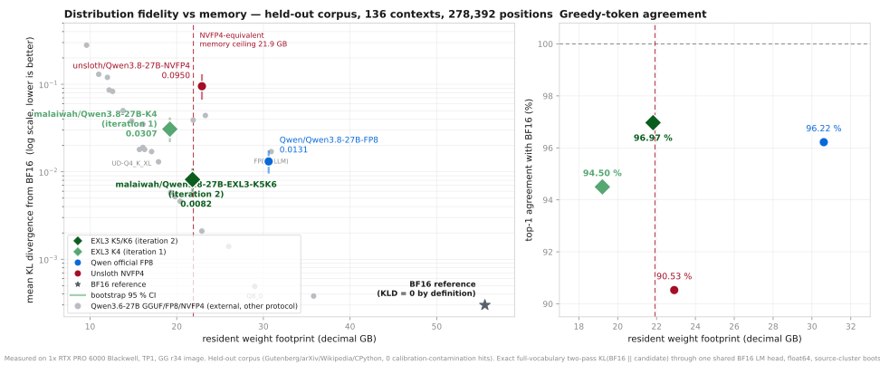

# Qwen3.8-27B EXL3 K5/K6 — lower divergence than official FP8 at 71 % of its memory

> **Requires a custom runtime.** This checkpoint does **not** load in upstream vLLM,
> SGLang, TensorRT-LLM, llama.cpp, transformers, or stock exllamav3. It needs the
> Gilded Gnosis vLLM fork (public image below), explicit `--quantization exl3`, an exact
> `ignore` list, and — for CUDA graphs — an as-yet-unmerged patch
> ([PR #314](https://github.com/local-inference-lab/vllm/pull/314)). Treat it as an
> experimental, runtime-specific research artifact.

Mixed-precision EXL3 quant of [`Qwen/Qwen3.8-27B`](https://huggingface.co/Qwen/Qwen3.8-27B)
@ `1d4bf0f2ff6012fd82039f2fa52739d0dd7c60c0`.

| role | representation |
|---|---|
| MLP `gate_proj`, `up_proj` (64 layers) | EXL3 **K5**, `mcg` |
| MLP `down_proj` (64 layers) | EXL3 **K6**, `mcg` |
| attention: `linear_attn.{in_proj_qkv,in_proj_z,out_proj}` ×48, `self_attn.{q,k,v,o}_proj` ×16 | **BF16 on disk**, encoded to **K6 at load** by the runtime's Trellis overlay — and **K5 or K4 instead, from the same download**, by one env var ([table](#attention-width-is-a-runtime-knob)) |
| `lm_head` | EXL3 **K6**, `mcg` |
| MTP draft head | **quantized** (attention K4, MLP K5/K6) |
| `embed_tokens`, vision tower (27 blocks), norms | BF16 |
| GatedDeltaNet `in_proj_a` / `in_proj_b` (96) | **FP16** passthrough (exllamav3 emits FP16 for unquantized linears; more mantissa than BF16, less range) |

`quantization_manifest.json` and `build-receipt.json` in this repo are authoritative for
composition. **`SHA256SUMS` covers the immutable payload only** — the four shards, the index,
the configs, the tokenizer and preprocessor files: 17 files, 30,597,223,337 bytes.
Documentation that changes with card edits (`README.md`, `.gitattributes`, `assets/**`) is
listed separately in `DOCS-SHA256SUMS`, because a hash map that claims to describe a build
must not move when prose does. An earlier revision mixed the two, listed a `crc32.txt` that
does not exist, and carried stale hashes for two files. The legacy `config.json → quantization_config` block keeps a single
`bits`/`codebook` pair for loader compatibility and **cannot** describe this mixed
checkpoint.

## Which of the three builds

All three are the same architecture and tokenizer; they differ in where the bits go. Measured
on one held-out suite, so the rows are comparable ([collection](https://huggingface.co/collections/qwen38-27b-mixed-precision-exl3-measured-6a7fe0cb27817c23e4a57025)):

| build | download | resident | mean KLD (body-only) | native 262k on 32 GB | pick it when |
|---|---:|---:|---:|---|---|
| [**-hydrated**](https://huggingface.co/malaiwah/Qwen3.8-27B-EXL3-K5K6-hydrated) | 21.61 GB | 20.31 GiB | **0.007406** | no (~186k) | you want the best fidelity, the smallest download and a 178 s cold start |
| [**-EXL3-K5K6**](https://huggingface.co/malaiwah/Qwen3.8-27B-EXL3-K5K6) | 30.57 GB | 20.32 / 19.82 / 19.05 GiB | 0.008157 / 0.012135 / 0.027530 | no (~206k at K5) | you want to choose the attention width at launch |
| [**-K4**](https://huggingface.co/malaiwah/Qwen3.8-27B-K4) | 28.31 GB | 17.89 GiB | 0.030736 | **yes** (289,577 KV tokens) | you need native context on a 32 GB card |

Official `Qwen/Qwen3.8-27B-FP8` is 28.51 GiB resident at 0.013126 on the same suite, and runs
on stock vLLM — which none of these do.

## Measured results

**30.60 GB download → 20.32 GiB (21.82 GB) resident weights**, measured from the engine's
own allocation log, versus 28.51 GiB for official FP8 and 21.34 GiB for Unsloth NVFP4
under identical flags.

### Fidelity: held-out corpus, 136 contexts, 278,392 full-vocabulary positions

<picture>
  <source media="(prefers-color-scheme: dark)" srcset="assets/fidelity-vs-size-dark.svg">
  
</picture>


`KL(BF16 reference ‖ candidate)`, two passes, no top-k, float32 within vocabulary chunks
accumulated in float64 across chunks, one shared BF16 LM head for both operands,
source-cluster bootstrap. Corpus is Gutenberg / arXiv / Wikipedia / CPython. The builder requested nine Wikipedia
languages but tolerated under-filled strata, so the **frozen suite is English, German and
Russian only** (the multilingual stratum is 6 German + 1 Russian context), **held out from this quantizer's calibration data** (160-character shingle scan:
0 contaminated contexts). The suite, the shared BF16 head, the sentinels and the K4/FP8/NVFP4 captures are published
as a [dataset](https://huggingface.co/datasets/malaiwah/qwen38-27b-fidelity-suite-v3).
**This checkpoint's own captures are not in it yet**, so today a third party can check the
arithmetic and re-derive the comparators but cannot recompute this row independently;
publishing the K5/K6 hidden states and the complete 136-row report is the open blocker.

| candidate | resident | mean KLD | bootstrap 95 % CI | median | p99.9 | top-1 |
|---|---:|---:|---:|---:|---:|---:|
| **this quant** | **21.82 GB** | **0.008157** | [0.00607, 0.01067] | 0.001529 | 0.475 | **96.97 %** |
| `Qwen/Qwen3.8-27B-FP8` | 30.61 GB | 0.013126 | [0.00981, 0.01709] | 0.002343 | 0.773 | 96.22 % |
| `malaiwah/Qwen3.8-27B-K4` (previous) | 19.21 GB | 0.030736 | [0.02238, 0.04073] | 0.004218 | 1.758 | 94.50 % |
| `unsloth/Qwen3.8-27B-NVFP4` | 22.91 GB | 0.094978 | [0.06858, 0.12688] | 0.012911 | 4.509 | 90.53 % |

Paired over the same contexts: **-0.004969** versus official FP8
(95 % CI [-0.00643, -0.00371], **136/136 contexts**), i.e.
**38 % lower mean KL divergence than FP8 while holding 8.8 GB less weight**;
and **-0.022579** versus the previous K4 release (136/136 contexts).

**Body-only versus as-served.** Every row above replays both operands through one shared
BF16 head, so no candidate's head quantization is counted — that is what makes the four
comparable. Measured separately with asymmetric heads on this checkpoint, its **K6 head
adds +0.000127** (95 % CI [+0.000105, +0.000148], 10/136 contexts favour it), so the
as-served figure is **0.008284** — still 1.58x better than FP8's body-only 0.013126.
Promoting the head to BF16 would buy that 1.5 % of divergence back for **+1.589 GB**, so
this checkpoint keeps K6.

Controls published with the dataset: runtime-repeat noise floor **0.000000** (three
captures of the same runtime) and harness self-check 0.000000. A third control,
"CUDA-graph parity 0.000000", was **withdrawn**: it captured a prefill forward, and
`FULL_DECODE_ONLY` captures no prefill graph, so it could not have measured the decode
path. Re-measured properly on real decode steps, graph and eager agree on 24/32 greedy
32-token sequences with mean |Δ logprob| 0.0118 on the chosen token; unquantised BF16
on this same build drifts identically (24/32, 0.0128), so this is a property of CUDA
graphs here and not of the quantisation.
**Weakest control:** live-vs-replayed logit qualification is 6.54e-04, so differences
below ~1e-3 are not resolvable with these artifacts. The FP8 gap is **7.6x** that floor
and the K4 gap **34.5x** it; the K6-head increment (0.000127) and the K5-vs-FP8 gap
(0.000991) are **at or below** it and are reported as unresolved point estimates, not
as established differences. The KLD magnitudes here are only comparable within this suite — thresholds from
other models, corpora or tokenizers do not transfer.

### Attention width is a runtime knob, and native context needs the K4 build

Attention weights ship in BF16 and are encoded to EXL3 Trellis **at load**, so the width is
a launch-time choice rather than a property of the download: `VLLM_EXL3_ONLINE_TRELLIS_BITS`
accepts 3-8. One checkpoint, several operating points.

<picture>
  <source media="(prefers-color-scheme: dark)" srcset="assets/context-per-card-dark.svg">
  
</picture>

| `VLLM_EXL3_ONLINE_TRELLIS_BITS` | resident weights | mean KLD | top-1 |
|---|---:|---:|---:|
| **6** (default) | 20.32 GiB | **0.008157** | 96.97 % |
| **5** | 19.82 GiB | 0.012135 | 96.29 % |
| **4** | 19.05 GiB | 0.027530 | 94.49 % |

Paired against K6 on the same contexts: K5 costs **+0.003978** (95 % CI [+0.00306, +0.00506],
0/136 contexts win) and K4 costs **+0.019373**. K5's mean stays below official FP8's 0.013126,
but only by 0.000991 — at this harness's ~1e-3 resolution floor, so treat that as an
unresolved point estimate, not an advantage.

#### Measured on a real RTX 5090, by an independent tester

**Native 262,144 context does not fit this checkpoint on a 32 GB card.** An earlier revision
of this card claimed it did, from a memory simulation on a 96 GB card. That was wrong twice:
the simulation omitted MTP's KV (with `num_speculative_tokens: 3` the engine needs
**9.13 GiB** for 262,144 tokens, not 8.18) and it assumed 31.84 GiB usable where a 5090
reports **31.39**. Corrected, with hardware numbers (TP1, FP8 E4M3 KV, MTP-3, decode-only
CUDA graphs, vision enabled):

| attention | max seqs | util | KV attained | context | outcome |
|---|---:|---:|---:|---:|---|
| K6 | 8 | 0.95 | 187,050 tok / 6.71 GiB | **185,600 run** | stable, multimodal-safe |
| K6 | 8 | 0.98 | 202,185 tok / 7.55 GiB | — | text fine, **a 3,264-token image OOMed** with 33 MiB free |
| K5 | 8 | 0.95 | 212,255 tok / 7.55 GiB | **206,400 run, 205,021 tokens, exact retrieval passed** | best demonstrated |
| K5 | 8 | 0.95 | 7.33 GiB available vs 9.13 needed | 262,144 refused | short by 1.80 GiB |
| K5 | 4 | 0.96 | 7.99 vs 9.13 | 262,144 refused | short by 1.14 GiB |
| K5 | 4 | 0.97 | 8.30 vs 9.13 | 262,144 refused | short by 0.83 GiB |
| **K4 build**, K6 | 8 | 0.98 | 289,577 tok capacity | **262,144 configured** | native context fits |

So on a 32 GB Blackwell card: **use K5 attention for ~206k with retrieval verified**, keep
utilisation at **0.95** if you serve images (0.98 leaves no vision headroom), and if you need
native 262,144 use [`malaiwah/Qwen3.8-27B-K4`](https://huggingface.co/malaiwah/Qwen3.8-27B-K4)
— it is the only build in this family that fits, at 3.8x the divergence. Closing the last
0.83 GiB through utilisation alone would need ~0.997, which leaves no runtime headroom at
all. On 48 GB and larger, native context fits at K6 with the best fidelity.

KV costs **37.4 KB/token with MTP-3** (16 full-attention layers, 4 KV heads, head_dim 256;
the other 48 layers are Gated DeltaNet and hold per-sequence state instead) and 33.5 KB/token
without it — turning MTP off is worth about 11 % more context if you would rather have length
than 2x decode.

**4-bit KV is not available on this architecture:** the runtime's generic NVFP4 KV path
requires SM100 trtllm-gen and is rejected on SM120, and GLM-5.2's `nvfp4_ds_mla` cache is
MLA-specific, which Qwen3.8 is not.

Thanks to the tester who ran this on real hardware and caught the overclaim.

### Throughput

Median of 3 runs, `--max-num-seqs 8`, greedy, 256 output tokens; prefill measured with
exact token-count prompts.

| configuration | TG C1 | TG C4 | TG C8 | PP 2k | PP 6k |
|---|---:|---:|---:|---:|---:|
| **this quant + graphs + prefill dispatch** | 56.6 | 199.6 | 404.6 | **5,050** | **5,146** |
| **+ MTP-3 speculative decoding** | **113.8** | 206.8 | — | 2,292* | — |
| this quant, graphs only (no prefill patch) | 56.5 | 199.6 | 402.7 | 2,369 | 2,362 |
| `unsloth/…-NVFP4` | 48.9 | 171.4 | 369.7 | 14,528 | 13,468 |
| `Qwen/…-FP8` | 46.3 | 163.3 | 342.5 | 10,667 | 10,474 |

\* MTP figure predates the prefill patch; the two are independent and compose.

**Best decode throughput of every candidate measured, and 2.3-2.5x the single-stream
rate of FP8/NVFP4 with speculative decoding on.** Speculative decoding uses this
checkpoint's **quantized** draft head: 58.2 % of drafted tokens accepted, **1.745 accepted
draft tokens per step**, so **2.745 output tokens per speculative iteration** once the
verifier's own token is counted (acceptance 77.5 / 57.2 / 39.8 % by draft position). The
comparators are measured **without** speculative decoding, so the 113.8 figure is this
checkpoint against itself, not a like-for-like format comparison.

**Prefill improved 2.1x** in [PR #316](https://github.com/local-inference-lab/vllm/pull/316):
the backend routed every shard through the decode-shaped `exl3_gemm` at all row counts, so
rows >= 128 now use reconstruct+`hgemm` instead (4.1-5.2x faster at m=2048, slower below
m=64). Decode is untouched. That patch is **not** bit-exact — it changes fp16 summation
order and costs +0.43 % measured divergence with top-1 unchanged to four decimals;
`VLLM_EXL3_PREFILL_RECONSTRUCT_M=0` restores the exact path.

**Prefill remains the weak axis, and it is now attributed rather than suspected.** A 2x2
over attention representation and MLP kernel isolates it: the MLP kernel is worth
**2.13-2.26x**, the online attention overlay only **1.05-1.11x** — so the overlay is not
the bottleneck, which refutes what this card previously said. `ext.hgemm` measures at
cuBLAS parity (0.92-1.06x) and a larger prefill chunk changes nothing, so the tuning
levers are spent. The residual is the GEMM's **dtype**: at these shapes an FP8 matmul runs
1.85-2.02x faster than fp16 on this card, which is almost exactly official FP8's prefill
lead. Closing it needs dequant emitted into an FP8 GEMM, not another dispatch tweak — the
work is tracked in [docs/26](https://github.com/malaiwah/qwen38-27b-exl3/blob/main/docs/26-prefill-attribution.md).

## Serving

**Two recipes, because the published image predates the patches.** The pinned digest below
was built on 2026-08-10 from vLLM `e2666d9a`; PRs #314 and #316 were opened on 2026-08-14
and are still open, so **that image cannot contain them**. Recipe A is what the image runs
unmodified. Recipe B is the headline configuration and requires applying one patched module
into the container before launch. Anything claiming graph decode or the prefill dispatch on
recipe A is wrong.

### Recipe A — unmodified image, eager only

```bash
docker run --rm --gpus '"device=0"' --ipc host -p 8000:8000 \
  -v /models:/models:ro -v /cache:/cache \
  -e VLLM_EXL3_ONLINE_TRELLIS_BITS=6 \
  -e VLLM_EXL3_ONLINE_CACHE_DIR=/cache/exl3-online \
  --entrypoint /opt/venv/bin/vllm \
  voipmonitor/vllm@sha256:820181fbbc975cd5291c411cda9771d58fecee1636d916f508f47230df20592b \
  serve /models/Qwen3.8-27B-EXL3-K5K6 \
    --served-model-name qwen38 --quantization exl3 --enforce-eager \
    --quantization-config '{"linear":{"weight":"mxfp8"},"ignore":["re:.*visual\\..*","re:.*in_proj_a$","re:.*in_proj_b$","re:.*in_proj_ba$","lm_head"]}' \
    --mm-processor-kwargs '{"truncation":false}' \
    --reasoning-parser qwen3 --enable-auto-tool-choice --tool-call-parser qwen3_coder \
    --max-model-len 8192 --gpu-memory-utilization 0.85 --max-num-seqs 8 \
    --host 0.0.0.0 --port 8000
```

Measured on this path: **28.8 tok/s** decode at concurrency 1 and **2.4k tok/s** prefill —
that is the honest floor without the patches.

### Recipe B — headline configuration (graphs + prefill dispatch)

Replace one module inside the container, then launch. The module is published in the
companion repository as
[`tools/vllm-exl3-prefill-dispatch.py`](https://github.com/malaiwah/qwen38-27b-exl3/blob/main/tools/vllm-exl3-prefill-dispatch.py),
`sha256:cb9e60024057e8097237a5518e6469b15f73e4139cc37f1f67e9c1485b44aedd`, and is the concatenation of
[PR #314](https://github.com/local-inference-lab/vllm/pull/314) (head `7917c928`) and
[PR #316](https://github.com/local-inference-lab/vllm/pull/316) (head `8451183e`):

```bash
T=vllm/model_executor/layers/quantization/exl3.py
docker run --rm --gpus '"device=0"' --ipc host -p 8000:8000 \
  -v /models:/models:ro -v /cache:/cache -v $PWD/vllm-exl3-prefill-dispatch.py:/patch.py:ro \
  -e VLLM_EXL3_ONLINE_TRELLIS_BITS=6 \
  -e VLLM_EXL3_ONLINE_CACHE_DIR=/cache/exl3-online \
  -e VLLM_EXL3_GRAPH_DECODE=1 \
  -e VLLM_EXL3_PREFILL_RECONSTRUCT_M=128 \
  --entrypoint bash \
  voipmonitor/vllm@sha256:820181fbbc975cd5291c411cda9771d58fecee1636d916f508f47230df20592b \
  -lc 'cp /patch.py /opt/venv/lib/python3.12/site-packages/$T &&
       find /opt/venv/lib/python3.12/site-packages/vllm/model_executor/layers/quantization/__pycache__ \
            -name "exl3.*.pyc" -delete;
       exec /opt/venv/bin/vllm serve ...'   # same flags as below
```

There is **no published image digest containing these patches**; building one is on the
open list. Until then recipe B is a source-pinned patch, not an immutable artifact.

```bash
# flags for recipe B, appended to the launch above
docker run ... \
  -e VLLM_EXL3_ONLINE_TRELLIS_BITS=6 \
  -e VLLM_EXL3_ONLINE_CACHE_DIR=/cache/exl3-online \
  -e VLLM_EXL3_GRAPH_DECODE=1 \
  -e VLLM_EXL3_PREFILL_RECONSTRUCT_M=128 \
  --entrypoint /opt/venv/bin/vllm \
  voipmonitor/vllm@sha256:820181fbbc975cd5291c411cda9771d58fecee1636d916f508f47230df20592b \
  serve /models/Qwen3.8-27B-EXL3-K5K6 \
    --served-model-name qwen38 \
    --quantization exl3 \
    --quantization-config '{"linear":{"weight":"mxfp8"},"ignore":["re:.*visual\\..*","re:.*in_proj_a$","re:.*in_proj_b$","re:.*in_proj_ba$","lm_head"]}' \
    --compilation-config '{"cudagraph_mode":"FULL_DECODE_ONLY"}' \
    --speculative-config '{"method":"mtp","num_speculative_tokens":3}' \
    --mm-processor-kwargs '{"truncation":false}' \
    --reasoning-parser qwen3 --enable-auto-tool-choice --tool-call-parser qwen3_coder \
    --max-model-len 8192 --gpu-memory-utilization 0.85 --max-num-seqs 8 \
    --host 0.0.0.0 --port 8000
```

Load-bearing details:

1. **`--quantization exl3` is mandatory** — auto-detection only fires for GLM-5.2
   metadata.
2. **Both performance features need unmerged patches**, which is why recipe A and recipe B
   are separate. `VLLM_EXL3_GRAPH_DECODE=1` + `cudagraph_mode: FULL_DECODE_ONLY` need
   [PR #314](https://github.com/local-inference-lab/vllm/pull/314) (without it the loader
   refuses non-eager execution and you lose ~46-50 % of decode); `VLLM_EXL3_PREFILL_RECONSTRUCT_M`
   needs [PR #316](https://github.com/local-inference-lab/vllm/pull/316) and doubles prefill.
   Neither has upstream CI validation yet: pre-run checks on those heads are blocked by
   repository policy labels, not by a demonstrated failure.
3. **The `ignore` list is mandatory and its anchoring is subtle.** Prefixes carry no
   leading `model.`, so `re:.*visual\..*` matches while `re:.*\.visual\..*` silently does
   not — and the wrong pattern **crashes** startup
   ([#311](https://github.com/local-inference-lab/vllm/issues/311), fixed by
   [PR #312](https://github.com/local-inference-lab/vllm/pull/312)). `mtp.*` must **not** be
   ignored here: this checkpoint's draft head is quantized and the overlay must leave it
   to the EXL3 loader.
4. **`--mm-processor-kwargs '{"truncation":false}'` is required for images** whose expanded
   token sequence exceeds 2,048, or requests fail with HTTP 400
   ([#313](https://github.com/local-inference-lab/vllm/issues/313)). Verified here: a
   2044×1622 image answers correctly with the flag.
5. First load encodes 208 attention projections to K6 (~16 min cold); point
   `VLLM_EXL3_ONLINE_CACHE_DIR` at persistent storage.

### Client contract, inherited unchanged from upstream

Chat template, tokenizer, preprocessors, generation defaults and vocabulary (248,320,
untied head) are byte-identical to upstream. `generation_config.json`: `temperature 1.0`,
`top_p 0.95`, `top_k 20`. Qwen's recommendation for non-thinking mode is
`temperature 0.7`, `top_p 0.8`, `top_k 20`, `presence_penalty 1.5`.

Thinking control is `chat_template_kwargs`: `{"enable_thinking": false}`, or
`{"reasoning_effort": "..."}` where the **only valid values are `xhigh` (default),
`medium` and `low`** — the upstream template raises on `high`.

Context: **262,144 native**; verified here only to 8,192. Upstream's 1M procedure is
static YaRN, not a bare `max_position_embeddings` bump: it needs nested `rope_parameters`
with `rope_type: yarn`, `factor: 4.0`, `original_max_position_embeddings: 262144`,
`VLLM_ALLOW_LONG_MAX_MODEL_LEN=1` and `--max-model-len 1000000`, and Qwen warns it costs
short-context quality. **Untested on this runtime.**

## Verification performed, and not performed

Done: structural audit (1,199 logical tensors reconstructed, matching upstream), serving
under the pinned image, greedy text, 96×96 and 2044×1622 image answers, MTP acceptance
from server counters, 3-run throughput with <1 % dispersion, prefill at exact token
counts, eager-vs-graph decode parity on real decode steps (24/32 exact sequences, with a
BF16 control showing the same 24/32), and the fidelity suite above.

**Context length is the sharpest gap between what is claimed and what is tested.** Fidelity
and functional tests ran at `--max-model-len 8192`. The 262,144 rows above are *engine
allocation and startup* at that length, not generation, retrieval or accuracy at length. No
native-262K generation, no YaRN-1M run, and no long-context retrieval measurement exists yet.

**Not done:** downstream task benchmarks (no MMLU/GPQA/HumanEval-style retention
evidence), OCR/chart/video multimodal evaluation, long-context retrieval or perplexity,
native-262K or YaRN-1M runs, multi-GPU/TP>1, non-SM120 hardware, and any quant-specific
safety testing. KLD ranks distribution fidelity; it does not establish task retention.

## Safety and intended use

Upstream does not disclose training-corpus composition, knowledge cutoff, safety
evaluation, or detailed intended-use limits, and this quant adds none. Quantization can
alter refusal behaviour and calibration even when average divergence is low, and **no
quant-specific safety regression testing has been performed**. Intended for research and
local inference evaluation. Inherits Apache-2.0 from upstream.

## Prior art and credits

- [`Qwen/Qwen3.8-27B`](https://huggingface.co/Qwen/Qwen3.8-27B) (Apache-2.0) and
  [`Qwen/Qwen3.8-27B-FP8`](https://huggingface.co/Qwen/Qwen3.8-27B-FP8) — base and
  official 8-bit comparator.
- [`nvidia/Qwen3.6-27B-NVFP4`](https://huggingface.co/nvidia/Qwen3.6-27B-NVFP4) — the
  role-aware recipe this design is modelled on (4-bit MLP, 8-bit attention, protected
  embeddings/vision/MTP), and the source of the memory ceiling used here.
- [`unsloth/Qwen3.8-27B-NVFP4`](https://huggingface.co/unsloth/Qwen3.8-27B-NVFP4) —
  independent confirmation of the same protection pattern.
- [`malaiwah/GLM-5.2-EXL3-TR3-MTP78`](https://huggingface.co/malaiwah/GLM-5.2-EXL3-TR3-MTP78)
  — prior art for quantizing the MTP draft head: 3 bpw matched BF16 acceptance length at
  one fifth the size.
- [turboderp-org/exllamav3](https://github.com/turboderp-org/exllamav3) 1.4.2 @ `5f3c537`
  — EXL3 format, encoder and conversion pipeline.
- [Gilded Gnosis r34](https://github.com/local-inference-lab/rtx6kpro/blob/master/models/glm5.2_v20.md)
  — the runtime, its online-K6 overlay, and the distribution-fidelity protocol
  ([Kimi-K3 1024×2048](https://github.com/local-inference-lab/rtx6kpro/blob/master/models/kimi-k3/distribution-fidelity-1024x2048.md))
  this evaluation follows.
- [malaiwah/progressive-tensors](https://github.com/malaiwah/progressive-tensors) —
  per-expert EXL3 provenance work and the per-bit error ladder.

## Companion repository

Recipes, receipts, the fidelity harness, the response to an independent review, and the
open items: **<https://github.com/malaiwah/qwen38-27b-exl3>**.

Upstream contributions from this work:
[#311](https://github.com/local-inference-lab/vllm/issues/311) /
[PR #312](https://github.com/local-inference-lab/vllm/pull/312) (overlay fallback crash),
[PR #314](https://github.com/local-inference-lab/vllm/pull/314) (CUDA-graph decode),
[#313](https://github.com/local-inference-lab/vllm/issues/313) (Qwen3.8 vision
truncation).
