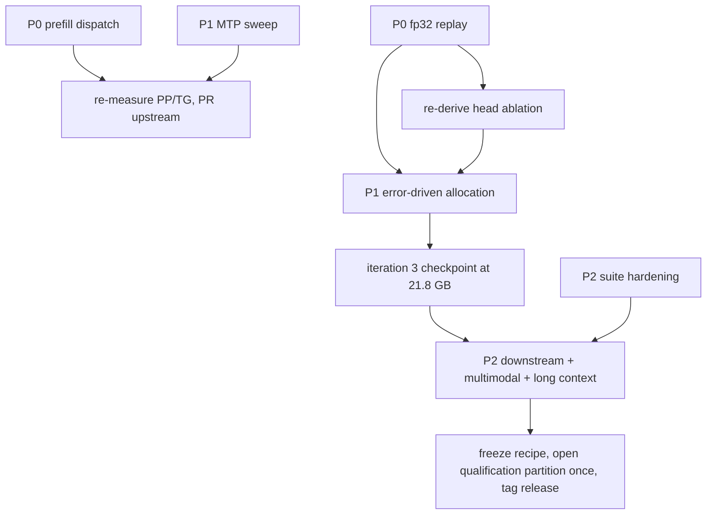

# What to attack next, ranked

> **Historical plan.** Later work closed or changed most items; the live ranking is
> [docs/29](29-plan-and-loose-ends.md). An offset-independent contamination correction changes
> the iteration-2 fidelity point from 0.008157 to **0.007945** and FP8 from 0.013126 to
> **0.012798**, with the same 38 % advantage and ordering.

State at the end of iteration 2 (all held-out, all measured on one RTX PRO 6000
Blackwell, TP1, GG r34 image):

| axis | current | best competitor | gap |
|---|---|---|---|
| fidelity (mean KLD) | **0.008157** | FP8 0.013126 | **we lead by 38 %** |
| resident weights | **21.82 GB** | NVFP4 22.91 GB, FP8 30.61 GB | at the 21.92 GB ceiling, 0.10 GB headroom left |
| decode C1 / C4 / C8 | **56.5 / 199.6 / 402.7** | NVFP4 48.9 / 171.4 / 369.7 | we lead by 9-16 % |
| decode C1 with MTP-3 | **113.8** | — | 2.0x this checkpoint's no-MTP C1; comparator MTP profiles unmeasured |
| **prefill 2k / 6k** | **2,369 / 2,362** | NVFP4 14,528 / 13,468 | **we lose by 4.5-6x** |
| measurement resolution | 6.54e-04 replay error | reference protocol 1.23e-06 | **530x worse; blocks sub-1e-3 work** |

Two numbers set the agenda: prefill is the only axis where we lose, and the replay
floor is the only thing preventing us from measuring the fine-grained recipe work that
comes after.

## P0 — Prefill dispatch (the one axis we lose)

**Do:** row-count-dependent dispatch in `Exl3LinearMethod._apply_one`. Below ~m=64 keep
`exl3_gemm`; above it, reconstruct the weight with `reconstruct_had_slice` and call
`hgemm`, mirroring exllamav3's own `LinearEXL3.reconstruct_hgemm`.

**Evidence** (`tools/prefill_micro.py`, on this checkpoint's three real geometries,
reconstruct cost included):

| geometry | m=1 | m=32 | m=256 | m=1024 | m=2048 |
|---|---:|---:|---:|---:|---:|
| `mlp.gate_proj` 5120x17408 K5 | 0.33x | 0.60x | **3.91x** | **3.85x** | **4.57x** |
| `mlp.down_proj` 17408x5120 K6 | 0.39x | 0.74x | **4.85x** | **4.31x** | **5.19x** |
| `lm_head` 5120x248320 K6 | 0.38x | 0.71x | **5.49x** | **5.07x** | **6.07x** |

**Expected gain:** prefill 2.4k -> 8-12k tok/s, i.e. within reach of NVFP4 and above FP8,
with decode untouched. **Cost:** one patch plus a scratch-buffer policy (a reconstructed
`lm_head` is 2.54 GB in fp16, so it must be chunked or reused, not held per layer).
**Acceptance:** PP >= 8,000 tok/s at 2k and 6k, decode within noise of today, and
distribution parity 0.000000 against the current build.

**Second-order:** once prefill no longer autotunes per shape, revisit widening the
CUDA-graph gate from `FULL_DECODE_ONLY` to `FULL_AND_PIECEWISE` (deliberately refused in
[PR #314](https://github.com/local-inference-lab/vllm/pull/314)).

Also verify, while in there, whether our 65 K6+`mcg` shards (`down_proj` x64, `lm_head`)
actually reach the B12X native kernel and whether that kernel is decode-shaped too. If it
is, they need the same treatment.

## P0 — Replay precision (unblocks everything fine-grained)

**Do:** capture hidden states in fp32 and replay in fp32 (`--fp32` already implemented on
both paths), then re-run `qualify`.

**Why it gates work:** at 6.54e-04 live-vs-replay error, any effect below ~1e-3 is
unmeasurable. That currently includes the entire head-attribution result (6.8e-05) and
will include most single-projection recipe deltas from here on, because we are now in the
0.008 regime rather than the 0.03 regime.

**Cost:** 2x disk (42 MB per context per candidate), one capture pass per candidate.
**Acceptance:** `mean_kld_live_vs_replayed <= 1e-5`; then re-derive the head ablation and
publish whichever direction it actually goes.

## P1 — Buy fidelity without buying memory

Headroom is spent: 21.82 of 21.92 GB. Further quality has to come from **allocation, not
volume**.

1. **Error-driven allocation.** Convert once more at `-b 6`, then
   `util/measure.py -i k4 k5 k6 -r bf16` and `util/optimize.py -b <21.8 GB budget>`, which
   allocates by measured `dkld/dbits` per layer group instead of my uniform
   gate/up/down choice. Precedent inside our own data: `down_proj` proxy error is 2.3x
   `gate_proj`, and the spread across layers is larger than the spread across projections.
   **Expected:** 10-30 % KLD at identical memory. **Cost:** ~40 min conversion + ~15 min
   measure + recompile.
2. **Calibration corpus.** Still exllamav3's generic 250x2048 mix: no chat-template text,
   no reasoning traces, no tool calls, for a thinking multimodal model. Free in VRAM.
   **Acceptance:** measured on held-out data only, never on the calibration text — the
   mistake that produced the retracted v2 headline.
3. **Free memory to spend elsewhere.** `lm_head` K6->K5 releases 0.16 GB, but
   the K6-vs-BF16 head ablation does not predict the K5 cost; a K5 head replay
   must gate that trade. MTP attention K4->K3 releases ~0.05 GB. Either is worth
   considering only if P1.1 finds a layer group that can use the recovered bits.

## P1 — Speculative decoding is under-exploited

MTP-3 doubles single-stream throughput at 58.2 % acceptance (2.745 tokens/step) with a
**quantized** draft. Untuned knobs:

- `num_speculative_tokens` sweep 2/3/4/5 — acceptance decays by position (77.5 / 57.2 /
  39.8 %), so 4 may still pay at C1 and lose at C8;
- draft bit width: the draft is attention K4 + MLP K5/K6 today; the GLM-5.2 precedent says
  3 bpw suffices, which would release ~0.1 GB;
- interaction with `max_num_seqs` and graph capture sizes (the row plan already covers
  spec-decode multiples);
- acceptance on *code* and *reasoning* prompts, not just prose — acceptance is
  distribution-dependent and our number comes from one prompt shape.

**Acceptance:** an acceptance/throughput curve over `num_speculative_tokens` x concurrency
with the same 3-run discipline, published as a receipt.

## P2 — Close the validation gaps the review named

These do not improve the artifact; they establish what it is worth.

| gap | minimum credible test | why it matters |
|---|---|---|
| downstream retention | paired BF16 / v2 / FP8 / NVFP4 on a small transparent subset (instruction following, code, multilingual, tool calling), same prompts, seeds and harness, reporting per-example deltas | KLD ranks distributions, not capability. This is the single biggest missing claim |
| multimodal | OCR/document, chart/STEM, natural image, and one video subset; plus a vision-input fidelity capture (the harness already handles image prompts) | vision tower is BF16 but the language body is quantized; one 2044x1622 smoke test is not evidence |
| long context | 32k and 131k fidelity tiers (chunk accumulation is implemented), plus passkey/retrieval and perplexity-vs-depth | 8,192 verified out of 262,144 native. Does 4-bit MLP degrade with depth? Unknown |
| YaRN 1M | Qwen's full static-YaRN configuration, not a `max_position_embeddings` bump | currently documented as untested; it should either work or be declared unsupported |
| KV dtype | FP8 KV to match both vendor quants; re-measure fidelity with KV pinned identically | halves KV (16 GiB -> 8 GiB at 262k), and both comparators ship FP8 KV schemes |
| portability | TP2/TP4, and one non-SM120 device | everything measured is SM120 TP1 |

## P2 — Suite hardening (measurement integrity)

Carried from the review, all accepted:

- **cluster-level** analysis/qualification split (today contexts from one document can
  land on both sides);
- rolling token n-gram contamination with a stable hash, scanning the **full** decoded
  window (today: fixed-stride 160-char windows, process-randomised `hash()`, and only
  `context_length*5` of `context_length*8` characters scanned);
- the four missing strata: dialogue/instruction, worked mathematics, structured/tool-call,
  news/legal/essay — the distributions this model is actually used for;
- scale to >= 512 contexts and >= 200 source clusters (we have 181 / 41; the reference
  artifact has 1,024 / 827);
- MinHash near-duplicate pass, and a benchmark-leakage scan against HumanEval, MMLU,
  GPQA;
- corpus source hashes and a tokenizer content hash in the manifest;
- live-logit sentinels so runtime variation stays separable from replay defects.

## P3 — Upstream and operations

Open from this work: [PR #312](https://github.com/local-inference-lab/vllm/pull/312)
(overlay BF16 fallback), [PR #314](https://github.com/local-inference-lab/vllm/pull/314)
(CUDA-graph decode), [#311](https://github.com/local-inference-lab/vllm/issues/311),
[#313](https://github.com/local-inference-lab/vllm/issues/313).

To file next:

1. **Prefill dispatch** patch (P0 above) — the largest performance contribution available.
2. **exllamav3: `add_quant_config.py` skips the MTP module**, silently producing a
   checkpoint that cannot serve speculative decoding (`no module or parameter named
   'fc.mcg'`). We work around it in `tools/finalize_checkpoint.py`.
3. **exllamav3: no per-module bitrate control.** Upstream our `EXL3_BITS_OVERRIDE` hook;
   without it this iteration's recipe is impossible.
4. **`vllm.utils.flashinfer` has no `mm_mxfp8`** in the r34 build, so the documented
   "128-unaligned shards retain MXFP8" path cannot execute; it should probe and degrade to
   BF16.
5. **exllamav3 codebook anomaly:** iteration 1 emitted a `mul1` head under a global
   `-cb mcg`; iteration 2 did not. Worth a reproducer before it bites someone else.

Operations, from the review: eval receipts carrying candidate revisions and container
digest; fail-closed context intersection in `paired`; CI plus signed tags; OCI puller
hardening (verify cached layer hashes, verify the config blob digest, clean rootfs,
whiteout path validation before deletion); read-only model mounts in the published
docker recipe.

## Sequencing

The two P0 items are independent and can run in parallel: prefill is a runtime patch,
replay precision is a measurement pass. Everything that changes bit allocation should wait
for fp32 replay, because at 0.008 KLD the deltas we are chasing are close to the current
measurement floor.

## Explicitly not doing

- **More bits on attention.** The then-current single-window control put online
  K6 below BF16 attention, so attention was deprioritized; that observation did
  not prove that no attention allocation could improve held-out fidelity.
- **Quantizing the vision tower.** 0.92 GB, not 128-aligned, and both vendors leave it
  alone. Revisit only if a vision-specific fidelity measurement says otherwise.
- **Activation quantization (W4A4-style).** Not available in EXL3, and the W4A4 comparator
  is the worst KLD we measured (0.094978).
- **Chasing NVFP4's no-MTP decode throughput further.** The no-MTP profile
  already led it by 9-16 %. The 113.8 tok/s MTP result is an internal uplift,
  not a comparator win, because NVFP4 MTP was not measured.
