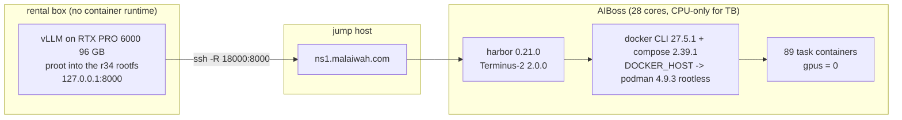

# 45 — Terminal-Bench 2.1: a three-pass agentic evaluation with quantisation attribution

Receipts: `receipts/terminal-bench-2.1-pins.json` (every knob, frozen before the GPU window),
`receipts/terminal-bench-2.1-task-inventory.json` (the 89 tasks actually run, with their declared
resources and timeouts), and one receipt per pass —
`receipts/terminal-bench-2.1-hyd.json`, `-healing.json`, `-bf16-attribution.json`.
Per-task rows, agent transcripts and verifier output are published to
<https://huggingface.co/datasets/malaiwah/qwen38-27b-terminal-bench-2.1> as each pass completes.

Runner: `tools/run_terminal_bench.sh`. Row extraction: `tools/tb_rows.py`.

## 0. What a Terminal-Bench number is, and what it is not

Terminal-Bench scores an **agent + model system**, not a model. Every number in this document is
produced by Terminus-2 2.0.0 driving a vLLM OpenAI-compatible endpoint; the harness measures
whether that *system* made a container's verifier pass. Two consequences we hold to throughout:

1. **A failed task does not implicate the quantisation.** It may be the agent's scaffold, the
   task's difficulty, a timeout, or the weights. Distinguishing these is the entire reason pass 3
   exists.
2. **These numbers are not comparable to a leaderboard entry** unless that entry used the same
   agent, the same harness version, the same sampling and the same timeouts. Ours are pinned in
   `receipts/terminal-bench-2.1-pins.json` precisely so the comparison can be checked rather
   than assumed.

## 1. The protocol

| Pass | Job | Tasks | Weights | Question it answers |
|---|---|---|---|---|
| 1 | `tb21-pass1-hyd` | all 89 | `K5K6-hydrated` | What does the shipped quantisation score? |
| 2 | `tb21-pass2-hyd-healing` | pass-1 failures only | `K5K6-hydrated` | Which failures were one-off, and which are persistent? |
| 3 | `tb21-pass3-bf16-attribution` | twice-failed only | BF16 `Qwen/Qwen3.8-27B` | Of the persistent failures, which are the quantisation's fault? |

Pass 3 runs on the **same card, same agent, same sampling, same eager mode, same tunnel** — the
weights are the only thing that changes. Each twice-failed task then lands in exactly one bucket:

- **`capability`** — BF16 fails it too. The failure belongs to the agent+model system at this
  scale; the quantisation is exonerated for that task.
- **`quantization-suspect`** — BF16 passes it. The quantisation is implicated for that task, and
  the published BF16 transcript is the evidence.

The two-pass filter before attribution matters: without pass 2, a single flaky failure would be
promoted into a "quantisation suspect" and then spend a BF16 run to be disproved.

## 2. Why the bench runs across two machines

The rental box that has the 96 GB RTX PRO 6000 **cannot run containers at all**. It is itself a
container whose seccomp profile denies `clone(CLONE_NEWUSER|CLONE_NEWNS)`: both `unshare -U` and
`unshare -m` return `EPERM`, there is no `docker` or `podman` binary, and there is no systemd.
Terminal-Bench is a container benchmark, so the harness had to go elsewhere.

The owner's decision was route **(c)**, and this is what it looks like:

Two details carried the whole thing:

- **harbor shells out to the `docker` CLI and `docker compose`**; it does not use the docker Python
  SDK. So a static user-local docker CLI plus the compose plugin, with `DOCKER_HOST` pointed at the
  rootless podman socket, makes the harness work unmodified — no patching.
- **The tunnel must survive hours**, and getting that right required abandoning the obvious form.
  See below.

### The remote port must not belong to sshd

The obvious tunnel is `ssh -R 18000:127.0.0.1:8000`. It has a failure mode that would have been
fatal to a multi-hour bench, found in preflight by killing the client uncleanly:

- sshd keeps the remote listener. It then **accepts each connection and immediately resets it** —
  `curl` exits `rc=56` after 0.29 s. Every request through the tunnel fails.
- That listener is held by sshd's **root** privsep process (`sshd: mbelleau [priv]`). Confirmed by
  resolving the listening socket's inode out of `/proc/net/tcp` and finding no readable
  `/proc/<pid>/fd` match among this user's processes; `fuser -k -n tcp` and `lsof -iTCP` both report
  nothing at all. An unprivileged agent **cannot reclaim the port**.
- And the port cannot simply be changed, because harbor bakes `api_base` into the job's
  `config.json` and resume demands an identical config — so it must stay fixed across all three
  passes.

So port ownership was taken away from sshd:

- `ssh -R /run/user/1000/tb21-vllm.sock:127.0.0.1:8000 -o StreamLocalBindUnlink=yes` binds a **unix
  socket**, and that option makes ssh unlink a stale socket file itself. The ssh side can no longer
  be poisoned.
- `tools/tb_tunnel_proxy.py` — an ordinary user process — owns `127.0.0.1:18010`, the port harbor
  actually talks to. It is killable and restartable by us, and it refuses fast when the socket is
  absent, which is what makes `wait-ready` and `probe` real signals instead of timeouts.

**Verified against the final design**, with the worst case rather than a polite one: with the tunnel
up and serving (HTTP 200 at 0.5825 s), the ssh client was `SIGKILL`ed. Its log reads
`attempt 1 … dropped rc=137 … attempt 2`, and ~14 s later the *same* port served `http=200
ttfb=0.581403`. The proxy kept running across the drop (same pid), so the TCP port was never
released and therefore could never be poisoned. On a deliberate stop the proxy released 18010 at
once — while port 18000, poisoned earlier in preflight, was still held by the root sshd. That
contrast is the whole argument for the design.

### The tunnel costs ~581 ms per request, and that is not fixable

Measured before the window with a stand-in HTTP endpoint on the same port (re-measured against the
live vLLM endpoint at window start by `probe`):

| Path | Time to first byte |
|---|---|
| AIBoss → tunnel → rental | **0.579–0.587 s** |
| rental loopback, same fetch | 0.00072–0.00088 s |

It is **not** connection setup. With five requests on one reused connection, `time_connect` was
0.0001 s while `time_starttransfer` stayed ~0.582 s on every one — so LiteLLM's connection pooling
cannot amortise it. The cause is distance: the rental's TCP round-trip to the jump host is
**266 ms** (median), AIBoss's is **12 ms**, and the rental has no direct route to AIBoss at all
(TCP connect simply times out, which is why the jump host is in the path). One
AIBoss→jump→rental round trip is ~278 ms, and an HTTP request/response through the reverse channel
costs about two of them. The latency is the topology, not the implementation.

Three consequences, all of which shaped the design:

- **It is a time-to-first-token cost, not a per-token cost.** Tokens after the first arrive inside
  the same stream. A task using 100 agent turns pays ~58 s of pure latency, against per-task agent
  timeouts of 360–12,000 s (most are 900–3,600 s).
- **It cannot corrupt the attribution.** Passes 1–2 and pass 3 cross the *same* tunnel and pay the
  *same* penalty, so latency is common-mode and cannot move a task between the `capability` and
  `quantization-suspect` buckets.
- **Throughput is therefore read server-side.** tok/s comes from vLLM's own `/metrics` counters on
  the rental's loopback, never from agent-side wall clock, so the tunnel cannot depress the
  reported number.

`TB_TIMEOUT_MULT` stays at **1.0**, keeping the run comparable to stock Terminal-Bench. Contingency,
recorded in advance rather than applied silently: if pass 1 produces a material number of
`AgentTimeoutError` rows, those tasks are flagged latency-suspect in the pass receipt and pass 2 may
raise the multiplier — with the change recorded.

## 3. No task container ever touches a GPU

AIBoss has its own GPU and hosts the owner's live `qwen38-27b` service, so "CPU-only" needed to be
asserted, not asserted-to-be-obvious. `run_terminal_bench.sh no-gpu-assert` runs four independent
checks:

1. **Declarations.** 89/89 `task.toml` files pin `gpus = 0`; none is non-zero. Every TB 2.1 task is
   CPU-only by construction.
2. **No code path exists.** The six modules of harbor's docker environment contain no
   `DeviceRequests`, no `--gpus`, no `nvidia`, no `/dev/nvidia`. Compose overrides are written by
   `write_resources_compose_file`, which emits `cpus` / `mem_limit` / `reservations` and *has no GPU
   parameter at all*.
3. **Live containers.** Every container running a TB task image (`docker.io/alexgshaw/*`) is
   inspected for `HostConfig.Devices` and `HostConfig.DeviceRequests`.
4. **`nvidia-smi` process lists** are captured on both hosts during every pass.

Per trial, `config.environment.override_gpus` is recorded in `result.json`, and
`tb_rows.py gpu-assert` fails the pass if any value is not null/0.

**Stated plainly, because filtering evidence until it is green is not evidence:** two containers on
AIBoss *do* hold `/dev/nvidia*` — the owner's `qwen38-27b` vLLM service and a
`nvidia-gpu-exporter`. They are pre-existing co-tenants, not created by this bench. The assertion is
scoped to TB task containers, and the checker prints the co-tenant list every time it runs.

## 4. Resume is a design requirement, not a convenience

The rental card is shared and queued. Summing the 89 tasks' declared agent timeouts gives
**149,160 s = 41.4 h** of worst-case agent time, with one task allowed 12,000 s. A pass must
therefore be concurrent *and* interruptible.

Resume is delegated to the harness rather than reimplemented, and the semantics were confirmed by
reading `harbor/job.py`:

- a trial directory **without** `result.json` is deleted and re-run (`job.py:258-260`);
- a **completed** trial is preserved and skipped — planned trials are matched against existing ones
  in `_init_remaining_trial_configs` (`job.py:327-357`), and only unmatched ones run;
- the job's config is **identity-checked** (`job.py:246` raises `FileExistsError` on a mismatch),
  which is why resume must go through `harbor job resume` — it re-reads the job's own
  `config.json` — instead of re-issuing `harbor run`;
- `-f <ExceptionType>` deletes matching *errored* trials before resuming
  (`cli/jobs.py:1750-1796`), so transport-failed trials retry while genuine failures are kept.

An interrupted window therefore loses only the trials in flight at that instant. Rerunning
`pass1`/`pass2`/`pass3` is always safe.

### Retries are transport-only, on purpose

In-run retries (`--max-retries 3`) are restricted to transport failures — `APIConnectionError`,
`ServiceUnavailableError`, `EnvironmentStartError` and friends — so **a tunnel drop can never be
recorded as the model failing a task**. `AgentTimeoutError` is deliberately *excluded*: running out
of task time is a real Terminal-Bench failure mode, and pass 2 retries it anyway. The full list is
in the pins receipt.

## 5. What is pinned

Everything, before the window opened, in `receipts/terminal-bench-2.1-pins.json`:

- **harness** — harbor 0.21.0 (uv 0.12.5), docker CLI 27.5.1, compose 2.39.1, podman 4.9.3 rootless
- **dataset** — `terminal-bench-2-1@6`, run from a *local* pinned tree
  (`sha256 c13961ac…a48d0ec2`, method recorded) so a registry-side change cannot alter a pass
  mid-protocol
- **agent** — `terminus-2` 2.0.0, with an explicit `model_info` (LiteLLM ships no metadata for
  `hosted_vllm/` names, so without it the agent miscomputes remaining context and its summariser
  misfires)
- **serving** — vLLM `0.11.2.dev280+gilded.gnosis.v20…r34`, torch 2.12.0+cu132, 32,768-token
  window, fp8 KV, `max_num_seqs 16`, MTP-3, prefix caching, `mamba_cache_mode align`,
  `--enforce-eager`
- **sampling** — the agent sends no temperature, so each checkpoint's `generation_config` applies;
  those two files are **byte-identical** between the hydrated and BF16 checkpoints, which is what
  makes pass 3 like-for-like
- **timeouts** — `task.toml` values at multiplier 1.0

Two deliberate deviations, both recorded:

- **Window 32,768 rather than the card's 8,192**, with fp8 KV. Terminus-2 summarises when free
  context drops below its threshold; an 8k window would thrash on Terminal-Bench's long
  tool-output transcripts and would measure the summariser rather than the model.
- **`--enforce-eager` on the BF16 arm too**, where it is not required. It *is* required for the
  EXL3 loader (docs/03: `Exl3Config._require_enforce_eager`), and keeping it for BF16 makes pass 3
  differ from passes 1–2 in the weights alone.

The BF16 arm is served under a distinct name, `qwen38-bf16`, so every published row says which
weights answered it.

## 6. Concurrency comes from a measurement

`--n-concurrent-trials` is chosen from measured serving headroom, not from core count.
`run_terminal_bench.sh headroom` runs identical 256-token completions at concurrency 1, 2, 4, 8, 16
and records aggregate output tok/s, per-request tok/s and max latency per arm.

The container side is not the binding constraint: 83 of the 89 tasks request a single core (3 ask
2, 3 ask 4) and the largest asks 8,192 MB, against AIBoss's 28 cores and 117 GB free. The single
vLLM server on the 96 GB card is what binds, which is why the number comes from the endpoint.

## 7. Harness validation before committing the card

Before any GPU time was spent, an **oracle-agent** trial was run through the entire stack — podman
rootless → docker CLI → compose → task container → verifier → `result.json` — on the `regex-log`
task. It scored **1.0** in 29.7 s. The oracle agent needs no model, so this isolates the
infrastructure from the endpoint and proves the container runtime, compose wiring, verifier and
artifact capture all work.

That evidence is published at
[`harness-validation/oracle-smoke`](https://huggingface.co/datasets/malaiwah/qwen38-27b-terminal-bench-2.1/tree/main/harness-validation/oracle-smoke).

## 8. Results

Pending the rental GPU handover; the card is queued behind other agents and this agent has taken no
GPU time. Each pass lands here and in its receipt as it completes, and is published to the dataset
at the same time rather than at the end — so a mid-protocol decommission still leaves the evidence
public.

Recorded per pass: per-task rows (reward, resolved, exception type, token counts, phase timings),
MTP draft/accepted tokens and acceptance rate, output tok/s, the `-n` actually used, the measured
tunnel RTT, and `nvidia-smi` process lists on both hosts.
