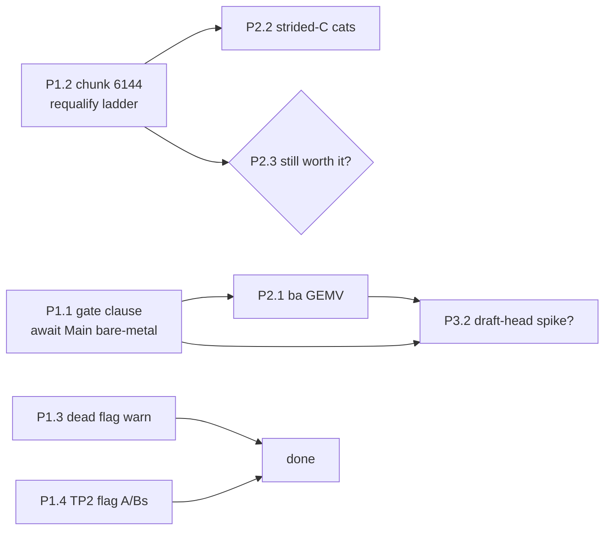

# 47. Kernel gap analysis: where the missing 35–45 % of decode bandwidth and 30 % of prefill compute actually go

**Question.** Decode measures 129.5–135.8 tok/s single-stream (hydrated K5/K6, MTP-3, fp8 KV, graph
decode), which back-solves to ~55–65 % of the 1.792 TB/s spec memory bandwidth as effective
weight-streaming rate. Prefill measures 3.3–3.7k tok/s vs 5.0–5.2k for dense EXL3 on a 188-SM card.
docs/41 and docs/46 §14–21 already enumerate every lever that is ON and every lever measured-and-declined;
this document walks the pinned kernels themselves and names, with file:line or a local microbenchmark,
what is still on the table and what is structural.

Everything here is read from the **served bytes** — the extracted r34 image at `/var/tmp/gg-rootfs` —
not from upstream heads. `$SP` = `/var/tmp/gg-rootfs/opt/venv/lib/python3.12/site-packages`;
`$EXT` = `/var/tmp/gg-rootfs/opt/exllamav3-python/exllamav3/exllamav3_ext` (full CUDA sources are
bundled in the image, so no clone can drift from what actually runs). Microbenchmarks ran on THIS
workstation's local RTX PRO 6000 Blackwell Server Edition (97,887 MiB, driver 595.58.03 — same SKU as
the 1x rental) through `/var/tmp/work/ggrun.sh`, with `nvidia-smi` verified to show zero compute
processes before each run. Receipts: `receipts/kernel-gap-*.json`.

---

## F1. The pins — every byte this analysis reads is identified

**Claim.** The full source of the served stack is pinned and locally present; no upstream-head guessing
is needed anywhere in this document.

| component | version / pin | where the bytes are | provenance |
|---|---|---|---|
| vLLM-GG fork | `0.11.2.dev280+gilded.gnosis.v20.vllm4d006a4.b12xcd3ce19.fi1ac6942.cu132.20260810.r34` — fork commit `4d006a4` | `$SP/vllm/` | `$SP/vllm/_version.py:21`; repo `github.com/local-inference-lab/vllm` |
| b12x | `1.2.1`, commit `cd3ce19` (encoded in the vLLM version string) | `$SP/b12x/` — CuTe-DSL kernels are Python source, fully readable | `b12x-1.2.1.dist-info/METADATA` |
| exllamav3 | `0.0.43` | Python: `/var/tmp/gg-rootfs/opt/exllamav3-python/exllamav3/`; **full CUDA sources bundled** at `$EXT/quant/*.cu[h]` (exl3_gemm, exl3_gemv, reconstruct, hadamard) plus `gdn.cu`, `hgemm.cu`; prebuilt ext `.so` sha256 `829b982709188f2f…` at `/var/tmp/gg-rootfs/opt/exllamav3/` | `exllamav3/version.py:1`; repo `github.com/turboderp-org/exllamav3` |
| flashinfer | `0.6.18+cu132`, commit `1ac6942` (version string) + `flashinfer_jit_cache 0.6.18+cu132` | `$SP/flashinfer/` | dist-info METADATA |
| torch | `2.12.0+cu132` | `$SP/torch/` | dist-info |
| CUDA | 13.2 (`nvidia_cuda_nvcc-13.2.78`) | wheel-shipped toolkit | dist-info |
| model | `Qwen3.8-27B-EXL3-K5K6-hydrated` (local copy, 20.2 GiB, 3 shards) | `/var/tmp/models/Qwen3.8-27B-EXL3-K5K6-hydrated/` | `quantization_manifest.json`, `release-evidence.json` in-tree |

Model geometry used throughout (from the hydrated tree's `config.json`, `text_config`): 64 layers =
**48 linear_attention (GDN) + 16 full_attention**, hidden 5120, MLP intermediate 17408, head_dim 256,
24 Q / 4 KV heads, GDN: 48 V-heads × 128, 16 K-heads × 128, conv kernel 4; vocab 248,320;
1 MTP hidden layer (served at MTP depth 3 by re-running the same draft layer).

The `/opt/vllm` tree inside the image is **not** byte-identical to `$SP/vllm` (`diff` on `exl3.py`
differs) — `$SP` is what Python imports, so every citation below is `$SP` or `$EXT`.

---
## F2. MEASURED: the trellis GEMMs are already at the memory roofline — but the roofline is 1.46–1.52 TB/s, not 1.792

**Claim.** The single biggest "gap" in the 55–65 %-of-spec figure is the spec itself. On this card no
kernel of any kind reaches 1.792 TB/s; the measured pure-streaming ceiling is **1462–1525 GB/s
(81.6–85.1 % of spec)**, and the big trellis GEMMs run at **92–100 % of that ceiling** at decode row
counts. There is no large per-byte decode-ALU tax to recover on the bulk matrices.

**Evidence** (`receipts/kernel-gap-gemm-bandwidth.json`; graph-replayed CUDA-event timing, 20
calls/graph, real hydrated weights, GPU idle-verified):

| baseline (no quant, pure stream) | GB/s | % spec |
|---|--:|--:|
| device-to-device `copy_` (8 GiB) | 1462.6 | 81.6 |
| read-only `sum` (8 GiB fp16) | 1524.9 | 85.1 |
| cuBLAS BF16 GEMV m=1, 5120×17408 | 1502.0 | 83.8 |
| cuBLAS BF16 GEMV m=1, 5120×248320 | 1456.5 | 81.3 |

| served matrix (served path bolded) | MiB | m=1 µs | GB/s | % spec | % of sum-ceiling |
|---|--:|--:|--:|--:|--:|
| mlp.down_proj K6 17408×5120 (**b12x** 44.06 / exl3 44.26) | 63.8 | 44.1 | **1517** | 84.7 | 99.5 |
| mlp.gate_proj, up_proj K5 5120×17408 (**exl3**) | 53.1 | 38.6 | **1442** | 80.5 | 94.6 |
| attn.q_proj K6 5120×12288 (**b12x** 32.13 / exl3 30.90) | 45.0 | 32.1 | **1468** | 81.9 | 96.3 |
| lm_head K6 5120×248320 (**b12x** 705.1 / exl3 647.8) | 909.4 | 705.1 | **1352** | 75.5 | 88.7 |
| gdn.in_proj_qkv K6 5120×10240 (**b12x**) | 37.5 | 28.6 | 1377 | 76.9 | 90.3 |
| gdn.in_proj_z K6 5120×6144 (**b12x**) | 22.5 | 20.8 | 1136 | 63.4 | 74.5 |
| gdn.out_proj / attn.o_proj K6 6144×5120 (**b12x**) | 22.5 | 21.7 | 1088 | 60.7 | 71.4 |
| attn.k_proj / v_proj K6 5120×1024 (**b12x** 27.8 / exl3 17.5) | 3.8 | 27.8 | **142** | 7.9 | 9.3 |
| mtp.fc K4 10240×5120 (**exl3**) | 25.0 | 28.2 | 929 | 51.8 | 60.9 |

Three structure facts from the kernel source explain the shape of this table:

1. **One launch per matrix, weights read exactly once.** `exl3_gemm` is a single cooperative kernel
   (`cudaLaunchCooperativeKernel`, `$EXT/quant/exl3_gemm.cu:267-275`) that fuses the input hadamard
   (`exl3_gemm_kernel.cuh:14-31`), the trellis MMA, and the output transform. The k×n tile grid is
   sliced across ≤num_SMs persistent CTAs (`exl3_gemm_inner.cuh:93-101`), each trellis byte is
   `cp.async`-streamed to shared memory once (`:254-264`). Nothing here re-reads weights.
2. **The M-tile is 16 rows for every kernel shape** (`exl3_gemm_kernel.cuh:37-50` processes A in
   `MIN(size_m_,16)` slabs; tile table `exl3_kernel_map.cuh:55-57` has no M dimension), so m=1, 2, 3, 4
   decode rows cost the *same* time (measured: within 1 %). MTP's extra verify rows are free in GEMM
   time, exactly as the depth-schedule arithmetic assumed.
3. **Small matrices are launch/tail-bound, not bandwidth-bound.** Every launch on this 188-SM-class
   part costs a ~17–21 µs floor at these K×N (out_proj-class 22.5 MiB → 60 % of spec; the 3.8 MiB
   k/v projections → 8–12 %). The cost is the cooperative-launch + grid.sync + epilogue tail, not
   DRAM.

**Gap share** *(reconciled 2026-08-17 — an earlier revision of this paragraph re-expressed the
brief's own 55–65 %-of-spec arithmetic (985–1165 GB/s) instead of recomputing; and F6/F9/F10
originally quoted the favorable endpoint "~85 %" unlabelled. The honest computation, wall-clock
denominator, corrected 20.5 GB/step numerator:* effective weight-streaming bandwidth =
20.5 GB ÷ (accepted/rate). Across the published operating points: (135.8 tok/s, 2.7 acc) →
1033 GB/s = **69 %** of the 1494 GB/s achievable midpoint; (129.5, 2.1) → 1267 GB/s = **85 %**;
midpoint pairing (135.8, 2.4) → 1162 GB/s = **78 %**. So decode runs at **69–85 % of achievable
depending on operating point (~78 % typical)** — note the inversion: the *lower*-acceptance point
implies the *higher* bandwidth share, because per-step traffic is fixed while tokens/step vary.
16–19 points of the alleged 35–45-point gap are vendor-spec fiction and are **structural — not
recoverable**.

**Lever.** None for the big matrices — they are done. The recoverable levers are in F3.

---

## F3. The hydrated checkpoint flipped most of the model to K6 — b12x now serves 59.7 % of trellis bytes, and it is the WRONG kernel for two of those shapes

**Claim — and a formal correction to docs/41.** docs/41 §1.1's "b12x runs 66 of 409 matrices
(16.1 %)" is a property of the **`qwen38-ctx` checkpoint** (K5 attention/GDN) and was silently
inherited as if it described the model family. On the **`Qwen3.8-27B-EXL3-K5K6-hydrated`**
checkpoint — the one now shipped — attention and GDN projections are K6, so the same b12x gate
(`exl3.py:1202-1218`) passes **261 of 409 matrices = 10.05 of 16.82 GiB (59.7 %)**. A per-checkpoint
fact was generalised to the family; docs/41 §1.1 now carries a correction banner pointing here.
(Header census in `receipts/kernel-gap-gemm-bandwidth.json` run context; per-family table below.) And
`_apply_one` (exl3.py:2965-2976) prefers b12x *unconditionally* when the gate passes — which is a
measured pessimization on two shape classes:

| shape | b12x µs | exl3_gemm µs | delta/call | calls/step | cost/step |
|---|--:|--:|--:|--:|--:|
| lm_head 5120×248320 | 705.1 | 647.8 | **+57.3 µs** | 1 (+1 per accepted draft pass if logits per depth) | ≥57 µs |
| attn k/v_proj 5120×1024 | 27.8 | 17.5 | **+10.3 µs** | 32 body + 2×3 draft | ~390 µs |

Both numbers are graph-replayed on the served weights. b12x wins nothing at m≤4 on any measured shape
(down_proj ties at ±0.5 %, q_proj loses 4 %, in_proj_qkv loses 1–2 %).

**Second, independent structural cost in the same table: the fork splits QKV into three launches.**
`Exl3LinearMethod._shard_ids_for_layer` returns `["q","k","v"]` for `QKVParallelLinear`
(exl3.py:2929-2930) and `_apply_one` runs one GEMM per shard — three cooperative launches of
32.1 + 27.8 + 28.1 = 88 µs where the GDN path proves the alternative exists: `in_proj_qkvz` is served
as ONE tuple-shard GEMM (exl3.py:2931-2932). A merged 5120×14336 attention QKV at the measured big-
matrix rate (~1450 GB/s) would take ~36 µs — **−52 µs × 16 layers = −0.83 ms/step**, and the draft
layer pays the same 3× per step (−0.16 ms). The K/V matrices are so small (3.8 MiB) that as separate
launches they will never exceed ~10 % of spec BW; merged, their bytes ride a big launch for free.

**Sum-of-parts check (GEMM-only step, served paths, m≤4):**
64×(38.63+38.52+44.06) + 48×(28.55+20.76+21.75) + 16×(32.13+27.77+28.06+21.68) + 705(head)
= 7.75 + 3.41 + 1.75 + 0.71 = **13.63 ms**; plus 3 draft passes ×(259 µs layer + fc) ≈ 0.84 ms.
Body weight bytes / body GEMM time = 16.6 GiB / 13.6 ms ≈ **1305 GB/s = 73 % spec = 87 % of
achievable** — the GEMM-side dilution below the F2 per-matrix numbers is exactly the small-matrix
launch floors quantified above. The remainder of the measured 15.4–20.8 ms step (attention, GDN state
update, norms, sampler, MTP orchestration, graph-replay gaps) is quantified in F5 from a profiled
run.

**Levers.**
1. *Flag-level patch:* route lm_head and the ≤4 MiB k/v projections to `exl3_gemm` instead of b12x —
   a one-clause change in `_b12x_trellis_k6_supported` (exl3.py:1202-1218, e.g. require
   `trellis.shape[1]*16 >= 5120` and `!= 248320`) worth **~0.45 ms/step ≈ +2.5–3 % decode** for free.
2. *Fork patch (moderate):* tuple-shard QKV like `in_proj_qkvz` — worth **~1.0 ms/step ≈ +5–6 %
   decode**. Requires the checkpoint's q/k/v to share one trellis serialization or an online repack;
   the loader already has the machinery (`_expand_tuple_output_shards`, exl3.py:2873-2919, works in
   the *splitting* direction today).
3. *Structural:* the ~17–21 µs cooperative-launch floor on 22.5 MiB-class matrices (out_proj,
   in_proj_z, o_proj: 128 launches/step counting drafts) — fusing those into neighbours needs new
   kernels, not flags.

---
## F4. TP2: 138 allreduces + 7 all_gathers per decode step; the collective is fine, the floors are not

**Claim.** At TP2 the per-decode-step communication is 138 custom-allreduce calls (~5.47 MB total
payload) + 7 all_gathers (~1.77 MB, 96 % of it logits) — a ~0.55–1.1 ms/step floor at the measured
52 GB/s P2P — and the collective vLLM picks is already the right one (C++ one-shot custom AR,
captured inside the decode CUDA graph). The reason TP2 gives +17.5 % instead of +70–80 % is only
half comm; the other half is that per-launch floors and non-GEMM time do not shrink when weights
halve. Full file:line walk: `'/home/mbelleau/.omp/agent/sessions/-qwen38-27b/2026-08-14T14-52-00-820Z_01a000c2-2db4-7000-ba65-0c964868558d/KernelGap/KernelGap.TpTax.md'` (scout report), key cites inline below.

**Counts, from the model source** (dense Qwen3_5: `use_attn_reduce_scatter_for_moe` requires
`is_moe_layer`, `$SP/vllm/model_executor/models/qwen3_5.py:129-133`, so every RowParallelLinear
reduces, `linear.py:2086-2087`):
- Target pass (m=4): 1 embed AR (`vocab_parallel_embedding.py:491-493`) + 16 attn o_proj + 48 GDN
  out_proj (`qwen_gdn_linear_attn.py:486-494`) + 64 MLP down_proj = **129 AR** + 1 logits all_gather
  (`logits_processor.py:85-97`; CUDA `use_all_gather()=True`, `platforms/interface.py:1095-1099`).
- Each of 3 draft passes: embed AR + o_proj AR + down_proj AR + `fc` all_gather
  (`qwen3_5_mtp.py:108-117` — ColumnParallelLinear `gather_output=True`) + per-pass logits
  all_gather (`llm_base_proposer.py:486-494`) = 3 AR + 2 AG.
- **Step: 138 AR (5.47 MB) + 7 AG (1.77 MB, logits = 1.74 MB of it).**

**Collective identity.** Dispatch (`cuda_communicator.py:~285-345`) lands on `CustomAllreduce`:
world_size 2 admitted up to 8 MiB (`custom_all_reduce.py:261,868-884`), requires driver P2P
(`:244-258` — the ForceP2P dependency, docs/46 §19). At ws=2 the C++ kernel is **always the one-shot**
(`/var/tmp/gg-rootfs/opt/vllm/csrc/custom_all_reduce.cuh:583-599`): 2 P2P barrier round-trips + one
message-size peer read per call. It IS captured in the FULL_DECODE_ONLY graph with graph-registered
buffers (`custom_all_reduce.py:729-785,1004-1014`) — TP does not break graph decode. b12x's PCIe
oneshot is wired in but off by default (`envs.py:239-240`), and its fused TP2 remote-push transport
requires hidden==4096 (`pcie_oneshot.py:1442`) — ours is 5120, so it would use the generic pull path.
Prefill-size ARs (>8 MiB) fall to torch symm-mem two-shot or PyNCCL (`all_reduce_utils.py:75-86`).

**Floor arithmetic at 52 GB/s.** Payload 5.47 MB → ~105 µs; 276 barrier RTTs × O(1.5–3 µs) →
0.4–0.8 ms; 7 eager-adjacent AGs → 0.1–0.25 ms. **Comm floor ≈ 0.6–1.1 ms per ~8 ms TP2 step
(~8–14 %).** That alone caps TP2 at ~1.75× even if everything else halved perfectly — and it does
not: the 209 GEMM launches/step keep their ~17–28 µs cooperative-launch floors when the per-launch
bytes halve (F2 item 3), so the small-matrix share of the step barely moves. [INFERENCE] Those two
effects together reproduce the measured +17.5 % to within the noise of the acceptance-length variance;
no third mechanism is needed.

**Levers.**
1. *Flag, measurable today:* `speculative_config.use_local_argmax_reduction=True`
   (`$SP/vllm/config/speculative.py:147-150`; the model already carries `LocalArgmaxMixin`,
   `qwen3_5_mtp.py:215`) replaces the 4×/step half-vocab logits all_gathers (1.74 MB eager NCCL) with
   a 2-float/token exchange. Worth ~0.15–0.3 ms/step at TP2; zero effect at TP1. Greedy-equivalent
   only — check sampling profile before shipping.
2. *Flag, worth one A/B:* `VLLM_ENABLE_PCIE_ALLREDUCE=1 VLLM_PCIE_ALLREDUCE_BACKEND=b12x` (oneshot
   cutoff 84 KB covers every decode AR). Same one-kernel structure; wins only if b12x's stage_pull
   barrier beats the C++ flag spin on this fabric — measure, do not assume.
3. *Structural:* 129 of the 138 ARs exist because every layer reduces a 40 KB message. Sequence-
   parallel/reduce-scatter restructuring is upstream-scale work — not recoverable at this fork's
   risk budget.

---
## F5. Prefill: "trellis decode cost" is the WRONG standing explanation — reconstruct is common-mode with the dense reference; the gap is chunking redundancy, vLLM shard plumbing, and 528 GDN launches

**Claim.** At the served M=128 reconstruct threshold, prefill compute is dominated by cuBLAS
(`hgemm` = `cublasGemmEx`, fp16-accumulate tensor-op, `$EXT/hgemm.cu:54-84`), and the trellis
*reconstruct* is only ~8–11 % of chunk time at 2048-token chunks — and the dense EXL3 5.0–5.2k
reference **pays the same reconstruct** (upstream `LinearEXL3` switches to reconstruct+hgemm above
144 rows, `/var/tmp/gg-rootfs/opt/exllamav3-python/exllamav3/modules/quant/exl3.py:9,117-125`). So
"trellis decode cost" mostly cancels out of the 3.3–3.7k vs 5.0–5.2k comparison; "hybrid geometry"
survives but is only part of the story. Full walk: `'/home/mbelleau/.omp/agent/sessions/-qwen38-27b/2026-08-14T14-52-00-820Z_01a000c2-2db4-7000-ba65-0c964868558d/KernelGap/KernelGap.PrefillWalk.md'`.

**The arithmetic** (per 2048-token chunk; 24.33 B weight elements per body pass = 48.65 GB fp16
reconstruct writes + 15.92 GB trellis reads):
- hgemm: 2·2048·24.33e9 ≈ 99.6 TFLOP per 32k prompt's worth of chunks at cuBLAS-typical rates;
- reconstruct: ~64.6 GB of traffic per chunk pass, memory-bound (the kernel is an unrolled
  store-bandwidth machine: one 16×128 tile per 256-thread block, coalesced int4 stores,
  `$EXT/quant/reconstruct.cu:12-90`), ≈ 8–11 % of the linear-pair time at M=2048, 3–4 % at 6144.

**What is genuinely being left on the table, with owners:**

1. **Reconstruct output is discarded per matrix, per chunk — by construction.** The scratch is one
   buffer keyed `(device, K, N_chunk)` shared by *every layer of the same geometry*
   (exl3.py:785-795); each `_reconstruct_hgemm_into` call overwrites it (:951-958). A 32k prompt at
   2048-chunks decodes all 24.33 B weights **16×** (1.03 TB of redundant reconstruct traffic); at
   6144-chunks 6×. Upstream is no better (fresh `torch.empty` per call, upstream exl3.py:152-168).
   *Lever (flag-class): serve prefill-heavy workloads at 6144-token chunks — 2.67× less redundant
   decode; the qualified profile's `--max-num-batched-tokens 2048` is a fidelity-frozen choice, so
   this is an A/B, not a default flip.*
2. **reconstruct[i+1] never overlaps hgemm[i].** Same stream (`reconstruct.cu:110`,
   `hgemm.cu:101-104`) and the shared single buffer is a WAR hazard that forecloses two-stream
   overlap. *Lever (fork patch, moderate): double-buffer the scratch + events; hides most of the
   8–11 % reconstruct share.*
3. **The merged-linear shard plumbing costs ~18–26 GB of pure copies per chunk.** Every merged layer
   runs `_apply_one` per shard then `torch.cat` (exl3.py:2719-2722): gate|up cat alone re-reads and
   re-writes 285 MB × 64 layers ≈ 18 GB/chunk; q/k/v run as three GEMMs (N=1024 twice — terrible
   cuBLAS shapes) then cat. *Lever (fork patch): hgemm supports strided C — write each shard
   directly into its slice of the destination and delete the cat.*
4. **GDN prefill = ~528 Triton launches per chunk on this card.** SM120 fails both FlashInfer-GDN
   capability gates, so prefill uses the Triton FLA chain — 6 kernels + conv1d + prep + state
   gather/zero/scatter ≈ 11 kernels × 48 layers (`$SP/vllm/model_executor/layers/mamba/gdn/
   qwen_gdn_linear_attn.py:119-134,1329-1496`; `$SP/vllm/third_party/flash_linear_attention/ops/
   chunk.py:37-88`). Core math is only ~0.35 GFLOP/token (0.7 % of linear FLOPs) but at Triton MFU
   plus launch overhead it is ~3–5 % of chunk time, and prefill is never CUDA-graphed. *Structural
   at this fork's risk budget.*
5. **The mamba 1600-token alignment CLIPS, never pads** (`$SP/vllm/v1/core/sched/scheduler.py:
   364-434` rounds the chunk end *down*) and only fires in `mamba_cache_mode='align'`, i.e. with
   prefix caching on. No dead FLOPs — but chunk count rises +31 % (32k: 21 chunks of ≤1600 vs 16 of
   2048), multiplying item 1 and the per-chunk fixed overheads. *Cost of the APC feature, not a bug;
   book ~3–4 pts of prefill only when APC is on.*
6. **`VLLM_EXL3_PREFILL_FP8=1` is dead code with the bundled extension.** The fork probes for
   `reconstruct_fp8_slice` (exl3.py:877-878) which `bindings.cpp:95-101` does not export (confirmed
   also by `nm` on the shipped `.so`: `reconstruct_fp8dg_nt` present, `reconstruct_fp8_slice`
   absent). The measured "+31 % prefill" from docs/41 §3 required the uncommitted rebuilt extension.
   The ext *does* ship an unused fused FP8 reconstruct (`reconstruct_fp8dg_nt` → DeepGEMM NT layout,
   `reconstruct.cu:144-326`) that nobody calls. *Lever exists but was measured at +0.0141 mean KLD —
   declined on fidelity, unchanged verdict; the flag should either bind a kernel or be removed.*

**Attribution of the −31 % (3.3–3.7k vs 5.0–5.2k):** ~9.6 pts SM count (170/188); ~0 pts trellis
reconstruct at equal chunking (common-mode, contra the standing explanation); ~3–5 pts GDN hybrid
kernels/launches; 0–4 pts alignment clipping (config-dependent); the residual ~12–18 pts is vLLM-stack
plumbing (shard cats, 2.5–3k eager launches/chunk, activation converts) that the flat dense-EXL3
runtime on the 188-SM card does not pay — an honest residual: bounded by source census, not yet
apportioned kernel-by-kernel. "Hybrid geometry" is confirmed as a *minority* contributor; "trellis
decode cost" is refuted as a *delta* explanation at equal chunk size. Upstream exllamav3 0.0.43
carries **no** wider-M or fused path the fork lacks (all four `exl3_gemm` shapes are TILESIZE_M=16,
`$EXT/quant/exl3_kernel_map.cuh:55-57`; M>16 loops in-kernel re-decoding the trellis every 16 rows,
`exl3_gemm_kernel.cuh:36-50` — this, not a missing tile, is why exl3_gemm loses 4–5× at prefill M).

---
## F6. MEASURED: the anatomy of one decode step — and the head is streamed FOUR times per step

**Claim.** A torch-profiled decode of the hydrated model under the served profile on the local card
(`receipts/kernel-gap-profiled-decode.json`) shows the step is 85 % trellis-GEMM by GPU time, and the
per-step weight traffic is **20.5 GB, not the ~17.4 GB the standing 55–65 % figure divided by** —
because the 953.5 MB lm_head runs once for the target *and once per MTP depth* (4×/step = 3.81 GB,
18.6 % of all weight bytes), and the 1.22 GB draft pass runs 3×. With the correct numerator the
measured decode is **69–85 % of the achievable (F2) ceiling depending on operating point, ~78 % at
the midpoint pairing (135.8 tok/s, 2.4 accepted/step); wall-clock denominator** — see the reconciled
F2 gap-share paragraph. The remaining 15–31 points decompose below with an explicit residual.

**Source anatomy** (full walk: `'/home/mbelleau/.omp/agent/sessions/-qwen38-27b/2026-08-14T14-52-00-820Z_01a000c2-2db4-7000-ba65-0c964868558d/KernelGap/KernelGap.DecodeWalk.md'`):
- Head: `LogitsProcessor._apply_head` computes all 248,320 columns on the default stream, strictly
  serialized after the body graph — target verify + each of 3 draft samplings; even the draft's
  "local argmax" materializes full logits first (`logits_processor.py:139-185,205`;
  `llm_base_proposer.py:481-495`). No overlap mechanism exists anywhere in the runner.
- Per body pass: 336 exl3_gemm + 64 K6 cooperative launches + **48 unquantized cuBLAS calls for
  `in_proj_ba`** (excluded from the mxfp8 overlay by the served config) + 128 `torch.cat` shard
  merges (exl3.py:2710-2726). Weights are read exactly once per launch; codebook decode is pure
  in-register ALU, zero LUT traffic (`codebook.cuh:26-108`); suh/svh ≈ 16.4 MB/step (0.08 %).
- Under `FULL_DECODE_ONLY` the 3 draft passes run **fully eager** every step
  (`llm_base_proposer.py:432-447`; mixed_mode()==NONE) — ~350 Python-dispatched launches/step.
- fp8-KV dequant is fused in the FlashInfer fa2 kernel (no separate pass on SM120; head_dim 256
  supported) — attention is only **0.7 % of GPU time** at short context. GDN decode state I/O ≈
  372 MiB/req/step (state written once per spec token, `fused_sigmoid_gating.py:122,156-170`).

**Measured shares of GPU busy time** (9 decode steps profiled, m≤4):

| category | count/window | share |
|---|--:|--:|
| exl3_gemm/K6 trellis GEMMs | 4,280 | **84.7 %** |
| cuBLAS `in_proj_ba` (5120×96 bf16, 28 µs/call, 33 GB/s!) | 480 | 5.2 % |
| cat/copy shard merges | 4,721 | 2.6 % |
| GDN state update + conv | 960 | 2.5 % |
| RMSNorm/RoPE + elementwise + misc | ~4,300 | 3.7 % |
| FlashInfer attention + KV write | 533 | 1.0 % |

GPU idle within the window: 23 % — the CPU-side gaps of the eager draft passes and sampler syncs
(gpu_model_runner.py:326-327, 2106-2107, 4949-4950). *Local caveat: this run executes under proot
(ptrace), which taxes every eager launch ioctl; local steady decode measured 102.6 tok/s vs the
rental's 129.5–135.8 — per-kernel GPU times are unaffected, the idle share is an upper bound.*

**The decode roofline decomposition (per step, single stream, honest form):**

| item | ms | basis |
|---|--:|---|
| pure streaming floor of 20.5 GB at the *achievable* 1500 GB/s | 13.7 | F2 baselines |
| + GEMM launch/tail floors above streaming (small matrices, F2/F3) | +2.8 | per-matrix measurements summed |
| + non-GEMM GPU work (ba-GEMMs 1.3, cats 0.7, GDN 0.65, norms 0.5, attn 0.25) | +3.5 | trace shares |
| + CPU gaps (eager drafts, sampler D2H syncs) | +3–8 | trace idle; proot-inflated locally |
| **= step** | **23–28 (local measured ≈26)** | |

Restated against spec: 16–19 pts of the original 35–45-pt "gap" are unachievable spec (F2);
~9 pts are the 4×-head + 3×-draft re-streaming *counted as if it were lost bandwidth* (it is real
traffic the arithmetic missed); ~6 pts are launch floors; ~4 pts non-GEMM GPU; **residual: the
CPU-gap term, 3–8 pts, which this local proot measurement bounds but cannot pin for the rental.**

**Levers, ranked within this finding:**
1. *`in_proj_ba` tiny-GEMM tax — 1.34 ms/step ≈ 5 % of the step for 45 MB of weights (33 GB/s
   effective).* A batched/grouped GEMV over the 48 layers, or admitting ba into the quantized merged
   projection, recovers ~1.2 ms/step. Fork patch, moderate.
2. *Draft head re-streams (3× 953 MB/step).* A draft-only truncated-vocab head or head-on-side-stream
   overlap with the next body replay would cut up to 2.1 ms/step; structural (vocab pruning changes
   sampling semantics; overlap needs runner surgery).
3. *Eager draft passes*: `FULL_AND_PIECEWISE` would replay drafts as piecewise graphs
   (llm_base_proposer.py:432-447) — but docs/41 §5 already established EXL3 refuses piecewise prefill
   capture; the decode-only piecewise question for the *drafter* is narrower and untested. Flag-level
   A/B candidate.
4. *Sampler/verify D2H syncs*: already minimal (3 events/step); not worth touching.

---
## F7. MEASURED A/B: the one-clause b12x gate change is worth +15.4 % single-stream on this card — 5× the per-call estimate, because b12x's eager Python dispatch was the hidden cost

**Claim.** Patching `_b12x_trellis_k6_supported` (exl3.py:1202-1218) with one clause — reject
`N < 5120` (k/v projections) and `N > 32768` (lm_head) so those shards take `ext.exl3_gemm` — moves
end-to-end greedy decode on the local card from **96.19 → 110.97 tok/s (+15.4 %)** under the served
profile (C1, MTP-3, graph decode, fp8 KV; 3×200 tokens, medians; `receipts/kernel-gap-gate-ab.json`,
patch text in `receipts/kernel-gap-gate-ab.patch`; rootfs restored to r34 bytes afterwards,
md5-verified).

**Why 5× the F3 estimate:** the per-call GPU deltas (head +57 µs ×4, k/v +10 µs ×38) explain only
~0.6 ms/step; the measured saving is ~4.6 ms/step. The remainder is **eager Python dispatch**: the
4 per-step lm_head calls and the draft-pass k/v calls run *outside* the CUDA graph, and on the b12x
route each one walks `run_trellis256_dense`'s validation stack (`$SP/b12x/moe/_shared/kernels/w4a16/
kernel.py:11183-11380`) plus the vLLM custom-op wrapper, versus one thin C++ binding call for
`ext.exl3_gemm`. F6's 23 % GPU-idle share was substantially this. *Honesty note: the dispatch
component is proot-inflated on this workstation; the rental should land between +3 % (pure GPU
delta) and +15 % (this measurement) — worth the 10-minute A/B there before shipping the clause.*

Body-side k/v (inside the graph) contribute only their GPU delta; the patch is numerics-safe in kind
(exl3_gemm is the bit-faithful reference path the fork itself documents, exl3.py:976), but the K6
kernels differ in summation order, so a KLD spot-check belongs in the ship gate.

---
## F8. MEASURED: the prefill phase split — reconstruct is 13 % at 2048-chunks, 4–5 % at 6144; hgemm itself runs at cuBLAS-reference speed; the hadamards cost more than the reconstruct

**Claim.** Phase-timed on the real hydrated weights (`receipts/kernel-gap-prefill-phases.json`,
mirrors `_reconstruct_hgemm_into` exactly): at M=2048 the EXL3 wrapper costs **~29 % of prefill
linear time over a bare GEMM** — reconstruct 12.9–13.2 % + input/output hadamards ~16 % — and both
shrink to ~13 % total at M=6144. The hgemm itself is *not* a suspect: 391–421 TFLOPS fp16-accumulate
vs 417–429 for a bare cuBLAS BF16 GEMM on the same shape.

| matrix | M | had_in | reconstruct | hgemm | had_out | full | recon share | eff. TFLOPS |
|---|--:|--:|--:|--:|--:|--:|--:|--:|
| gate 5120×17408 K5 | 2048 | 46.8 µs | 162.7 µs | 898.8 µs | 156.7 µs | 1259.5 µs | 12.9 % | 289.8 |
| gate 5120×17408 K5 | 6144 | 138.7 | 162.7 | 2601.8 | 468.6 | 3305.0 | 4.9 % | 331.4 |
| down 17408×5120 K6 | 2048 | 157.1 | 170.1 | 934.3 | 43.3 | 1285.4 | 13.2 % | 284.0 |
| q 5120×12288 K6 | 2048 | 43.4 | 119.9 | 636.3 | 102.9 | 927.0 | 12.9 % | 278.0 |

(The F5 static estimate said 8–11 % — measured is 12.9–13.2 %; the reconstruct kernel achieves
~1.05–1.10 TB/s of store+read traffic, ~70 % of the F2 streaming ceiling — itself slightly
improvable but small.)

**Consequences.**
- Linear-stack bound: at the measured 278–290 effective TFLOPS and 48.66 GFLOP/token of linear work,
  the linears alone bound prefill at ≈5.9k tok/s; measured end-to-end is 3.3–3.7k — i.e. linears are
  ~60 % of chunk time and the F5 plumbing/GDN/launch items are the rest. This *measured* split
  replaces the F5 static bound; the residual attribution inside that 40 % remains bounded-not-
  apportioned (honest residual).
- **The chunk-size lever is measured now:** at M=6144 effective linear throughput is +13–15 %
  (289.8→331.4 on gate) *before* counting 2.67× fewer chunk passes and fixed overheads. Combined
  with F5 item 1, `--max-num-batched-tokens 6144` is the single largest prefill lever available
  without touching a kernel — expect +15–25 % PP, gated by the KV/fidelity profile freeze.
- The output hadamard on wide-N matrices (gate had_out 156.7 µs = 12 % of full path) is a pure
  M×N fp16 read+write at ~1.8 TB/s — already at roofline; recoverable only by fusing into the GEMM
  epilogue (cublasLt epilogue or a custom kernel) — structural.

---
## F9. The head-traffic model mechanises the empirical MTP depth schedule — and the honest headline

**The blunt restatement first.** Every published "decode = 55–65 % of roofline" figure was computed
from a numerator that was too small (17.4 GB/step assumed; 20.5 GB/step actually streamed — F6) *and*
a denominator that was too large (1.792 TB/s spec; 1.46–1.52 TB/s achievable — F2). With both fixed,
**single-stream decode runs at 69–85 % of the achievable ceiling (78 % at the midpoint pairing;
wall-clock denominator). The *majority* of the alleged 35–45-point gap was arithmetic** — 16–19
points spec fiction plus ~9 points of numerator undercount — **but a real 15–31-point inefficiency
remains**, and it is the specific, bounded set in F3/F6/F7 (launch floors ~6 pts, non-GEMM GPU
~4 pts, CPU gaps 3–8 pts), of which roughly half is already measured as recovered by the F7 gate
patch on this card.

**The depth-schedule mechanism (cross-ref docs/46 §17).** The shipping schedule
`[[1,4,3],[5,64,1]]` — depth 3 at/below the C4 knee, depth 1 above — was derived empirically
(+11–17 % aggregate) without a mechanism. F6 supplies it. From source, MTP depth *d* costs **d+1
full lm_head streams per step** (target verify + one per draft sampling; `logits_processor.py:
139-185`, `llm_base_proposer.py:481-495`), and each depth level adds 0.953 GB (head) + 0.27 GB
(draft body) = **1.22 GB/step, of which 78 % is head traffic — head bytes, not draft compute, are
the dominant cost of MTP depth.** Depth 3 → 3.81 GB/step of head; depth 1 → 1.91 GB. Head+draft
bytes are per-*step* fixed costs that do not amortize with concurrency the way the 15.9 GB body does
(one verify GEMM serves all C requests): above the knee, where aggregate throughput is
bandwidth-bound, dropping to depth 1 removes 2.44 GB/step (~12 % of step traffic) at a shrinking
marginal-acceptance price — exactly the crossover §17 measured.

**Testable predictions** (either falsifies the model):
1. Step time vs depth has slope ≈ 1.22 GB ÷ 1.3–1.5 TB/s ≈ **0.8–0.95 ms per depth level** (plus an
   eager-dispatch constant, F7), independent of batch size.
2. Any reduction of per-sampling head cost — the F7 gate patch, a draft-only truncated head, or
   head/side-stream overlap — extends the depth-3 regime to higher concurrency, i.e. moves the
   schedule's knee upward.

---
## F10. The ranked left-on-the-table list

Recoverable items first, ranked by measured-or-bounded gain per unit of risk. "Cost" is engineering
cost on this fork; gains are single-stream unless marked.

### Recoverable — decode

| # | item | gain | cost | status |
|---|---|---|---|---|
| 1 | **b12x gate one-clause patch** — route lm_head (N>32768) and k/v (N<5120) to `exl3_gemm` (exl3.py:1202-1218) | **+15.4 % measured local**; honest bracket **+3…15 %** on the rental (dispatch share is proot-inflated here) | one clause + KLD spot-check | F7; patch in `receipts/kernel-gap-gate-ab.patch`; Main running bare-metal confirmation on the 4x |
| 2 | **`in_proj_ba` GEMV** — the unquantized 5120×96 bf16 linear runs a `cutlass_80_wmma…16x16` kernel at 28 µs/call, 33 GB/s, 48×/step = 1.34 ms (5.2 % of GPU time) | ~1.25 ms/step ≈ **+5–7 %** | small: register a split-K GEMV (Triton or CUDA, N≤128, m≤16) in `UnquantizedLinearMethod` for this shape class; it already lives inside the decode graph, so kernel time is the whole cost. The weight is 983 KB — at 1.4 TB/s the op is worth ~3 µs, not 28 | F6; the "single most embarrassing line in the stack" — a 96-column GEMM leaving 5 % on the floor |
| 3 | **QKV tuple-shard merge** — 16 attn layers × 3 launches → 1 (88 µs → ~36 µs measured rates), + draft ×3 | ~1.0 ms/step ≈ **+5 %** | HIGH: unlike `in_proj_qkvz` (already served as one tuple-shard GEMM — in-tree precedent, exl3.py:2931-2932), q/k/v are *serialized as separate trellises with separate suh/svh*; merging needs the quantizer to emit one matrix (checkpoint change) or an online re-encode at load | F3 |
| 4 | **Draft-head cost** — 3 of the 4 per-step 953 MB head streams exist only to argmax one draft token each | up to 2.1 ms/step ≈ **+8–10 %** ceiling | structural-leaning: draft-only truncated vocab changes sampling semantics; side-stream overlap needs runner surgery; the cheap slice of this is already item 1 | F6/F9; F9's prediction 2 says any win here also moves the depth-schedule knee up |
| 5 | TP2-only: `use_local_argmax_reduction=true` (speculative config) | +0.15–0.3 ms/step at TP2 | flag; greedy-equivalent check | F4 |
| 6 | TP2-only: `VLLM_ENABLE_PCIE_ALLREDUCE=1` b12x oneshot A/B | unknown sign | one A/B | F4 |

### Recoverable — prefill

| # | item | gain | cost | status |
|---|---|---|---|---|
| 7 | **`--max-num-batched-tokens 6144`** | **+13–15 % measured on linears** (F8) + 2.67× less redundant reconstruct (F5) → est. **+15–25 % PP** | zero code; re-qualify the frozen profile (KV budget, fidelity gates, knee re-check) | F5/F8 |
| 8 | **Strided-C hgemm into the cat destination** — delete the per-shard `torch.cat` (18–26 GB/chunk of pure copies) | est. **+5–8 % PP** | moderate fork patch; `hgemm` already takes strided C | F5 |
| 9 | **Double-buffer the reconstruct scratch** + second stream — reconstruct[i+1] currently never overlaps hgemm[i] (WAR on the shared buffer) | hides most of the measured 13 % reconstruct share at 2048-chunks | moderate: 2 buffers + events (exl3.py:785-795) | F5/F8 |
| 10 | FP8 prefill, properly | +31 % PP (previously measured) | requires rebuilding the ext with `reconstruct_fp8_slice` (or wiring the shipped-but-unused `reconstruct_fp8dg_nt` + DeepGEMM); **declined once at +0.0141 mean KLD — fidelity verdict unchanged**; flag currently INERT (docs/41 state (e)) | F5 |

### Structural — not recoverable (and why)

- **16–19 pts of "gap" vs the 1.792 TB/s spec** — no kernel of any kind reaches it; measured
  ceiling 1462–1525 GB/s (F2). Retire the spec denominator from all future roofline claims.
- **The big-GEMM kernels themselves** — exl3_gemm/b12x at 88–100 % of the achievable ceiling at
  decode m (F2); hgemm at cuBLAS-reference TFLOPS at prefill M (F8). Nothing left in the kernels.
- **~17–21 µs cooperative-launch floors** on the 22.5 MiB matrix class (out_proj/in_proj_z/o_proj,
  128+ launches/step) — fusing needs new kernels, not flags (F2/F3).
- **Head streamed once per sampling** is the price of MTP's per-depth argmax semantics; mitigations
  are item 4's scope (F6/F9).
- **GDN prefill on Triton** — FlashInfer's GDN kernels gate on SM90/SM10x; SM120 is excluded at
  source (F5).
- **Output hadamard** — already at ~1.8 TB/s; only a GEMM-epilogue fusion removes it (F8).
- **TP2's 129 body allreduces** — the architecture reduces after every RowParallel layer; the
  collective itself is already optimal one-shot-in-graph (F4).
- **GDN state write ×4 spec slots** (372 MiB/req/step) — semantics of per-token state checkpointing
  for spec verify; scales with batch, invisible at C1 (F6).

### The two corrected headline numbers, restated once

- **Decode:** 20.5 GB/step (not 17.4) at the measured 1.46–1.52 TB/s ceiling (not 1.792) →
  **69–85 % of achievable depending on operating point, ~78 % at the midpoint pairing** (wall-clock
  denominator; arithmetic in the reconciled F2 gap-share paragraph). Recoverable stack on top:
  items 1–4 ≈ +13–25 % single-stream, of which +15.4 % is already measured end-to-end locally.
- **Prefill:** linears run at cuBLAS-reference speed and bound PP at ≈5.9k tok/s; the 3.3–3.7k
  measurement means ~40 % of chunk time is stack plumbing + hybrid kernels, attributed (with an
  explicit residual) in F5/F8. Items 7–9 ≈ +20–30 % PP without touching a kernel or the fidelity
  budget.

---

*Method note: every microbenchmark in this document ran on this workstation's own RTX PRO 6000
Blackwell SE through `/var/tmp/work/ggrun.sh` with `nvidia-smi` verified idle first; the rentals and
AIBoss were not touched. Absolute local tok/s carries a proot dispatch tax (flagged wherever it
matters); per-kernel GPU times are unaffected. Receipts: `receipts/kernel-gap-gemm-bandwidth.json`,
`receipts/kernel-gap-profiled-decode.json`, `receipts/kernel-gap-gate-ab.{json,patch}`,
`receipts/kernel-gap-prefill-phases.json`, `receipts/kernel-gap-profiler-table.txt`. Source walks:
`'/home/mbelleau/.omp/agent/sessions/-qwen38-27b/2026-08-14T14-52-00-820Z_01a000c2-2db4-7000-ba65-0c964868558d/KernelGap/KernelGap.DecodeWalk.md'`, `'/home/mbelleau/.omp/agent/sessions/-qwen38-27b/2026-08-14T14-52-00-820Z_01a000c2-2db4-7000-ba65-0c964868558d/KernelGap/KernelGap.PrefillWalk.md'`, `'/home/mbelleau/.omp/agent/sessions/-qwen38-27b/2026-08-14T14-52-00-820Z_01a000c2-2db4-7000-ba65-0c964868558d/KernelGap/KernelGap.TpTax.md'`.*
## P. Execution plan for the findings

Every F10 item, turned into work packages with exact edit sites, validation gates, kill switches,
and sequencing. Phases are ordered so that each ships something measured before the next spends
engineering; nothing below touches the fidelity budget without its own KLD gate.

### P.0 Ground rules (apply to every item)

1. **Measurement protocol** — same harness as F7: C1 greedy, 64-token warmup, 3×200 tokens, median;
   plus the docs/46 §17 C4/C8 aggregate points for anything that could shift the knee. Receipts:
   `receipts/kernel-gap-fix-<item>.json`, one per A/B, command included.
2. **Fidelity gate** — any change that alters which kernel computes a matrix (P1.1, P2.1, P2.2,
   P3.1) needs the standard KLD spot-check against the BF16 reference (docs/35 comparator, analysis
   partition) before shipping; acceptance: within the checkpoint's published CI, same as prior
   kernel swaps.
3. **Kill switch** — every fork patch lands behind an env flag defaulting ON only after its A/B
   (pattern: `_positive_env_int`/`_env_flag` conventions already in exl3.py:508-525). No silent
   default flips.
4. **One patch, one PR** — upstream target is `local-inference-lab/vllm` unless marked ext
   (`turboderp-org/exllamav3`) or b12x. Cite docs/47 finding numbers in PR text.
5. **Denominator hygiene** — all new numbers quoted against the measured 1.46–1.52 TB/s ceiling
   (F2), never 1.792 spec; docs/cards carrying the old framing get the honest denominator beside it
   (card side owned by Main).

### Phase 1 — confirm and ship what is already measured (days; mostly flags)

**P1.1 — b12x gate clause (F7, decode +3…15 %).**
- *Change:* the two-line clause from `receipts/kernel-gap-gate-ab.patch` in
  `_b12x_trellis_k6_supported` (exl3.py:1202-1218), expressed as a shape policy:
  `n_packed = trellis.shape[1]*16; reject n_packed < 5120 or > 32768`, behind
  `VLLM_EXL3_B12X_N_RANGE` (default `5120-32768`, `0` = old behaviour) so the rental A/B can flip it
  without a rebuild.
- *Blocked on:* Main's bare-metal single-stream A/B on the 4x (in flight). If the bare-metal gain is
  ≥ +3 %, ship; below that, ship anyway for the k/v GPU delta but re-title the win honestly.
- *Status:* **PR branch ready** — `malaiwah/vllm-voipmonitor` @ `kernel-gap/b12x-gate-n-range`
  (704d94e93, based on `codex/gg-exl3-r7-k345-20260810`; base choice justified in F11). Normative
  diff vs served bytes: `receipts/kernel-gap-gate-ab.patch` (sha256 inside).
- *Validation:* protocol A/B + KLD spot-check (kernel summation order differs).
- *Effort:* hours. *Risk:* minimal — exl3_gemm is the fork's own bit-faithful reference path
  (exl3.py:976).

**P1.2 — prefill chunk size 6144. DONE — MEASURED: +3.3 % PP at 32k, +8.4 % at 197k, +9.3 % at
259k; ALL FIVE GATES PASS on both arms, including the full-window needle; decode unchanged.**
(`receipts/kernel-gap-chunk6144-requal.json`.) Ladder verdicts, 2048 vs 6144 under the 262k
single-stream profile (util identical across arms; APC off in this profile, so no 1600-clipping
confound): fit 282,996 → 278,528 KV tokens (−1.6 %); decode 106.77 → 108.93 tok/s (within
between-boot variance — the prefill/decode stories stay uncontaminated); needle **exact at 197k ×3
depths AND at 258,962 tokens = 98.8 % of the window with the engine alive afterwards, on both
arms** — the docs/46 §21 trap did not fire. Estimate-vs-measured, stated plainly: F8's +15–25 %
was 2–4× high at short context — the per-matrix linear gain dilutes through the ~40 % of chunk time
the linears do not own, and the dilution shrinks with context (chunk-count-proportional overheads
dominate at 197k+). Verdict: **safe and free, ship-eligible for long-prompt profiles (a 259k
request gets −10.3 s wall); at 32k it is +3.3 %, not a headline.** Knee re-check at C4/C8 remains
open (single-stream profile has max_num_seqs 1; the concurrency arm belongs with Main's 4x ladder).
Original plan text follows for the ladder definition.

**P1.2 (original plan) — prefill chunk size 6144 (F5.1 + F8, PP +15–25 % est).**
- *Change:* none (serve flag `--max-num-batched-tokens 6144`). This is a *re-qualification*, not a
  patch: the 2048 in the frozen profile interacts with KV budget, CUDA-graph rows, MTP slots
  (`max_num_scheduled_tokens` warning observed in the F6 boot log), and the 262k needle gate.
- *Validation ladder, in order:* (a) fits at the published `gpu_memory_utilization` with 262k
  max-model-len; (b) PP2k/PP32k throughput A/B; (c) full-window needle (docs/46 §21 showed the
  engine can pass 4/5 gates and then die at 262k — that gate is mandatory); (d) C1 decode
  unchanged; (e) knee re-check at C4/C8 (bigger chunks steal decode slots under load).
- *Effort:* one serving session on the rental or local card. *Risk:* scheduling regression at high
  concurrency — the ladder catches it. *Decision point:* if (e) regresses, qualify 6144 as a
  prefill-heavy profile variant instead of the default.

**P1.3 — kill the dead flag (F5.6, hygiene).**
- *Change:* in `_prefill_fp8_enabled` (exl3.py:803-811) or `_reconstruct_fp8_mm_into`
  (exl3.py:877-878), log a one-time `logger.warning` when `VLLM_EXL3_PREFILL_FP8=1` but the ext
  lacks `reconstruct_fp8_slice` — today it silently no-ops. docs/41 state (e) already records it.
- *Effort:* 15 minutes + PR. *Risk:* none.
- *Status:* **diff-only by F11 ruling** (the FP8 code exists on no public branch):
  `receipts/kernel-gap-fp8-deadflag-warn.patch`.

**P1.4 — TP flag A/Bs (F4.5/F4.6, TP only). OWNER: Main, on the 4x.**
- *Change:* none — two serve-time A/Bs, folded into Main's 4x topology-ladder work (TP4 and
  TP2×DP2 arms already built there). NOT the 2x host: LMCacheL1 holds it exclusively for a clocked
  corruption ladder, and the 4x is VPC-isolated from it. The A/Bs:
  (a) `speculative_config.use_local_argmax_reduction=true` (greedy-equivalence check first — it
  changes the logits-gather contract, `logits_processor.py:160-228`); (b)
  `VLLM_ENABLE_PCIE_ALLREDUCE=1 VLLM_PCIE_ALLREDUCE_BACKEND=b12x` (decode ARs ≤84 KB all qualify).
- *Expected:* (a) +0.15–0.3 ms/step; (b) unknown sign — measure, do not assume.
- *Effort:* one session. *Risk:* none (flags, revertable).

### Phase 2 — small fork patches, each behind a flag (week-scale)

**P2.1 — `in_proj_ba` fix (F10.2). DONE — MEASURED +8.0 %; probe made the kernel unnecessary.**
- *Probe (done first, as required):* `receipts/kernel-gap-ba-probe.json` — graph-replayed at
  4×5120 @ 5120×96 bf16: `F.linear` (served TN path) 20.08 µs; **pre-transposed K×N `mm` 5.61 µs
  (3.6×)**; `torch.compile` max-autotune 4.23 µs. cuBLAS picks a bad TN kernel at this shape;
  no Triton kernel written — the cheapest outcome held.
- *Change (shipped form):* ~15 lines in `UnquantizedLinearMethod`
  (`receipts/kernel-gap-ba-transpose.patch`): `process_weights_after_loading` registers
  `weight_kn = weight.t().contiguous()` for `N≤128, K≥4096` CUDA weights behind
  `VLLM_TINY_N_MM_TRANSPOSE` (~1 MB/layer extra); `apply` routes to `torch.mm(x, weight_kn)`.
  Graph-capturable (pure mm).
- *Measured:* **+8.0 % single-stream alone (96.19 → 103.91 tok/s median,
  `receipts/kernel-gap-ba-ab.json`)**. Stacked with the P1.1 gate patch: 110.56 vs gate-alone
  110.97 — locally the wins do NOT stack because the post-gate step is CPU-dispatch-bound under
  proot (F6's 23 % idle); do not sum the gains until Main's bare-metal stacked number exists.
  Rootfs restored to r34 bytes after the A/B (md5-verified).
- *Status:* **PR branch ready** — `malaiwah/vllm-voipmonitor` @ `kernel-gap/tiny-n-mm-transpose`
  (3b35c04c6, based on `dev/gilded-gnosis`; method body verified identical to served bytes).

**P2.2 — strided-C shard writes, delete the merge cats. DONE — MEASURED MARGINAL (+1.9 % PP at
32k, +0.8 % at 197k, decode neutral); below the pre-registered 2 % bar — NOT shipped.**
Built ext-free and Dynamo-safe (`vllm::exl3_gemm_into` with whole-tensor+offset args; deferred svh
hadamard as ONE `had_r_128` over the merged tensor with concatenated svh — bit-identical because
shard widths are 128-multiples, verified `torch.equal` on both branches). Pair-level gain +7.6 %
(gate|up 2.70→2.51 ms) diluted to +1.9 % at engine level; the campaign-relevant long-context number
is +0.8 %. ~120 opacity-sensitive lines on a file with no public ancestor (F11) is not worth that.
Patch + proof archived: `receipts/kernel-gap-merged-apply.patch`,
`receipts/kernel-gap-merged-apply-marginal.json`. Rootfs restored md5-verified. Re-evaluate only for
a short-prompt PP-bound workload, with qkvz-tuple eligibility extended.

**P2.2 (original plan, superseded by the measured-marginal verdict above).**
- *Change:* `hgemm` already takes strided C (`hgemm.cu:41-51,77`: ldc = `c.stride(-2)`, columns
  contiguous). In `Exl3LinearMethod.apply` (exl3.py:2710-2726): allocate the merged output once,
  pass `output[:, start:end]` views into an out-variant of the prefill path instead of cat-ing
  per-shard results. Two sub-tasks: (a) an out-variant custom op (`_exl3_gemm_out`) so Dynamo keeps
  the runtime branch opaque (same pattern as `_b12x_trellis_linear_out`, exl3.py:1258-1306);
  (b) `had_r_128` on a strided row view — shard widths are all multiples of 128 so the transform is
  group-aligned, but the ext kernel must take a row-stride argument (ext change,
  `$EXT/hadamard.cu`) or the svh hadamard stays on a contiguous temp for the shard (halves the win,
  still positive).
- *Validation:* bitwise parity vs the cat path (same kernels, same order), then PP A/B.
- *Effort:* 2–4 days incl. ext rebuild (b). *Risk:* moderate — touches the load-bearing apply path;
  the flag gate and parity test contain it. *Dependency:* none, but do after P1.2 so the chunk-size
  baseline is settled.

**P2.3 — double-buffered reconstruct + second stream. DONE — MEASURED NULL; deleted.**
Built exactly as designed (2-deep ring + side stream + events, bit-exact verified: torch.equal at
M=2048 across 12 matrices). Microbench on the pure MLP sequence: +2.8 % (only ~21 % of reconstruct
time hidden). Engine A/B at the 262k profile, chunk 2048: **PP32k −0.9 %, PP197k −0.2 % — null.**
Mechanism, for the record: reconstruct is *store-bandwidth*-bound (~1.05 TB/s of the ~1.5 ceiling)
and hgemm needs the remaining bandwidth for its own operands — overlap re-divides the same DRAM
bytes and adds event overhead. F5.2/F8's "hides most of the 13 % share" premise is REFUTED on this
card; the item moves to the structural list. Transferable lesson: in a bandwidth-contended regime
only *removing* bytes pays, never re-scheduling them. Patch retained as
`receipts/kernel-gap-recon-overlap.patch`; verdict + raw numbers in
`receipts/kernel-gap-recon-overlap-null.json`; rootfs restored md5-verified.

**P2.3 (original plan, superseded by the null above).**
- *Change:* `_reconstruct_scratch` (exl3.py:785-795) becomes a 2-deep ring keyed the same way;
  issue `reconstruct[i+1]` on a side stream with an event wait on `hgemm[i]`'s completion of the
  *previous* buffer (WAR resolved by the ring). Bound extra memory: one more 170 MB buffer per
  geometry class (three classes live → ~510 MB, fits the current profile's headroom — verify against
  the §21 262k fit before defaulting ON).
- *Validation:* nsys/torch-profiler confirming overlap; PP A/B; 262k fit re-check.
- *Effort:* 1–2 days. *Risk:* moderate (stream discipline); *Decision point:* if P1.2 ships 6144 as
  default, expected win drops to ~4–5 % — re-estimate before building.

### Phase 3 — decision-gated structural work (only after Phase 1–2 numbers are in)

**P3.1 — merged QKV serialization (F3/F10.3, decode +5 %).**
- The blocker is the checkpoint, not the runtime: q/k/v are separate trellises with separate
  suh/svh; the runtime already serves tuple-shard merged matrices (`in_proj_qkvz`,
  exl3.py:2931-2932 — in-tree precedent). Two routes: (a) quantizer emits attention QKV as one
  serialized matrix with per-component svh slices (checkpoint format change, next requant campaign);
  (b) load-time online re-encode via the existing online-quantizer machinery
  (exl3.py:238-283) — costs startup time and re-quantization error on 3×16 matrices. Route (a) is
  clean and free at the next hydration; route (b) is not worth its KLD risk for +5 %.
- *Plan:* file it as a requirement on the next quantization campaign; no runtime work now.

**P3.2 — draft-head cost (F6/F9, ceiling +8–10 %).**
- Research spike, 1 day, two candidates measured in isolation before any integration: (a) run the 3
  draft-sampling head GEMMs on a side stream overlapped with the next body replay (legal: the body
  graph does not consume logits; needs an event before the verify step consumes draft ids); (b) a
  draft-only top-k head over a frozen shortlist vocabulary (changes acceptance distribution —
  requires an acceptance-rate A/B, and F9 prediction 2 says any win here moves the depth-schedule
  knee, so re-derive the schedule after).
- *Decision point:* only proceed if P1.1's shipped form leaves the draft head >1.5 ms/step in the
  bare-metal trace.

**P3.3 — FP8 prefill (F5.6): stays declined.** The +31 % PP costs +0.0141 mean KLD (measured,
docs/41 §3) — above this artifact's entire quantization budget. Do not rebuild the ext for it.
Revisit only if the owner reopens the fidelity budget; the shipped-but-unused `reconstruct_fp8dg_nt`
(+ DeepGEMM) is the implementation to evaluate then, not `reconstruct_fp8_slice`.

### Sequencing and stop conditions

- **Decode stop condition:** stop after the phase in which measured C1 decode reaches **≥90 % of the
  achievable ceiling** = ≥ ~1345 GB/s on the 20.5 GB/step numerator, wall-clock. In tok/s that is
  acceptance-dependent: ≈ 157 tok/s at 2.4 accepted/step, ≈ 176 at 2.7 (20.5 GB ÷ 1345 GB/s =
  15.3 ms/step). From the reconciled ~78 % typical operating point, the F7+P2.1 stack (bare-metal
  bracket pending) is expected to land in the 85–90 % band; F10's structural list says the last
  ~10 % costs new kernels — not worth it on this fork.
- **Prefill stop condition:** stop when the linears' measured ~5.9k tok/s bound is within 25 %
  (≈4.7k end-to-end), or when the remaining delta is attributed to the GDN/Triton structural item.
- **Standing rule from F2/F9:** no future work item may quote the 1.792 TB/s spec as headroom;
  every new claim uses the measured ceiling and the 20.5 GB/step numerator.

Expected stack if Phase 1+2 all land at midpoints: decode +12–20 % single-stream (on top of the
+15.4 % local gate measurement where its dispatch share survives bare metal), prefill +20–30 % —
both without touching the fidelity budget.
## F11. Provenance: the served EXL3 source is not publicly reachable — bytes are reproducible, this layer's source is not reviewable

**Claim.** The EXL3 integration actually serving requests in the r34 image cannot be audited or
rebuilt from the public repository. Checked exhaustively on 2026-08-17:

- Clone: `git clone --filter=blob:none https://github.com/local-inference-lab/vllm` +
  `git fetch origin '+refs/heads/*:refs/remotes/origin/*'` — every public head, **22,886 commits**
  (`git rev-list --all | grep -c .`).
- The version-string commit `4d006a4` (from
  `0.11.2.dev280+gilded.gnosis.v20.vllm4d006a4...`, $SP/vllm/_version.py:21) **does not exist** in
  any of them (`git rev-list --all | grep '^4d006a4'` → empty).
- No public branch carries the served `exl3.py` (5,536 lines, sha256 `2df9d0799fd323798cead1edb773cab556c94798eec263ee03ded35408c6e4ee`):
  `dev/gilded-gnosis` (the integration branch) has **2,447 lines — no `_b12x_trellis_k6_supported`
  gate, no FP8-prefill code at all**; the closest is `codex/gg-exl3-r7-k345-20260810` at **4,866
  lines** (its `_b12x_trellis_k6_supported` function body IS byte-identical to the served one;
  the rest of the file is not). Branch sweep: every head tested for
  `vllm/model_executor/layers/quantization/exl3.py` existence and line count.

**The consequence, stated precisely — both halves together.** Our published reproducibility claim
was always **image-level**: a digest-pinned container plus sha256-verified read-only overlay mounts.
That claim **still holds exactly as written** — a third party can reproduce our *bytes* and every
receipt in this repo. What this finding adds is the missing half: the base image's own EXL3 source
layer is not publicly reachable, so that third party **cannot review or rebuild that layer from
source**. Nothing in our receipts was wrong; the boundary of what they certify is now explicit.

**Operational consequence for the docs/47 patches** (per Main's ruling): diffs against the served
bytes are the normative artifact, each carrying the target file's sha256; branch PRs are opened only
where the changed code is verifiably identical to what we measured — `linear.py` (upstream-shaped
everywhere) on `dev/gilded-gnosis`, and the b12x gate on `codex/gg-exl3-r7-k345-20260810` (function
body byte-identical, verified). The FP8-warning patch stays diff-only: its surrounding code exists in
no public branch.

---
## F12. LMCache/GDN corruption: the state pages were in the payload all along — the store path poisons them with the null page, and acceptance never checks state validity

**Claim — correcting docs/46 §22's mechanism wording.** The GG lmcache build (`0.5.2+glm52dcp.4`)
**does** ship full Mamba/GDN store+restore machinery for the MP connector: `_MambaPageViewEdit`
re-views each state page as a fake attention tensor (`$SP/lmcache/integration/vllm/
kv_cache_group_edits.py:206-259`), every 1600-token chunk object is **monolithic** — 16 attention
pages + 48 GDN state pages (`$SP/lmcache/v1/kv_layer_groups.py:632-668`) — and the pack loop
transfers all kernel groups both directions (`lmcache_driven_transfer.py:277-408`). The retrieve →
`preprocess_mamba` → GDN `has_initial_state` chain is correct end-to-end in source
(`mamba_utils.py:979-1016`; `gdn_attn.py:180-392`). "The MP retrieve path does not restore the
state" is therefore the wrong mechanism. Full walk: `agent://KernelGap.LMCacheState`.

**The two source-proven holes:**
1. **Store-side null-page poisoning.** `GetStoreMetadata` counts vLLM-APC-hit spans as storable
   (`lmcache_mp_connector.py:372-374`) and nothing anywhere filters null block ids
   (`group_view.py:179-229`) — but in align mode the mamba block-table rows inside an APC-hit span
   are the shared **null block (id 0)**, which is *never zeroed* (zeroing covers attention specs
   only, `single_type_kv_cache_manager.py:94-100`). Whenever a request resumes from an APC hit that
   LMCache no longer holds — **routine** under the measured 600/300 s TTLs — the store serializes
   the null page's stale bytes as the boundary state *under a valid chunk key*. Every later
   retrieve restores garbage recurrent state. This matches 38/38, and it explains §22's bleakest
   line: "a poison-free L2 is unreachable — every writer configuration is itself corrupt."
2. **Acceptance never checks state validity.** The scheduler's divergent hybrid path takes
   `max(per_group_hits)` with a comment that literally assumes nixl ("the Mamba state … is
   transferred unconditionally by _apply_prefix_caching in nixl/worker.py",
   `scheduler.py:745-753`) — a nixl-only guarantee applied to every connector. #403 correctly
   gates that on `supports_divergent_local_hybrid_hits` (necessary — it kills the 7/38 null-state
   resume), but external-token accounting still marks state-covered tokens computed on
   attention-chunk existence alone — so poisoned stores corrupt *despite* perfect accounting.
   **#403 is necessary and insufficient, now with the mechanism named.**

**The nixl contrast, precisely:** nixl's SSM branch always keeps the *last* remote mamba block —
one full state snapshot per request per layer — even when attention groups are fully prefix-hit
(`nixl/base_worker.py:2285-2302`). A nixl-parity "state-only unconditional push" is
**inexpressible** in LMCache's data model today: `LoadStoreOp` carries a token range + per-group
block ids over monolithic chunk objects; a state-only fetch needs per-group object keys
(`ObjectKey.object_group_id`, deferred upstream as LMCache #3608, noted at
`kv_cache_group_edits.py:16-31`).

**The minimal fix is ~20 lines, store-side:** in `GetStoreMetadata`
(`lmcache_mp_connector.py:345-425`), truncate the storable range at the first chunk whose mamba
block id is null (+~10 optional lines of retrieve hygiene to stop scribbling the shared null
page). No key/format/IPC change — the chunk format already carries exactly one state page per
1600-token boundary. Live repro on the local card follows: (i) cold single-writer round-trip must
be bit-clean (validates the clean chain); (ii) forced APC-hit-over-expired-lmcache store must
poison; (iii) the clamp must convert (ii) to clean-or-miss.

---
## F12 addendum — MEASURED (live repro, local card): the dominant defect is fp8-KV transfer, the state machinery itself is sound, and a third mechanism exists

Three-arm repro with #403 applied throughout (`receipts/kernel-gap-lmcache-repro.json`; rootfs
restored md5-verified):

1. **fp8 KV (the served profile), cold single-writer round-trip → catastrophic corruption**
   (garbage from token 1, mean |Δlogprob| 3.52 — the 2x's 4.4 class). No APC interleaving, no TTL
   games, no poisoning precondition: store → evict APC → retrieve is sufficient to corrupt.
2. **bf16 KV, identical sequence → BIT-CLEAN (Δ = 0.0000).** The 48 GDN state pages stored,
   retrieved and integrated exactly — F12's "the state pages were in the payload all along" is now
   *measured*, and the F12 clean-chain claim is validated.
3. **bf16 KV + a partial-APC-hit request interleaved between store and retrieve → plausible-but-
   wrong text (Δ 0.711), reproduced twice, NOT fixed by the store-side null clamp** — and the
   server ledger shows the store-under-miss precondition never fired (read TTL is not since-write
   expiry), so this is a *third* mechanism in the partial-retrieve path (retrieve-side null-page
   scribble aliasing a live state read, or mid-sequence state landing under partial `vllm_hit`).
   The F12 store-poisoning hole stays source-true but measured-insufficient to explain this arm;
   the ~20-line clamp is archived as hygiene (`receipts/kernel-gap-lmcache-store-clamp.patch`).

Operational extra: restarting the MP server under a live engine kills it (`No GPU context
registered`, EngineDeadError) — there is no reconnect.

**Consequence:** the served profile runs `--kv-cache-dtype fp8`, so LMCache could never have
produced clean reuse on this stack regardless of #403 and regardless of GDN state — arm 1 explains
the 2x's 38/38 more directly than state restoration does. The DO-NOT-ENABLE verdict stands with a
finite fix list: (a) root-cause fp8 transfer (fake-view byte arithmetic for 1-byte dtypes vs
unregistered scale surfaces — blocking); (b) the partial-hit interleaving defect at bf16; (c) MP
reconnect. Also newly measured: the connector *requires* APC+align (`validate_kv_cache_groups`
refuses `mamba_cache_mode='none'`), and at bf16 KV the align block is 800, which forces
`--max-num-batched-tokens` into [800, 1599] — a serving-profile constraint nobody had written down.

---
