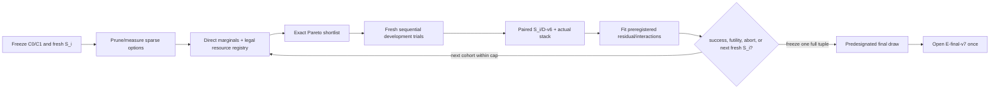

# 61 — Final-frontier Qwen3.8-27B requantization + serving-stack plan

**Status:** final research plan, 2026-08-20; execution remains gated. Repository, external, dataset, upstream and three independent adversarial reviews are incorporated. No rental or GPU conversion is authorized until G0/G1 pass.

## 0. Reformulated mandate

Build the next Qwen3.8-27B artifact and its serving stack as one co-designed, auditable system rather than as a checkpoint followed by runtime tuning.

The checkpoint/runtime pair must:

1. improve the verified Pareto frontier across **time to first token (TTFT), prompt-processing throughput (PP), token-generation throughput (TG), fidelity, memory, and capability**;
2. target a **single RTX 5090 32 GB** as the primary deployment constraint while preserving larger-card and multi-GPU operation;
3. retain the original model's text, reasoning, tool-use, image, video, MTP, and native-context surfaces, with a default context as close as practical to the native **262,144-token** window;
4. use the strongest evidence available: EXL3 K3–K7 candidates, direct propagated KLD, activation/output sensitivity, the bounded “+1” transition prior, calibration A/Bs, and only those rotations or residual corrections that win isolated tests;
5. co-design exllamav3 conversion, checkpoint topology, B12X kernels, Gilded Gnosis vLLM, and upstream vLLM so stored precision has a fast and correct serving path;
6. be transparent, measurable, reproducible, and falsifiable: no hidden overlays, incomparable protocols, unexplained runtime patches, post-hoc thresholds, or capability claims inferred from proxies;
7. proceed through increasingly expensive gates: **AIBoss RTX 5090 local rehearsal → one rented RTX PRO 6000 → final multi-GPU conversion machine**;
8. preserve continuity with the current published models by rerunning the frozen method of record, while adding new methods only through versioned bridge measurements;
9. incorporate every open or blocked item from the [retrospective peer review](60-retrospective-peer-review.md); and
10. serve as a durable memory checkpoint: what was tried, what survived, what failed, why the next experiments are ordered this way, and what evidence would reverse each decision.

The research question is not “what is the smallest acceptable quant?” It is:

> What checkpoint/runtime pair can dominate the current deployable frontier on the most important axes without sacrificing native capability, and what sequence of cheap experiments gives enough evidence to spend the final conversion rental confidently?

## 1. Executive decision

The next artifact is **not one guessed K-map**. It is the output of a constrained, multi-fidelity feedback loop named here **Frontier Loop**.

The executable order is deliberately simpler than the initial draft:

1. preserve standard EXL3 1.4.2 LDLQ, the hydrated artifact and the existing direct end-logit marginal path as controls;
2. audit the already-built [`Intel/Qwen3.8-27B-bpw2.8-AutoRound`](https://huggingface.co/Intel/Qwen3.8-27B-bpw2.8-AutoRound) artifact before implementing a new quantizer;
3. use the measured K curve to retain only incumbent/adjacent K options plus justified K3/K7 and codebook arms—never a Cartesian bank;
4. derive and test forward-only ResComp-style trellis compensation on AIBoss;
5. prove a differentiable BF16 Qwen hybrid forward/backward on the RTX PRO 6000 before collecting YAQA/KronQ/GuidedQuant/DeltaLoss/MBQ statistics;
6. compare no more than three **fresh sequential** development candidates on source-disjoint search/development data;
7. freeze one complete tuple—checkpoint recipe, topology, sidecars, runtime tree, profile and command—before the final confirmatory set is opened;
8. produce a predesignated fresh final draw, use a sibling only as a nondeterminism control, and evaluate that one draw plus matched controls; and
9. return the exact finalized hashes to AIBoss for the release-authorizing 5090 run.

The old EDA ladder, Dynamic 3.0 map, KronQ joint trace, GuidedQuant, AutoRound DeltaLoss, BAQ, late-layer measurements and role labels are **features and priors**, never truth. Direct measured candidate behavior is the target.

Algorithmic priorities:

- **Control allocator:** pinned EXL3 LDLQ + `measure_model.py -l 3` end-logit marginals + exact resource solver.
- **P0 rounding experiment:** ResComp-style running-input/current-layer compensation, independently derived for 16×16 trellis tiles and tested on whole GDN/full-attention block suffixes.
- **P0-after-gradient-gate:** YAQA-style two-Hessian rounding. It is the strongest paper-level match to EXL3/QTIP tiles, but it is not a one-linear or 5090 experiment and GPL source is not transplanted.
- **P1 features:** candidate-specific KronQ-trace×EXL3-distortion, GuidedQuant and DeltaLoss ablations; MBQ is an alternative modality weighting, not another additive score.
- **Conditional only:** GAMMA soft preferences, learned transforms, new residual formats and Q-Palette TCQ kernels. Q-Palette's fusion-aware resource formulation is adopted now; its 4090 kernels/latencies are not.

Current formats already establish a 5090 PP/KLD/context deadlock. A high-risk packed-TCQ/new-format lane is reopened only if the clean-source integrated profile and profiler prove format/GEMM work is still the Gate-C blocker after the simpler EXL3 lanes.

## 2. Memory checkpoint: how we reached this point

| Epoch | Durable result | Consequence now |
|---|---|---|
| K4 and online K5/K6 | The runtime could serve mixed EXL3 with vision, but online/un-calibrated K6 was measurably worse. | Sensitive roles stay offline-calibrated and serialized. |
| Hydrated K5/K6 | K6 attention + K5/K5/K6 MLP, K6 head, MTP, BF16 embedding/vision became the fidelity anchor. | This exact artifact is the control, not merely a recipe to reconstruct. |
| Context edition and int8 embedding | K5 attention plus a clean embedding overlay demonstrated native 262,144 on 32 GB; isolated int8 embedding cost is about **+0.000065** mean KLD. | Memory has a measured fidelity-priced lever. The embedding PR must be replaced cleanly. |
| v5 fidelity method | 5,120×2,047 positions, 842 source clusters, shared BF16 head, exact candidate identities and paired intervals established the strongest artifact comparison. | Keep v5 unchanged for continuity; do not tune on its final aggregate. |
| Error-driven allocation | Adjacent K3–K8 proxy error has a stable curve, but the byte-identical `rel` allocation lowered proxy error 13.1% and worsened KLD 13.6% (`0.002700 → 0.003066`). | Reuse the byte law/rung bank; retire every unvalidated scalar objective. |
| EDA re-solve | `sqrt_energy` moved bytes in the same bad attention→MLP direction; `abs` moved toward attention/GDN but had 2.52× scale inconsistency and stripped 1.34 GB from `down_proj`. | The replacement objective must observe propagation/end loss and interactions. |
| Depth and Dynamic 3.0 studies | Controlled gate/up FP6 bands made late layers 2.3× costlier than early; Dynamic 3.0 and EDA agree at role level but not per layer. | Late-heavy and v/k-over-q are priors to test, not fixed maps. |
| Rotation pilot | One fixed-pair K=8 Givens pilot on layer-0 gate was 725× worse than EXL3 Hadamard in original-space MSE. | That pilot is closed. Only materially different, function-preserving/two-sided transform pilots remain. |
| Multi-precision runtime | All-FP4 reached PP but failed fidelity; all-FP6 passed KLD but lost context/PP; mixed RTN/GPTQ attempts also failed KLD or correctness. | Nominal “+1” mappings are candidate generators only. |
| Kernel/profile work | B12X ANY_BITS cure raised fidelity PP to 2,987.7; the current three profiles expose a real memory/format deadlock. QKV fragmentation remains a structural checkpoint/runtime opportunity. | Allocation must include execution format, kernel route, fusion topology, scratch, and KV budget. |
| Retrospective review | 186 findings reconciled; 15 confirmed items remain open/blocked. | Stage zero closes or explicitly gates all 15. |

Primary repository sources: [KLD method](42-kld-method.md), [allocation result](37-error-driven-allocation.md), [EDA re-solve](57-eda-allocation-revisit.md), [kernel gaps](47-kernel-gap-analysis.md), [Dynamic 3.0](59-unsloth-dynamic3-research.md), and [retrospective](60-retrospective-peer-review.md).

## 3. Current frontier and exact target contract

### 3.1 Current live RTX 5090 Pareto set

One RTX 5090, 600 W, n=3 historical boots, 2,051-token PP, shard-0 KLD:

| Profile | PP tok/s | TG fox / essay tok/s | mean KLD | p99 | context | failure |
|---|---:|---:|---:|---:|---:|---|
| fidelity | 2,987.7 ± 4.4 | **228.3 / 104.1** | **0.003405** | **0.034889** | 238,400 | PP |
| balanced | 3,925.2 ± 13.1 | 215.6 / 103.7 | 0.005672 | 0.059908 | 199,104 | context |
| throughput | **9,638.9 ± 18.3** | 187.4 / 94.3 | 0.063759 | 0.7010 | **249,600** | fidelity, fox TG |

Source: [`receipts/frontier-2026-08-19.md`](../receipts/frontier-2026-08-19.md) final corrected table and `charts/profiles-*.png`. These are planning anchors, not confirmatory controls: every relevant incumbent is recaptured on the same inputs/runtime/hardware blocks as the final candidate.

Full-v5 artifact means are a different, already-used protocol surface: hydrated 0.002760, online K5/K6 0.003210, context 0.003509, official FP8 0.005294, K4 0.010604, NVFP4 0.031059. They remain descriptive continuity columns only.

### 3.2 Three gates, no best-row mixing

Every headline names **one payload+sidecar set, one runtime tree/image, one canonical profile manifest, and one command**. The profile hash covers all argv/env, route table, MTP depth/schedule, APC policy, graph mode/capture sizes, KV/attention backend, block size, max length/sequences/batched tokens, multimodal envelope, power and clocks. All headline workloads run without an unrecorded restart or override.

#### Gate A — target-hardware feasibility

The **exact payload hashes** must pass on the 32,607-MiB AIBoss RTX 5090:

- PP ≥ 7,000 tok/s on the existing 2,051-token compatibility harness;
- TG fox ≥ 190 and essay ≥ 83 tok/s;
- development-fidelity bridge mean KLD ≤ 0.012 and fixed-threshold tail gate;
- at least 238,400 configured tokens plus the composed long-context/multimodal request defined below;
- image, functional video path, native MTP, tools, thinking history and chat-template safety;
- no engine-fatal OOM, silent fallback or post-request death; explicit KV/scratch/graph accounting.

No RTX PRO 6000 or multi-GPU PP/TG/TTFT number can satisfy this gate.

#### Gate B — confirmatory frontier advance

The primary incumbent is fixed now as the current **fidelity** checkpoint/profile, because the mandate requires lower—not merely passing—KLD. Before any candidate result, a candidate-blind `campaign-contract.json` will freeze:

- the Pareto vector and direction for mean KLD, fixed tail-exceedance rates, PP, fox/essay TG, the TTFT grid, resident/peak memory and context;
- engineering non-inferiority margins, minimum superiority effects and capability margins;
- one-sided confidence level, multiplicity adjustment and fixed sample/boot counts derived from baseline-only power simulations;
- exact failure handling, randomization/interleaving blocks and stock-clock versus tuned-clock claims.

Candidate and incumbent are run on identical final-confirmatory inputs and randomized/interleaved 5090 blocks. Gate B is an **intersection-union** decision: simultaneous one-sided bounds must clear every non-inferiority margin, and an adjusted superiority bound must clear at least one preregistered material-improvement margin. Failure to detect a difference is not equivalence. Context/capability are explicit pass/fail constraints, not favorable scalar entries.

Secondary claims against balanced/throughput require separately preregistered, multiplicity-adjusted comparisons; the easiest incumbent cannot be chosen after results.

#### Gate C — best-of-axis envelope, stretch only

Gate C is non-budget-authorizing and non-expected. It requires the same final profile to beat matched remeasurements of:

- throughput PP (historical anchor 9,638.9);
- fidelity TG (228.3 fox / 104.1 essay);
- matched confirmatory body and own-head KLD/tails;
- native 262,144 context; and
- the fastest qualified incumbent TTFT at every declared workload.

Historical intervals/scalars do not establish Gate C. If the stretch fails, only an honestly verified Gate-B Pareto advance may ship.

### 3.3 TTFT and performance definition

Reuse `tools/tb21_ladder.py`, `bench-context-curve.py` and the server histogram instead of inventing another clock:

- client TTFT = request start to first nonempty SSE token;
- engine TTFT = matching `vllm:time_to_first_token_seconds` delta;
- at C1, report prompt tokens / engine TTFT as a latency-inclusive PP floor; at C>1, TTFT includes queueing and is not relabeled PP;
- APC-off arms have cold-prefix only; APC-on arms define cache reset, cold miss, warm hit, eviction and metrics. JIT-warm is not called prefix-warm;
- grids: 128/2k/32k/128k/native, C1/C4, text and image, with simultaneous one-sided bounds;
- pilot only the incumbents to choose the fixed number of independent boots; candidate measurement begins after N is frozen.

Current three-profile TTFT was not measured as one matched 5090 matrix, so Stage 1 establishes that baseline.

### 3.4 Hard invariants

- Base model exactly `Qwen/Qwen3.8-27B@1d4bf0f2ff6012fd82039f2fa52739d0dd7c60c0` with all 18 BF16 shard hashes.
- BF16 vision tower retained in the default artifact; no `language_model_only` headline.
- Native RoPE default; 1M static YaRN is a separate profile and protocol.
- Native MTP retained. Draft quantization is judged by target acceptance/TG/capability, not body KLD.
- Exact tokenizer, processors, chat template, tool parser, reasoning mode and `preserve_thinking` identities.
- At least the repository-qualified 8,388,608-pixel image ceiling and a separately declared video frame/pixel/token envelope.
- No LMCache/external connector until fixed and requalified; no undocumented KV override.
- Existing receipts immutable; corrections are new objects.
- Primary tuned claims record the +6000 memory-clock state; a stock-clock 600-W portability block is reported separately.

## 4. Dataset, rights and BF16 activation decision

### 4.1 Roles fixed before tokenization

| Role | Inputs | Decision use | Reuse/publication rule |
|---|---|---|---|
| `C0` converter control | exact exllamav3 250×2,048 feed at `5f3c537` | continuity and same-pass Hessian control | token identity reused; six text blobs have unresolved provenance, so rows/source-derived captures stay internal and only digests/results publish |
| `C1-text` | new pinned chat/reasoning/code/multilingual/tool rows rendered with the Qwen template | calibration A/B | new, rights-complete, disjoint |
| `C1-mm` | pinned image-caption/tool-media calibration with actual processor/template | multimodal calibration/gradient arm | distinct from multimodal search and benchmark panels |
| `S_i` | burned v5 shard 0, clean v4 and a finite sequence of fresh source-disjoint cohorts | adaptive marginals, feature/interaction fitting, trial feedback | development only; no release claim |
| `D-v6` | new source-disjoint development-validation short/text+capability panels | choose among at most three fresh sequential candidates | public/frozen after use; never called confirmatory |
| `E-final-v7` | separately sourced, locally access-controlled final text set plus frozen capability panels | exactly one predesignated fresh final draw and matched controls | opened once; any candidate/profile change burns it and requires `E-final2` |
| legacy v5 full | existing method of record | descriptive continuity after freeze | never fed back into this campaign |

Public benchmarks are **frozen panels**, not blind/sealed data; pretraining contamination is unknown. “Sealed” is reserved for the locally controlled `E-final-v7` before evaluation.

### 4.2 Rights-complete split manifest

Before collection, every item records full source revision, config/split/row or source ID, original URL, file/media SHA256, license/attribution, permitted transformations, redistribution decision, derivative-output policy, raw-content hash and role.

- C0 remains internal until every bundled blob's origin/terms are reconstructed. Do not publish its lossless rows, source text or source-derived captures under a blanket Apache label.
- CC-BY-ND media: publish IDs/hashes and aggregate outputs only unless permission/rights review authorizes more.
- Dataset-level license tags do not erase Wikipedia/arXiv/PSF/BSD/Gutenberg or task-container obligations.

Partition **before tokenization** by source-family connected component: book/work, repository, upstream document, benchmark task family and translation family. Deduplicate exact bytes plus a preregistered normalized 12-word-shingle/MinHash rule, code-clone fingerprints and template-aware tool hashes. Shared chat-template boilerplate is excluded from overlap scoring. Whole connected duplicate components enter one role only; exclusions, unresolved matches and per-stratum cluster counts are published.

### 4.3 Development and final dataset size

`D-v6` is not fixed at an underpowered 512 contexts by convenience. Use v5's source-cluster variance to simulate power for the smallest decision-relevant paired effect and every non-inferiority margin. Freeze:

- minimum independent source families per stratum, no family contributing more than a fixed context cap;
- a stratified/hierarchical source-cluster bootstrap;
- fixed tail exceedance probabilities at preregistered KLD thresholds with one-sided bounds;
- finite endpoint/stratum multiplicity adjustment.

p99 remains a descriptive quantile plus paired cluster-resampling interval; exact max is descriptive only.

Candidate search never changes `E-final-v7`. Stage 2 may compare up to three recipes on `D-v6`, then freezes one complete tuple. The first complete valid Stage-3 sequential draw is predesignated as the release candidate; the sibling is a nondeterminism control and cannot be chosen because it scored better.

### 4.4 Capability panels

Freeze exact trees before any candidate output:

- vision development/calibration and final panels are separate; candidate set may include MathVision `testmini` and RealWorldQA IDs/hashes, subject to rights policy;
- BFCL non-live v3 simple/multiple/parallel/multi-turn-long-context;
- RULER-generated 32k/131k/262k tasks with frozen seeds/tokens;
- the exact 89-task Terminal-Bench Harbor tree is pinned now, not selected after failure;
- a redistribution-safe generated video panel supplies functional-path coverage only until a powered licensed video-quality set exists.

For each retained-capability claim, preregister task population, scorer, seeds/sampling, repetitions, BF16/current-incumbent comparator, engineering margin and confidence method. Run BF16/current controls on the whole frozen panel or a candidate-independent random subset—not only candidate failures. Conditional Terminal-Bench BF16 remains diagnostic, not a population non-inferiority estimate.

`C1-mm`, `S-mm/D-mm`, and `E-mm` are disjoint. A 16–32-pair MBQ arm is only a feasibility/variance pilot. Allocator promotion requires a powered, source-diverse set at least paper-scale (128 pairs) spanning natural images, OCR/documents, charts/STEM, low/high visual-token counts, multi-image and a safe video fixture. MBQ weighting, GuidedQuant/Fisher weighting and token saliency are competing aggregations, not silently multiplied.

### 4.5 What must be regenerated from BF16

AIBoss has the complete 55,562,855,904-byte BF16 snapshot and reusable v5 shard-0 reference.

| Bundle | BF16 action |
|---|---|
| C0/C1 sequential conversion | regenerate states/H per conversion; calibration rows persist, downstream H does not |
| v5 shard-0 search | reuse existing reference/shared head; candidate captures new |
| D-v6 | matched BF16, candidate and incumbent development captures |
| E-final-v7 | matched BF16, predesignated final candidate and incumbent captures under one path |
| native context | sparse-position KLD primary; exact task/source counts and positions; full-position only via chunked projection with no full-logit materialization |
| multimodal | BF16 processor+vision+language forward; stream summaries rather than raw internal activations where possible |
| tools/capability | BF16/current control on preregistered task population |
| MTP | native-formatted inputs, draft/target logits and acceptance if MTP is quantized |
| full legacy v5 | recapture BF16 shards 1–9 plus controls after final selection |

Every confirmatory set captures BF16, final candidate and incumbent under matched runtime/hardware; an overlap bridge on shard 0 measures historical-versus-new capture drift. Shared-head body KLD and own-head live KLD remain separate estimands.

The RTX 5090 cannot host the full BF16 model. The RTX PRO 6000 stage first proves a differentiable Qwen hybrid path: finite/repeatable gradients through full attention, all GDN recurrence/gates, selected MTP and visual tokens; logit parity with the capture path; and measured memory/time for one block and one end-to-end sample. No YAQA/KronQ/GuidedQuant/DeltaLoss/MBQ result exists until that gate passes.

## 5. Frontier Loop: bounded allocation feedback

### 5.1 Decision variables and compatibility registry

For each quantizable module choose one **implemented and measured** option:

```text
o = (K ∈ {3,4,5,6,7}, codebook, output-scale mode,
     legal topology/fusion group, exact decode route, exact prefill route,
     optional immutable execution sidecar)
```

Vision/norm/small tensors are fixed. Embedding, head and MTP have separate objectives.

The registry is keyed by `(runtime SHA, SM, K, codebook markers, shape/alignment/N, row class, graph mode)` and records observed route, latency, scratch/JIT/startup and fallback. “B12X supports K3–K6” is not sufficient: ANY_BITS, MCG/no-mul1, dtype/rank, alignment and N-window constraints all apply. The default shipping domain is K3–K6; K7 enters only when its direct-fidelity value pays its measured fallback cost or a native path qualifies. Any unmeasured fallback is candidate-fatal.

Split q/k/v is the only initial topology. Before attention option/marginal work, a real producer/consumer pilot must exist for uniform fused QKV. Mixed-width tuple QKV remains research-only until one on-disk schema and one-launch kernel pass full-attention/logit/graph/startup gates. Split marginal scores never transfer to a fused matrix.

### 5.2 Sparse option cache, not a Cartesian bank

Reuse the existing measured K curve to prune first:

- retain incumbent K and adjacent K±1 for uncertain/high-value modules;
- add K3/K7 only where a prior/direct marginal justifies the edge;
- admit non-mcg codebooks/scale modes only after a matched representative panel;
- key every retained option to calibration token hash, predecessor propagation/state digest, rounding method, transform, codebook, scale mode and converter tree.

`tools/ladder_pass.py` may persist these **sparse screening options** atomically instead of discarding them. It must not materialize K×codebook×scale×rounding×transform. A splice is an S-only screen, never a sequential-conversion equivalent. Downstream Hessians/options are path-dependent, especially under ResComp.

Fresh sequential conversions are cheaper than a stale Cartesian bank for the ≤3 development candidates. A larger cache is allowed only after a written break-even calculation covers candidate count, bytes, build time, predecessor paths, atomic staging and retention.

Persist calibration int64 rows. Hessians/factors are ephemeral by default; same-pass reuse is allowed. A bounded representative factor cache may store one canonical triangular/factored representation keyed by full predecessor/calibration/arithmetic identity. Do not cache broad raw 17,408² Hessians.

### 5.3 Measurement hierarchy

1. **Control:** existing proxy K curve, bytes, role/depth and pinned LDLQ.
2. **External bound:** audit AutoRound's exact Qwen3.8 artifact—ancestry, hashes, vision/MTP/topology, actual bits, internally inconsistent PR references—then same BF16 bridge if runnable.
3. **Direct marginal:** pinned `measure_model.py -l 3`, with the exact optimizer group named; final-logit KLD remains the control allocator.
4. **Forward-only rounding:** independently derive ResComp at trellis tile/group level and evaluate a whole GDN/full-attention block suffix under running quantized inputs.
5. **Gradient gate on 96 GB:** only after differentiable-hybrid parity; then YAQA Sketch A/B, KronQ, GuidedQuant, DeltaLoss and MBQ.
6. **Candidate-level features:** e.g. `joint_trace(m) × actual_EXL3_distortion(m,K)`; DeltaLoss on reconstructed `W_K−W`. MBQ is an alternative modality aggregation. Drop features that add no held-out rank/calibration value beyond K distortion+role/depth.
7. **Interactions:** q↔v, attention↔MLP, early/mid/late, adjacent GDN/full-attention groups, embedding/head and legal topology pairs.
8. **Whole development candidates:** fresh sequential builds on fresh `S_i` and `D-v6`.
9. **Confirmation:** one predesignated fresh final draw plus matched controls on `E-final-v7`.

Method panels are stratified random samples with multiple modules per role/depth class plus untouched confirmation modules. Byte/tuning budgets are equalized; clean-room implementations pass toy numerical oracles, no-quant/BF16 limits and paper-equation checks before model claims.

### 5.4 Exact optimizer

Use a fusion-aware multiple-choice multidimensional knapsack/MILP. Hard constraints include exact disk/resident/scratch/graph/MTP/KV/startup budgets, legal topology/route and one option per logical module.

Objectives remain a Pareto vector: KLD/tails, TTFT/PP/TG, resident/context/startup/conversion and capability risk. The Q-Palette resource/fusion formulation is the inspiration; all coefficients are remeasured on SM120.

Start with a simple calibrated model: candidate-specific direct marginals + role/depth + preregistered interactions. GAMMA-style teacher-forced masks are conditional P2 only if the simple model is unstable across budgets/source-disjoint cohorts and a faithful implementation is affordable. No weighted sum may be retuned after results.

### 5.5 Finite feedback loop



Rules:

- v5 shard 0/full v5 are search/continuity only.
- Adaptive decisions use fresh source-disjoint `S_i`; ordinary reused cross-validation is not fresh evidence.
- Before work, freeze cohort sizes, maximum **three** whole candidates per development wave, maximum **two** waves before an explicit new plan, feature update rules, residual model, uncertainty calibration, proposal log and total GPU-hour/dollar cap.
- Log every proposed candidate, including unrun ones.
- `D-v6` selects/falsifies development recipes. `E-final-v7` evaluates one predesignated final payload; any response to its result starts a new campaign and `E-final2`.
- The first complete valid final draw is the release candidate. The sibling estimates nondeterminism; if the pair exceeds the preregistered envelope, stop rather than choose the better draw.

### 5.6 Decision outcomes

- **Success/freeze:** one development candidate satisfies the preregistered feasibility, non-inferiority/superiority and resource bounds.
- **Futility:** under the fixed uncertainty model, probability of a decision-relevant improvement falls below the frozen threshold within remaining budget.
- **Instability:** cohort ordering oscillates or uncertainty calibration fails—collect the one prespecified extra cohort, then abort if unresolved; never freeze.
- **Unsupported lane:** missing kernel/format terminates that lane, not evidence for another recipe.
- **Budget stop:** fixed candidate/iteration/GPU-hour cap reached.

Hypervolume normalization, feasible region and reference point are frozen in the campaign contract. “Any two vague signals” is not a stop rule.

A failed stretch goal never authorizes profile mixing. The fallback is only a verified Gate-B Pareto point.

## 6. Method lanes and hard prerequisites

### 6.1 Adoption order

| Rank | Lane | Disposition | Promotion evidence |
|---:|---|---|---|
| 1 | pinned LDLQ + existing direct end-logit marginals | control/adopt | current format/runtime and exact solver |
| 2 | AutoRound Qwen3.8 2.8-bpw artifact | early external comparator | pin all bytes/ancestry/consumer; same BF16 bridge and capability/runtime audit |
| 3 | ResComp-style drift correction | P0 forward-only experiment | trellis-tile derivation + whole GDN/full-attention suffix direct-KLD win |
| 4 | YAQA Sketch A/B | P0 after 96-GB gradient gate | clean-room 16×16 update, real Fisher/H_in/H_out, memory/time and direct-KLD win |
| 5 | MBQ modality balance | data policy after powered pilot | disjoint ≥128-pair multimodal set, stable gradient/rank estimates |
| 6 | KronQ trace × actual EXL3 distortion | P1 feature | held-out incremental prediction beyond K distortion/role/depth |
| 7 | DeltaLoss / GuidedQuant | P1 competing features/baseline | candidate-specific ablation, not additive gradient double-counting |
| 8 | Q-Palette fusion-aware exact constraints | adopt concept | all latency/byte coefficients remeasured on SM120 |
| 9 | GAMMA masks | conditional P2 | only if simple direct-marginal model is unstable across budgets/cohorts |
| 10 | non-mcg codebooks | conditional panel | direct KLD gain pays exact fallback latency/startup |
| 11 | learned transforms/new TCQ/residual format | deferred | only if baseline lanes cannot cross Gate A/C and full integration gate passes |

### 6.2 Differentiable-hybrid gate

YAQA, KronQ, GuidedQuant, DeltaLoss and MBQ require full-model end-loss gradients; they are not Stage-1 5090 statistics. At the start of the 96-GB stage:

1. pin exact BF16 model/processor/template and differentiable source;
2. prove forward logits match the capture/reference path;
3. prove finite/repeatable gradients through all GDN recurrent state/gates, full attention and visual tokens; include MTP only if its weights are in the objective;
4. measure peak memory/time on one block and one end-to-end sample;
5. freeze gradient sampling, damping, precision and aggregation.

Failure kills all gradient-derived lanes; Frontier Loop continues with direct marginals/forward-only evidence.

KronQ supplies a module sensitivity scalar, not a K-specific curve: evaluate `trace_score_m × actual_EXL3_distortion(m,K)`. DeltaLoss uses actual reconstructed `W_K−W`. MBQ selects modality weighting; it is not multiplied by every other Fisher score.

### 6.3 Competing rounding arms

**ResComp:** derive running-input/current-layer compensation for 16×16 trellis groups rather than applying scalar GPTQ formulas after quantization. The experimental unit is a whole GDN or full-attention block plus propagated suffix/end-logit KLD, not one projection reconstruction.

**YAQA:** choose Sketch A or B before implementation; freeze real-Fisher label sampling, sample count, H_in/H_out dtype/damping, memory/time, and clean-room numerical oracle. Validate the 16×16 update against a supported small model/paper limit before Qwen. YAQA and ResComp replace the same recurrence and remain mutually exclusive until a new joint derivation exists.

Whole-model promotion requires one-factor fresh sequential ablation; a representative-panel win alone is insufficient.

### 6.4 Multimodal calibration

MBQ's 16–32 pairs are a smoke/variance pilot only. A powered source-diverse set—at least the paper's 128-pair scale—must cover natural images, OCR/documents, charts/STEM, visual-token extremes, multi-image and safe video. Pin processor, decoder libraries, frame/FPS sampling, min/max pixels, media bytes and rendered tokens. Stream H/gradient summaries.

If MTP stays quantized, its native-formatted activations and acceptance statistics are mandatory; keeping MTP in the current/BF16 treatment avoids that lane.

### 6.5 Rotations and function-preserving transforms

The fixed-pair Givens pilot is closed. Learned transforms are deferred until direct allocation/rounding evidence is exhausted.

If reopened, test one transform at a time:

1. machine-precision BF16 identity for text, image/video and GDN state trajectories;
2. same-K whole-block and propagated end-KLD—not local MSE—as the GO metric;
3. mergeable transforms only for the default model; no online Givens;
4. new K sensitivities/options after transformation;
5. no MBQ/transform confounding in one arm.

AWQ/SmoothQuant/OSTQuant overlap EXL3 scales/Hadamards and are isolated ablations. SpinQuant noncommercial source is not reused. FlatQuant/DuQuant online paths are excluded by default.

### 6.6 Codebook and new-format lanes

Test `mcg`, `mul1`, `3inst` only on a matched sparse panel with actual route latency. K6/mcg is the known fast control.

Q-Palette TCQ kernels are not an unconditional Stage-1 task. Reopen only after an integrated profile proves the EXL3 format/kernel is the remaining Gate-C blocker. Then require deterministic conversion/reconstruction, Qwen full-attention **and GDN** block logits, packed/resident/scratch accounting, graph capture, TG, M=2k/6k latency and one end-to-end candidate. Compile success or a 4090 coefficient is not evidence.

Low-rank/sparse residuals first compete offline against simple K→K+1 on direct KLD per added byte; production additionally requires a fused route.

## 7. Checkpoint/runtime co-design

### 7.1 Default artifact policy

- BF16 vision, norms, small non-overlay linears, and required Qwen metadata.
- Fine-grained offline-calibrated K3–K7 language-body trellis selected by Frontier Loop.
- Clean int8 embedding backend as the initial memory lever; trellis gather remains optional.
- Head searched separately across K5/K6/K7 and own-head KLD/TG because MTP streams it `d+1` times.
- Native MTP retained; either BF16/pinned current treatment or separately calibrated K choices based on acceptance.
- Every logical tensor's format, K, codebook, scales, fusion group, source rung, and runtime route in the manifest.
- Optional execution-native overlays are separate immutable sidecars. The default-profile headline includes their disk/resident cost and exact hashes.

### 7.2 QKV topology is an early producer/consumer gate

Current full attention serializes q/k/v separately and pays three launches.

1. **Split q/k/v:** only default-eligible control.
2. **Uniform fused QKV:** conditional. The converter must emit one BF16-derived, versioned trellis object; loader/kernel must pass reconstruction, full-attention/logit parity, graph capture, startup and end-to-end decode. It loses q/v precision freedom and receives new fused direct marginals.
3. **Mixed-width tuple QKV:** research-only until one on-disk schema and one-launch kernel exist. It is not an optimizer option today.

Load-time re-encoding is rejected. Synthetic GEMM timing alone is insufficient and QKV cannot close the PP gap by itself. Complete this pilot before attention rung/marginal generation; never concatenate split rungs and call them fused evidence.

### 7.3 Required clean-source runtime DAG

Stage 0 must produce an **exact buildable source receipt**, not “choose a branch”: public vLLM base SHA, public EXL3 integration source/patches, B12X/FlashInfer SHAs, Torch/CUDA/compiler and container recipe. Rebuild every required served feature and reproduce incumbent correctness plus a matched AIBoss performance control. If no public ancestor can reconstruct it, independently implement the minimal integration or stop.

Dependency order:

1. public base;
2. #47272 and applicable #51113/#51812/#398 correctness;
3. per-`(device,bits)` and full launch-signature warmup outside graph capture;
4. #314 plus #53051 graph/state correctness;
5. opaque-op #316/#318 prefill dispatch;
6. minimal shared arena;
7. clean int8 embedding and exact width/codebook router;
8. QKV producer+consumer;
9. MTP/V2/fused-GDN ratio where eligible;
10. BF16 vision fallback, `truncation:false`, large-image/video gates.

Each change is one clean branch/flag. Publishable candidate measurements begin only after this clean tree reproduces the incumbent on AIBoss. Do not carry 31–33-commit stacks.

### 7.4 Close or correct the existing record

Before final publication:

- issue #409: post measured +1.9%/+0.8% marginal and close/rescope;
- issue #410: post engine null and close;
- file scoped `(device,bits)` warmup issue/fix in the vLLM integration;
- file linked exllamav3-format and vLLM-consumer QKV issues;
- close upstream vLLM PR #52530 after adopting #47272;
- replace PR #436 and correct embedding KLD;
- sync all corrected Hub cards.

## 8. Make conversion cheaper without weakening it

### 8.1 Pinned converter tree

Control: exllamav3 v1.4.2 at `5f3c537`. Candidate acceleration tree: that pin plus individually reviewed [`1b4c93f`](https://github.com/turboderp-org/exllamav3/commit/1b4c93ff7891a27f0e830287b108face5b76e85c) (deferred/coalesced loads, pinned PCIe staging, device-side cast and shared device cache), and merged PR #293 only if autosplit is exercised.

Do not repin wholesale to `dev`. AIBoss `791c830` is stale; custom `704aefd` is not the publication pin.

### 8.2 Qualification handles known nondeterminism

First run repeated unpatched A/A controls from the same captured H/weight and locate nondeterministic fields. Exact-byte identity is required only for proven-deterministic components.

For intended arithmetic invariants require:

- identical calibration token tensor, H/count, target set/order, shape/metadata and byte law;
- reconstruction/propagated output inside the preregistered A/A numerical envelope;
- proxy/direct KLD non-inferiority versus multiple control draws where bytes vary;
- lower wall or peak RAM/VRAM by the frozen threshold.

Qualification is not `--max_module` alone. It includes:

1. a stratified module panel;
2. a consecutive multi-block suffix or small end-to-end model to exercise propagation/load caches;
3. interrupted atomic checkpoint/resume and finalizer idempotence;
4. on the actual final topology, one representative parallel/autosplit module compared with the single-GPU control before the full run.

If device-side casting/scheduling intentionally changes arithmetic, it is a new quantizer arm with fresh paired KLD, not a silently relaxed acceleration test.

### 8.3 Efficiency work packages

1. Persist exact C0/C1 int64 rows; H/factors remain ephemeral except a bounded same-pass/representative cache.
2. Add resumable atomic writes for the sparse option cache; verify before releasing scratch.
3. Use current default parallel mode/autotuned device ratios only after the topology smoke.
4. Reuse the measured K curve; rerun rungs only when calibration, rounding or transform changes them.
5. Stream sparse options from one H/weight; never build the full Cartesian product.
6. Compile/warm selected kernels before KV sizing; time after JIT/autotune.
7. Resolve every recipe regex against the BF16 index; assert vision/MTP/embed/head and legal fusion.
8. Fail closed on nonempty artifacts, strict JSON, atomic replace, canonical digest and finalizer.
9. Predesignate final draw; sibling only measures nondeterminism.

### 8.4 Storage/IO bill is a hard gate

AIBoss has about 212 GiB free; preserving 60 GiB leaves about 152 GiB working space. That cannot hold BF16 (55.56 GB), a broad bank, missing v5 references, candidates and atomic copies together. Everything under `/tmp` is 30-day-cleaned.

Before any GPU block, emit a phase/branch byte ledger covering immutable input, sparse cache, workdir/scratch, live candidates, BF16/candidate captures, largest atomic temp, checksum/upload staging, failure/retry margin and retention/release order. The combined campaign can exceed 300 GB; “high-capacity storage” is not a gate.

Provision durable object storage or host NVMe, measured upload bandwidth and enough capacity before rental. Stream shard outputs; delete local copies only after two independently verified hashes exist. Preserve the minimal failure receipt/log before stopping paid compute.

Rental preflight pins exact GPU SKU/usable VRAM/SM, driver/CUDA, host RAM, NVMe capacity/read-write rate, object destination, egress, maximum GPU-hours and dollars. One representative parallel/resume job must pass before the full conversion.

### 8.5 AIBoss maintenance transaction

Stage 0 records the live OCI/service/image/model/profile/power hashes and provides a tested rollback transaction: stop the owning systemd unit (not only Podman), confirm no compute process, use a bounded owner-authorized window and `finally`/watchdog restore, write outside live paths, restart the exact captured service, then verify health plus known text, vision and throughput sentinels. Long conversions move to rental if they exceed the authorized outage.

## 9. Staged execution and go/no-go DAG

### G0 / Stage 0 — CPU/static closure, no service downtime

1. Pull the repo; preserve selected `/tmp` references/head/suite/environments/source to durable storage.
2. Emit exact BF16/recipe target census and sparse-option compatibility registry.
3. Build locked converter/runtime environments.
4. Produce the peak storage/IO/rental resource ledger and cost caps.
5. Freeze C1/S/D-v6/E-final manifests, rights, source-family split/dedup and power plans.
6. Audit the exact AutoRound Qwen artifact and consumer tree.
7. Build the public, reproducible runtime image and reproduce the incumbent on AIBoss.
8. Test the AIBoss maintenance/rollback transaction.
9. Split preregistration/result/correction schemas; render candidate-blind campaign contract.

**G0 pass:** durable capacity/provider path exists; public clean tree reproduces incumbent; no unsupported target/silent fallback; rollback works; every source/right/identity resolves. Otherwise no candidate GPU work.

### G1 / Stage 1 — AIBoss RTX 5090 rehearsal

Every block is owner-authorized and bounded. Stop the owning systemd unit, verify exclusive GPU, write outside live paths, and restore/health-check in `finally`.

1. Baseline-only pilot: current fidelity/balanced/throughput TTFT/PP/TG/memory at tuned and stock clocks; freeze margins, power, fixed N and profile hashes before candidate output.
2. Converter A/A, panel, consecutive suffix, resume/finalizer qualification.
3. Direct-marginal control and sparse incumbent/adjacent K/codebook panel.
4. AutoRound artifact bridge/capability/runtime audit if its pinned consumer builds.
5. Derive/test forward-only ResComp on trellis tiles and whole block suffixes.
6. Complete actual QKV producer/consumer pilot before attention fusion options.
7. Build **fresh sequential**, not bank-spliced, integrated development candidates with real sidecars/router/graph/MTP/profile; maximum three.
8. Serve each on the 5090 and score only S/development data.

**G1 pass to paid reference/gradient work:** at least one fresh sequential one-profile candidate measures Gate A on the 5090—including PP ≥7,000, composed memory/capability envelope and every observed route—and meets its preregistered development-fidelity bound. A current trellis route below 7,000, modeled fit, or isolated kernel cannot authorize rental.

If no candidate passes, continue local format/runtime work or stop; do not rent broadly to search for a speed path.

### G2 / Stage 2 — one RTX PRO 6000 development rental

This stage buys BF16/gradient evidence unavailable on 32 GB:

1. Run the differentiable-hybrid gate; failure kills YAQA/KronQ/GuidedQuant/DeltaLoss/MBQ immediately.
2. Capture/preserve D-v6 BF16 development, C1/C1-mm statistics, multimodal/tool and feasible native references.
3. Compare ResComp control and, only after gates, YAQA Sketch A/B and feature ablations.
4. Build at most three preregistered **fresh sequential** development candidates.
5. Compare only on S/D-v6; choose and freeze exactly one full tuple: recipe, QKV topology, payload/sidecars, runtime image, route registry, MTP/APC/graph policy and command.
6. Upload/hash artifacts continuously. No E-final input is opened.

The paid run uses fixed phase/GPU-hour/dollar caps. On a kill condition, preserve the diagnostic result then stop compute; no live design session on the rental.

### G3 / Stage 2b — selected-candidate target-hardware return

Copy the exact selected candidate/sidecars/runtime hashes to AIBoss. On the 5090:

- repeat Gate A;
- run matched development non-inferiority/superiority on D-v6 under the frozen contract;
- run composed maximum context+8,388,608-pixel image, explicit video envelope, MTP/output budget, post-request health/second request;
- run graph traps at prompt lengths 1, `1+spec_tokens`, chunk boundaries, MTP off/zero/final depths, C1/C4/C8, text/vision; assert routes/state/logits.

**G3 pass to final machine:** exact selected tuple passes; all options closed; provider/storage/runbook costed. Any change returns to S/D and requires another G3.

### G4 / Stage 3 — final multi-GPU conversion and confirmation

No option discovery occurs here.

1. Qualify one representative parallel/autosplit/resume job against the single-GPU control.
2. Produce the **first complete valid** fresh sequential final draw at the frozen map; produce one sibling only as nondeterminism control and never select between them.
3. Finalize atomically and verify every logical/capability tensor, route manifest and digest.
4. Capture matched BF16, final draw and incumbent controls on `E-final-v7`; open it once.
5. Run sparse native-context confirmatory KLD/capabilities and full legacy-v5 continuity, recapturing shards 1–9 with matched controls where claimed.
6. Run an explicit TP2/TP4 load/text/vision/MTP smoke as portability evidence, not a 5090 performance substitute.
7. Preserve two verified copies before teardown.

If E-final fails or the sibling exceeds the nondeterminism envelope, publish the failure and stop. No recipe/draw change is allowed against the same E-final.

### G5 / Stage 4 — release-authorizing exact-payload AIBoss run

Return the exact finalized payload/sidecar/runtime hashes to AIBoss. Run the full canonical one-profile 5090 Gate A/B matrix and optional Gate C. Only this stage supports the 5090 headline. Any failure blocks release even if RTX PRO 6000 or TP results passed.

## 10. Measurement and inference matrix

### 10.1 Fidelity estimands

- `S_i`/v5 shard 0 and D-v6 are development only.
- `E-final-v7`: matched BF16, predesignated final draw and primary incumbent, identical contexts/head/capture/runtime path.
- body KLD through shared BF16 head and own-head/live served KLD are separate estimands.
- paired source-cluster mean KLD with simultaneous one-sided bounds.
- fixed KLD tail-exceedance probabilities with paired cluster-resampling bounds; p99 with interval is secondary, exact max descriptive.
- strict wins/losses/ties, top-1, JSD and live-vs-replay bridge.
- 300×32 trajectory diagnostics: common-prefix length, first branch and gold/task outcome—never called KLD.
- full v5 rerun is descriptive continuity; old 0.002760 is not the confirmatory comparator.

Power simulation uses v5 source-cluster variance and the campaign's smallest effect/margins. Millions of positions do not replace independent source families.

### 10.2 Long-context protocol

Primary feasible estimand: preregistered sparse positions across independent RULER/source families at 32k/131k/262k, paired at source/task level. Exact positions, task counts and estimator are fixed.

Full-position is a separately named optional protocol: chunked head projection/comparison with no full-logit materialization, measured scratch/IO/runtime and an early pilot. Sparse and full results are never pooled.

### 10.3 Capability/correctness

- BF16/current-incumbent/final controls on the frozen task population or a candidate-independent preregistered subset.
- natural+synthetic vision, BFCL tools, thinking history, native MTP, RULER and Terminal-Bench.
- generated video is functional-path coverage only until a powered licensed quality panel exists.
- MTP acceptance by stratum, accepted tokens/step and target outputs.
- no KLD proxy substitutes for task non-inferiority.

### 10.4 Performance

Baseline-only pilot freezes N; candidate work then uses fixed independent boots/blocks, randomized/interleaved candidate-incumbent order, fixed warmup/cache resets, per-boot aggregation, failure policy and clock/thermal controls.

- TTFT: client first nonempty SSE and engine histogram, 128/2k/32k/128k/native, C1/C4, text/image, APC policy explicit.
- PP: 2,051 compatibility plus 8k/32k/128k/native; wall and model-execution time.
- TG: fox/500-token essay, C1/C4/C8, MTP schedule/acceptance.
- startup, online conversion, graph capture, first-request JIT and steady state separate.
- resident/peak load, graph/scratch/MTP/vision/non-torch, KV tokens and exact servable length.
- simultaneous one-sided bounds over the declared TTFT/TG grid; distinguish SD, SE, CI, within-boot and between-boot.
- nsys/torch profile only after an end-to-end delta.

### 10.5 Composed memory and graph safety

Define one supported joint envelope: context tokens + 8,388,608-pixel image + final MTP/output budget, and a separate video frame/pixel/token envelope. Run the maximum composed request and post-request health/second request on at least three cold boots with a preregistered headroom floor.

Graph controls cover eager versus graph at prompt lengths 1, `1+spec_tokens`, chunk boundaries, MTP off/zero/final depth, C1/C4/C8, full-attention/GDN and text/vision. Assert graph/fallback route counters and state/logits; any #53051-style state loss or silent fallback is fatal.

### 10.6 Publication rule

Every row names payload/sidecars, runtime tree/image, profile hash, inputs, hardware, driver, clocks/power, repetitions, estimator, uncertainty and failures. A timeout/HTTP 200 is not a quality/speed result. No one-profile claim is composed from several restarts/config hashes.

## 11. Receipt and reproducibility contract

An experiment never rewrites its preregistration. It creates immutable linked objects:

1. **`prereg.json` before output:** experiment/parent IDs, hypothesis/falsifier, changed/held variables, identities, analysis-code hash, candidate options, engineering margins, accept/reject/futility/abort rules, maximum spend and planned output paths.
2. **`result.json` after execution:** prereg digest, actual artifact hashes, raw logs, results/uncertainty/failures, cost and disposition.
3. **`correction.json` if required:** references the superseded digest and never edits either earlier object.
4. A manifest may point to the chain but cannot rewrite it.

Every object is strict RFC JSON (`allow_nan=False`) or explicit JSONL, atomically replaced, carries canonical path-independent content and whole-file digests, and fails closed on missing/empty required artifacts.

No sole dependency may live under `/tmp`, `agent://`, mutable Hub `main` or a rental disk. Served code has public source ancestry. One release manifest binds payload, sidecars, runtime tree/image, profile, cards and data/capture identities. Negative trials publish at winner evidence level.

This campaign closes F100/F163/F176 only when the new writers and versioned successors pass the audit; it does not repair old receipts in place.

## 12. Retrospective findings carried into execution

| Finding | Required campaign action | Gate |
|---|---|---|
| F046 missing strata | freeze source-disjoint S/D-v6/E-final-v7 plus multimodal/native panels with power and rights manifests | G0 before collection |
| F063 unrebuildable served source | exact public buildable runtime tree reproduces incumbent | G0 before candidate measurements |
| F100 path-dependent digests | canonical digest schema in every new writer | Stage 0 |
| F142 KV-pool provenance | new startup/KV/scratch receipt from final profile | every Stage 1+ serve |
| F150 speculative commands | validate native/external draft CLI and capture support; native MTP stays control | before optional DSpark profile |
| F163 invalid historical JSON | create versioned strict successors only where load-bearing | Stage 0–publication |
| F176 atomic writers | audit every campaign writer | Stage 0 |
| F177 issue #409 | post measured marginal and close/rescope | before final upstream summary |
| F178 issue #410 | post measured null and close | before final upstream summary |
| F179 per-bit warmup | scoped vLLM issue/clean fix/regression | before K3–K7 graph capture |
| F180 QKV fragmentation | producer+consumer issues and topology decision | before final conversion |
| F181 PR #52530 | close; backport merged #47272 only | before runtime freeze |
| F182/F183 embedding stack/evidence | clean replacement and +0.000065 evidence | before int8 embedding default |
| F184 Hub/local divergence | sync all corrected cards and verify new revisions | release gate |

## 13. Experiment priority and rental-risk ladder

| Order | Experiment/gate | Cost | Unlocks | Kill condition |
|---:|---|---|---|---|
| 0 | source/data/rights/storage/environment/profile/rollback closure | CPU | G0 publishable base | any mutable, unlicensed, underprovisioned or unrebuildable dependency |
| 1 | matched incumbent power pilot + AutoRound artifact audit + existing direct-marginal control | CPU/bounded 5090 | campaign contract and external bound | unmatched ancestry/path or no powered design |
| 2 | converter A/A/panel/suffix/resume and sparse adjacent-K/codebook panel | bounded 5090 | qualified tools/options | invariant/resume failure or underpriced storage |
| 3 | ResComp trellis derivation + whole-block suffix KLD | bounded 5090 | forward-only rounding arm | no direct-KLD win or invalid tile/GDN derivation |
| 4 | actual QKV producer/consumer and exact route registry | bounded 5090 | legal topology/runtime solver | only synthetic speed, FP mismatch or unmeasured fallback |
| 5 | ≤3 fresh sequential integrated candidates on S/D; one must measure Gate A | bounded 5090 blocks | authorizes paid BF16/gradient stage | PP<7,000, 32-GB/composed-capability fail, no development-fidelity path |
| 6 | 96-GB differentiable-hybrid gate, powered MBQ data, YAQA/features if legal | capped PRO 6000 phases | stronger objective/rounding evidence | gradient/logit/memory fail or cap reached |
| 7 | ≤3 fresh sequential D-v6 candidates; freeze one full tuple | same rental | selected development candidate | no development Pareto advance |
| 8 | exact selected tuple back on AIBoss G3 | 5090 | final-machine authorization | Gate A/development bound/composed graph fail |
| 9 | predesignated final draw+sibling, E-final-v7, legacy continuity, TP smoke | multi-GPU rental | confirmatory artifact | E-final/nondeterminism/capability/provenance fail |
| 10 | exact final hashes back on AIBoss G5 | 5090 | release | any final Gate A/B/profile-hash fail |

Q-Palette TCQ, GAMMA masks, learned transforms and residual formats are not unconditional rows. Each reopens only under its Section 6 trigger and receives its own cost cap.

## 14. External research adopted, conditional, or rejected

| Source | Final disposition |
|---|---|
| [YAQA / Model-Preserving Adaptive Rounding](https://arxiv.org/abs/2505.22988) | conditional P0 after hybrid-gradient gate; preregister Sketch A/B; independently derive 16×16 update; no GPL transplant |
| [ResComp](https://arxiv.org/abs/2604.07955) / [GPTAQ](https://arxiv.org/abs/2504.02692) | P0 forward-only competitor after trellis-tile/GDN-block derivation; plain GPTAQ is stale baseline; source copying awaits license clarity |
| [GAMMA](https://arxiv.org/abs/2605.18475) | conditional P2 only if simple direct-marginal model is unstable; no official code located |
| [GuidedQuant](https://arxiv.org/abs/2505.07004) | grouped-output Fisher baseline feature after gradient gate; not an independent stacked weight |
| [KronQ](https://arxiv.org/abs/2607.07964) | candidate-specific joint-trace×EXL3-distortion feature; reject BiIP/online reversion by default |
| [AutoRound/AutoScheme](https://github.com/intel/auto-round) and [exact Qwen artifact](https://huggingface.co/Intel/Qwen3.8-27B-bpw2.8-AutoRound) | Stage-0/1 comparator; card has mutable ancestry/PR/“MoE” defects, so audit then same bridge; scalar SignRound does not transfer |
| [MBQ](https://arxiv.org/abs/2412.19509) | adopt multimodal split/weighting policy after powered paper-scale set; never import a universal 0.1 ratio |
| [Q-Palette](https://arxiv.org/abs/2509.20214) | adopt fusion-aware resource/MILP concept; MIT TCQ kernels are conditional only after EXL3 format bottleneck is measured on Qwen/SM120 |
| [BAQ](https://arxiv.org/abs/2506.05664) | use equal-loss/sensitivity-dispersion diagnostic; note strong incoherence can erase mixed-bit value |
| [FPTQuant](https://arxiv.org/abs/2506.04985), [SpinQuant](https://arxiv.org/abs/2405.16406) | defer; only mergeable Qwen-identity/end-KLD pilot after simpler methods; no noncommercial source reuse |
| [ResQ](https://arxiv.org/abs/2412.14363) / QERA / SpQR | diagnostic/last-resort residual lane; must beat K promotion per byte and requires fused runtime |
| Dynamic 3.0 | adopt chat-aware/disjoint protocol and per-tensor priors, not six-prompt quality claim |

License observations are source facts, not legal advice. YAQA is GPL-3.0; SpinQuant is noncommercial; several ResComp/ResQ snapshots had no root license. Production code is permissive, independently derived or explicitly licensed.

No surveyed source validates Qwen3.8's GDN+full-attention+multimodal graph. Compatibility remains unmeasured until the actual hybrid path passes.

## 15. What would change or stop this plan

- If the clean public runtime cannot reproduce the incumbent, stop before candidate work.
- If no fresh sequential integrated AIBoss candidate measures Gate A—including PP≥7,000 and the 32-GB composed envelope—do not rent broadly; continue local format/runtime work or publish the no-go.
- If the 96-GB differentiable-hybrid gate fails, drop YAQA/KronQ/GuidedQuant/DeltaLoss/MBQ gradient lanes; retain direct/forward-only paths.
- If ResComp/YAQA cannot improve direct KLD at fixed bytes/K, keep LDLQ.
- If K7/non-mcg fallback costs more than paired fidelity value, exclude it from the shipping domain without pretending K3–K7 were uniformly fast.
- If Q-Palette/new-format integration cannot beat full Qwen blocks at TG and M=2k/6k after the format-bottleneck trigger, stop that lane.
- If learned transforms fail BF16 hybrid identity or end-KLD, keep native EXL3 regularization.
- If D-v6 reverses search ordering, it may choose a different development tuple before freeze. If E-final-v7 fails, publish failure and start a new campaign with E-final2; never tune on E-final-v7.
- If the predesignated final draw and sibling exceed the nondeterminism envelope, stop; never select the better draw.
- If provider/storage/IO/cost preflight cannot hold peak live set plus atomic/retry margin, do not provision.
- If exact final hashes fail G5 on AIBoss, no “all-fronts” release—regardless of 6000/TP results.

Gate C remains a stretch. A verified Gate-B Pareto advance may publish; anything weaker remains a research negative.

## 16. Final deliverables

1. finalized multimodal checkpoint and optional immutable overlays on Hugging Face;
2. exact K3–K7/codebook/fusion/route manifest and source-revision receipt;
3. clean public exllamav3/B12X/vLLM branches or accepted upstream commits;
4. D-v6 development, E-final-v7 confirmatory and regenerated full-v5 reference bundles where rights permit;
5. strict receipts for conversion, fidelity, TTFT/PP/TG, memory, context, vision/video, tools, MTP and Terminal-Bench;
6. synchronized model/dataset cards with limitations and negative results;
7. one command path from immutable public inputs to finalized payload and one command path to the qualified 5090 server;
8. cost ledger covering GPU-hours, wall time, disk, failed trials and rental stop decisions.

The artifact is ready only when an independent reader can identify every byte, reproduce every headline on the named hardware/runtime, and see exactly which experiment—not optimism—selected each precision and stack decision.

## 17. Adversarial peer review and accepted corrections

Three independent read-only reviews attacked methodology, quantization/data transfer and systems feasibility. The initial 45-KiB draft was judged **not executable/publishable as written**. Every blocker below changed the normative plan:

| Review finding | Accepted correction |
|---|---|
| v6 was called sealed but used to choose among three candidates | v6 is development-only; separate E-final-v7 opens once for one predesignated fresh final draw |
| “inside noise” was treated as non-inferiority | candidate-blind margins/power, matched controls, simultaneous one-sided intersection-union Gate B |
| v5 search/continuity numbers appeared in release gates | v5 is descriptive only; confirmatory body/own-head/tails use matched E-final data |
| capability “retention” relied on smokes/conditional BF16 | frozen populations, scorers, BF16/current controls, margins and confidence; video smoke claim narrowed to operability |
| exact-token split language missed source-family near duplicates | source-family connected-component split plus exact/shingle/MinHash/code-clone rules |
| 512-context v6 and p99/max gates were underpowered | baseline simulation determines source clusters/N; fixed tail exceedance bounds; max descriptive |
| adaptive CV and “any two” stop rules were gameable | finite fresh S_i cohorts/waves; fixed model/reference point/budget; separate success/futility/instability/abort |
| bank splices were treated too centrally | sparse incumbent/adjacent cache for S only; ≤3 fresh sequential candidates; parent propagation in every key |
| gradient methods were scheduled on a 32-GB card | full-hybrid differentiable/logit/memory gate first on RTX PRO 6000; Stage 1 is direct/forward-only |
| Cartesian options and reusable Hessians were underpriced/stale | no Cartesian bank; H ephemeral; exact break-even and >300-GB-class storage/IO ledger before expansion |
| C0/v6/media rights were not operational | C0 internal-only pending provenance; per-item rights/derivative policy; no default redistribution of ND/unknown material |
| YAQA/ResComp/GAMMA/Q-Palette were over-promoted | ResComp P0 after derivation; YAQA after gradient gate; GAMMA/new TCQ/rotations conditional; AutoRound audit promoted |
| Gate A could be “passed” on a 6000/multi-GPU host | selected and final exact hashes return to AIBoss; only 5090 G1/G3/G5 authorizes target claims |
| rental could start with a faithful but speed-impossible trellis route | fresh sequential integrated AIBoss candidate must measure Gate A, including PP≥7,000, before broad paid work |
| recipe froze after v6 and reopened on final host | full tuple freezes after D-v6; Stage 3 has no option discovery and first valid draw is predesignated |
| branch choice did not close F063 | exact public buildable runtime must reproduce incumbent at G0 before candidate numbers |
| QKV/routing assumptions exceeded implementations | split default; real producer/consumer before marginals; exact route registry; mixed-width tuple research-only |
| converter byte-identity gate contradicted known nondeterminism | A/A control envelope, suffix/resume/multi-GPU checks, exact bytes only where deterministic |
| memory/rental/provider plan was absent | phase peak-byte/IO ledger, durable streaming, exact host/SKU/driver/storage/egress and fixed spend caps |
| long/vision/graph/MTP maxima were tested separately | composed context+image/video+MTP envelope, post-health, #53051 boundary matrix and route assertions |
| preregistration contained post-result fields | immutable `prereg.json` → `result.json` → optional `correction.json` chain |

Decisions that survived all reviewers: one payload/runtime/profile/command; BF16 vision/native RoPE/native MTP; direct end-logit control; exact resource/topology solver; QKV decision before final conversion; clean-source DAG; fresh sequential final draw; AIBoss→PRO6000→multi-GPU→AIBoss staging; strict receipts and negative-result publication.

Residual uncertainty is explicit:

- no external method is validated on this exact GDN/full-attention/multimodal graph;
- Gate C requires roughly 3.2× fidelity-profile PP and remains speculative;
- capability/video panels and engineering margins still require candidate-blind G0 power/rights work;
- public runtime ancestry, K7 route and any new-format path are work, not assumptions.

This review changes the status from a broad research wish list to a gated plan. It does **not** authorize bypassing G0/G1.
